<!-- 
cSpell:words knxprod EEPROM Ausgangstrigger Sonnenstandsbezogene Sonnenauf vollzumüllen Enocean Pieptönen platformio
cSpell:words softwareseitig untergangszeit Urlaubsinfo Feiertagsinfo Konverterfunktionen Vergleicher Geokoordinaten
cSpell:words Konstantenbelegung vorzubelegen Intervallvergleich Hysteresevergleich Uebersicht Logiktrigger priorität
cSpell:words Szenenkonverter Szenennummern Zahlenbasierte Intervallgrenzen Hystereseschalter Ganzzahlbasierte
cSpell:words erwartungskonform hardwareabhängig Rueckkopplung eingabebereit maliges AUSschaltverzögerung EINschaltverzögerung
cSpell:words Triggersignal expample runterladen Wiregateway updatefähige Updatefunktion Auskühlalarm Zaehler tagestrigger
cSpell:words mgeramb ambiente Ambientenbeleuchtung
-->

# Applikationsbeschreibung Logik

Die Applikation Logik erlaubt eine Parametrisierung von Logikkanälen mit der ETS.

Es können bis zu 99 Logikkanäle angeboten sein. Die real verfügbare Anzahl von Logikkanälen hängt von der konkreten ETS-Applikation ab, die das OpenKNX Logikmodul nutzt.
Eine Übersicht über die verfügbaren Konfigurationsseiten und Links zur jeweiligen Dokumentation erfolgt in [ETS Konfiguration](#ets-konfiguration).

## Inhalte
> Achtung: Nachfolgende Auflistung teilweise abweichend von Reihenfolge im Dokument
* [Änderungshistorie](#änderungshistorie)
* [Einleitung](#einleitung)
* Grundlegende Konzepte
  * [Logiken](#logiken)
    * [Zeitschaltuhren](#zeitschaltuhren)
    * [Startverhalten](#startverhalten)
    * [Übersicht typische abgebildete KNX-Funktionen](#zusammenfassung)
  * [DPT-Konverter](#dpt-konverter)
* [ETS Konfiguration](#ets-konfiguration) (Übersicht aller Konfigurationsseiten und Links zu Detailbeschreibung)
* [Beispiele](#beispiele)
  * [Zeitschaltuhr soll jeden n-ten Tag schalten](#zeitschaltuhr-soll-jeden-n-ten-tag-schalten)
  * [Einfacher Szenen-Controller](#einfacher-szenen-controller)
  * [Betriebszeitzähler](#betriebszeitzähler-mit-maximaler-betriebszeit-pro-tag)
  * [Wert von einem KO nach einem Neustart lesen](#wert-von-einem-ko-nach-einem-neustart-lesen)
  * [Vervielfacher/Sequenzer am Beispiel einer Farbring-Steuerung für den OpenKNX-Fingerprint](#vervielfachersequenzer-am-beispiel-einer-farbringsteuerung-für-den-openknx-fingerprint)
* [Update der Applikation](#update-der-applikation)
* [Unterstützte Hardware](#unterstützte-hardware)
* Fortgeschrittene Funktionen
  * [Endlosschleifen-Erkennung](#endlosschleifen-erkennung)
  * [Diagnoseobjekt](#diagnoseobjekt)
  * [Benutzerformeln](#benutzerformeln)
  * [Benutzerfunktionen (veraltet)](#benutzerfunktionen)

### ETS Konfiguration

* **+ [ Allgemein](#allgemein)**
* **+ Logiken**
  * [**+ Dokumentation**](#dokumentation)
  * **Urlaub/Feiertage**
    * [Urlaub](#urlaub)
    * [Feiertage](#feiertage)
  * [**+ Logik n: ...** (n=1 bis 99)](#logik-n)
    * [Kanaldefinition](#kanaldefinition)
    * [Logikdefinition](#logikdefinition)
    * [Logikauswertung](#logikauswertung)
    * [Tordefinition](#tordefinition)
    * [Logik-Trigger](#logik-trigger)
    * [**Eingang 1/2: ...**](#eingang-1---eingang-2-)
      * [Eingangskonverter](#eingangskonverter)
      * [Eingangswert vorbelegen](#eingangswert-vorbelegen)
    * [**Intern 3/4: ...**](#intern-n)
    * [**Schaltzeiten: ...** (Zeitschaltuhr)](#schaltzeiten-unbenannt)
      * [Tagesschaltuhr](#schaltzeitpunkte-tagesschaltuhr)
      * [Jahresschaltuhr](#schaltzeitpunkte-jahresschaltuhr)
    * [**Ausgang: ...**](#ausgang)
      * [Treppenlicht](#treppenlicht)
      * [Ein-/Ausschaltverzögerung](#ein-ausschaltverzögerung)
      * [Wiederholungsfilter](#wiederholungsfilter)
      * [Zyklisch senden](#zyklisch-senden)
      * [Interne Eingänge](#interne-eingänge-1)
      * [Wert für Ausgang](#wert-für-ausgang)
        * [ReadRequest senden](#ja---readrequest-senden)
        * [Gerät zurücksetzen senden](#ja---ger%C3%A4t-zur%C3%BCcksetzen-senden)
          * [Physikalische Adresse](#physikalische-adresse)
        * [Status-LED schalten](#ja---status-led-schalten)
        * [Formeln](#formeln)

## Änderungshistorie

Im folgenden werden Änderungen an dem Dokument erfasst, damit man nicht immer das Gesamtdokument lesen muss, um Neuerungen zu erfahren.

13.02.2026: Firmware 4.0.0, Applikation 4.0:

* WICHTIG: Die frühere Steuerung von Buzzer und LED wurde aus dem Logikmodul entfernt - zugunsten der neuen Module LED-Status und Buzzer/Vibration. Dies kann zu manuellen Nacharbeiten nach einem Update des Gerätes notwendig machen (siehe [Besonderheiten ab der Version 4.0 bezüglich Update und Konfigurationstransfer](#besonderheiten-ab-der-version-40-bezüglich-update-und-konfigurationstransfer)).

* NEU: Der Status von LEDs kann in der Logik als interner Eingang dienen
* NEU: Das Logikmodul kann jetzt den Ausgang auf Statuskanäle legen und so LEDs steuern

14.02.2026: Firmware 3.10, Applikation 3.10:

* interne Version, nicht für ein Release vorgesehen. Falls (aus organisatorischen Gründen - bedingt durch den größeren Umbau) doch diese Version in ein Release gelangen sollte, gelten die Einschränkungen, die für Release 4.0 beschrieben wurden.

24.08.2025: Firmware 3.7.2, Applikation 3.7:

* FIX: DPT2 am Ausgang sendet wieder korrekte Werte, ist wohl in der Vergangenheit durch eine Änderung am KNX-Stack kaputt gegangen und wurde erst jetzt gemerkt.

16.06.2025: Firmware 3.7, Applikation 3.7:

* NEU: Ausgangs-KO eines Logikkanals kann jetzt manuell ausgeblendet werden. Der automatische Ein-/Ausblendalgorithmus wurde entfernt, weil er nicht alle gewünschten Fälle abdecken konnte. Nach einem Update müssen unerwünschte KO, die früher automatisch ausgeblendet worden sind, manuell ausgeblendet  werden. Dies ändert nichts an der Funktionalität der Logik, es geht nur um die Übersichtlichkeit in der ETS.
* NEU: Überarbeitung der Einstellungs-Seiten:
  * Jeder interne Eingang hat jetzt eine eigene Einstellungs-Seite
  * Die Ausgangsseite wurde in eine Signalverarbeitungs- und eine Ausgangs-Seite aufgeteilt
  * Die Signalverarbeitungs-Seite beinhaltet jetzt die eher selten genutzten Funktionen zur Beeinflussung des Ausgangssignals
  * Die Ausgangs-Seite ist jetzt kompakter und übersichtlicher
* NEU: Eingangskonverter für DPT3 (Dimmen)
* NEU: Ausgangskonverter für DPT3 (Dimmen)
* NEU: Alle Eingangskonverter können auch als Trigger fungieren (jedes Telegramm triggert die Logik)
* NEU: Die gleiche Applikation sowohl für TP- wie auch für IP-Geräte
* NEU: Stark verbesserte KNX-TP-Kommunikation. Viele Telegramme in kurzer Zeit (nicht zu verwechseln mit hoher Buslast) werden jetzt sowohl sendeseitig wie auch empfangsseitig nahezu verlustfrei bewältigt.
* NEU: Konfigurationstransfer wurde verbessert und vereinfacht
* NEU: Zeitbehandlung für alle Zeitzonen möglich
* FIX: Durch die Umgehung eines Bugs in der ETS wird partielles programmieren jetzt immer so schnell wie möglich durchgeführt
* NEU: Kommunikationsobjekte des Logikmoduls wurden neu geordnet, um eine bessere Trennung von Common zu erreichen. Folgende KO sind betroffen (Umnummerierung passiert beim Update automatisch):
  * KO 4 "Urlaub" -> KO 15
  * KO 5 "Welcher Feiertag ist heute" -> KO 16
  * KO 6 "Welcher Feiertag ist morgen" -> KO 17
  * KO 8 "LED sperren" -> KO 18
  * KO 9 "Buzzer sperren" -> KO 19

  >Diese KO-Änderungen haben keinen Einfluss auf die Update-Fähigkeit des Logikmoduls. Sollten allerdings Logiken existieren, die eine interne KO-Verknüpfung mit den alten KO-Nummern hatten, müssen diese Verknüpfungen nun auf die neuen Nummern umgestellt werden. 

25.02.2025: Firmware 3.6, Applikation 3.6

* NEU: Weltkindertag (20. September) als Feiertag zugefügt
* FIX: Wenn der Default für initial sichbare Kanäle größer war als die max. verfügbare Kanäle, hat sich das Logikmodul aufgehängt (Fix ist nur für developer wichtig, nicht für Enduser)

23.12.2024: Firmware 3.5.3, Applikation 3.5

* FIX: Hysterese/Differenzhysterese mit invertiertem Eingang führte beim Schreiben von Werten im Hysteresebereich zu Toggeln des Ausgangs.

07.12.2024: Firmware 3.5.2, Applikation 3.5

* FIX: Das neue Sendeverhalten am Ausgang und der Wiederholungsfilter haben sich leider gegenseitig beeinflusst und zu unerwarteten Ergebnissen geführt, die Logiken kaputt machen konnten. 
* NEU: Firmware-Update über den KNX-Bus lastet den Bus weniger aus (weniger Telegrammwiederholungen)
* NEU: Die Erzeugung der ETS-Produktdatenbank (knxprod) funktioniert jetzt auch mit der ETS 6.3

01.12.2024: Firmware 3.4, Applikation 3.4

* NEU: Standardfunktion A = ABS(E1) (Betrag von E1) und A = ABS(E2) (Betrag von E2)
* NEU: Standardfunktion A = -E1 (Negiere E1) und A = -E2 (Negiere E2)
* NEU: Sendeverhalten für den Ausgang: Wertwiederholungen können jetzt unterdrückt werden
* NEU: Alle internen KO-Verknüpfungen können auch relativ zum eigenen KO angegeben werden
* NEU: Alle internen Eingänge können auch relativ zum eigenen Kanal angegeben werden
* NEU: Die Feiertage Totensonntag und Schweizer Nationalfeiertag sind neu
* NEU: Zeitschaltuhren können jetzt neben einem binären Wert auch einen Zahlenwert (1 Byte) enthalten, der als "Wert vom Eingang 1" im Ausgangskonverter genutzt werden kann [Zeitschaltuhr: Wert (als E1)](#spalte-wert-als-e1)
* NEU: Zeitschaltuhren können jetzt über mehrere Logikkanäle verbunden werden (sowohl relativ wie auch absolut). Sie werden dann wie eine Zeitschaltuhr behandelt. Das ist vor allem wichtig, wenn man bei Neustart Schaltzeiten nachholen will, erlaubt aber auch mehr als 8 Schaltzeiten pro Zeitschaltuhr [Schaltzeiten fortsetzen von Kanal](#schaltzeiten-fortsetzen-von-kanal)
* NEU: Jahres- und Tageszeitschaltuhren können verbunden werden und somit wie eine Zeitschaltuhr fungieren. Ermöglicht eine Kombination von Tages- und Jahresschaltungen in einer Zeitschaltuhr.
* FIX: Zeitschaltuhren mit "Feiertage wie Sonntage behandeln" haben (leider) nicht immer zu den Sonntags-Schaltzeiten geschaltet.
* FIX: Zeitschaltuhren (und verbundene Zeitschaltuhren) werden jetzt korrekt in der "Übersicht interner Verknüpfungen" angezeigt. 
* FIX: Bei Zeitschaltuhren, die im Urlaub schalten sollen, kann man nicht mehr die Einstellung "Schaltzeiten nachholen" vornehmen. Das Feld was schon immer funktionslos, da noch nie Urlaubs-Schaltzeiten nachgeholt werden konnten.
* NEU: Interne Eingänge können jetzt auch als Trigger definiert werden [Internen Eingang als Trigger nutzen](#internen-eingang-als-trigger-nutzen-ist-immer-logisch-ein)
* NEU: Alle Firmware-Varianten haben ein neues Script zum KNX-Firmware-Update bekommen, das einen Upload über den KNX-Bus erlaubt.

24.07.2024: Firmware 3.3.1, Applikation 3.3

* FIX: Ausgangskonverter Zahl->String (irgendein Zahl-DPT nach DPT16) ist jetzt implementiert.

02.07.2024: Firmware 3.3, Applikation 3.3

* NEU: [Benutzerformeln](#benutzerformeln) sind nun in der ETS-Applikation definierbar, dies löst mittelfristig die bisher verfügbaren [Benutzerfunktionen](#benutzerfunktionen) ab.
* NEU: Es kann nun in der ETS getestet werden, ob die Ergebnisse von Benutzerformeln korrekt sind.
* NEU: Die mathematische Funktion "Potenz" ist jetzt bei den Standardformeln auch verfügbar.
* NEU: Durch die Logik verursachte Endlosschleifen werden jetzt erkannt und die entsprechenden Logikkanäle deaktiviert (siehe [Endlosschleifen-Erkennung](#endlosschleifen-erkennung))
* NEU: Es sind neue mathematische Funktionen hinzugekommen, die Logikkanäle vereinfachen können (siehe [Standardformeln](#standardformeln))
  * Inkrementieren und Dekrementieren, damit der Aufbau von Zählern einfacher wird.
  * Erhöhen und erniedrigen des Ausgangs um Eingangswerte
  * Bit-Shifts um 1-Bit
  * Min/Max unter Einbeziehung des Ausgangs

26.03.2024: Firmware 3.2, Applikation 3.2

* NEU: Übersichtsseite mit allen internen KO-Verknüpfungen hinzugefügt
* FIX: TOR wurde nicht korrekt getriggert, wenn nur Eingang 2 als Trigger ausgewählt worden ist
* FIX: Differenzhysterese funktionierte seit der Einführung von DPT12, DPT13 und DPT14 nicht mehr

* Logik verwendet jetzt den neusten KNX-Stack, der auch bei hoher momentaner Buslast keine Telegramme mehr verpassen kann. Somit ist die Robustheit der Logik nochmal verbessert worden

Um in der ETS ein Update der Logik von einer Version vor 3.1 auf die 3.2 vornehmen zu können, muss man erst ein Update auf die 3.1 machen. Anschließend funktioniert ein Update auf die 3.2. Die Firmware kann gleich auf die 3.2 aktualisiert werden.

04.02.2024: Firmware 3.1.4, Applikation 3.1

* FIX: Zeitschaltuhren haben bei hoher Auslastung des Gerätes sporadisch ihre Schaltzeiten "verpasst". Das ist korrigiert.
* FIX: Wenn man Befehle im Diagnosemodus falsch oder unvollständig geschrieben hat, konnte das zum Aufhängen des Gerätes führen.
* NEU: Der Befehl "logic help" ist jetzt nicht nur in der Console, sondern auch im Diagnoseobjekt verfügbar.

25.01.2024: Firmware 3.1.3, Applikation 3.1

* ACHTUNG: Falls ein Update einer früheren Firmware versagt, liegt das daran, dass bei einer internen KO-Verbindung vom Eingang 2 eines Logikkanals auch das "eigene" KO des Eingang 2 mit einer GA belegt wurde. Der Eingang 2 ist definiert als: Externe KO-Verknüpfung, DPT5.001, Eingangskonverter ist ungleich "Wertintervall". 
* ACHTUNG: Nach einem Update müssen alle Zeitschaltuhren, deren Schaltzeiten durch "Sonnenauf-/-untergang plus/minus Zeitversatz" definiert sind, neu definiert werden! Der Stunden-Zeitversatz geht durch das Update verloren und steht auf 0 Stunden.
* NEU: Ein Logikausgang kann jetzt auch seinen Wert zusätzlich über ein internes KO versenden, siehe [Zusätzlich senden](#wert-für-ein-an-ein-zusätzliches-ko-senden)
* NEU: Jede Logik kann jetzt auch einen mehrzeiligen Langtext (bis 512 Zeichen) als Kommentar enthalten, siehe [Kommentar](#kommentar)
* NEU: Ein Eingangskonverter für DPT1 erlaubt jetzt auch die Auswertung eines DPT1-Telegramms als Trigger, siehe [Eingangskonverter DPT1](#dpt-1xxx-schalten)
* NEU: Die Anzahl der verfügbaren Kanäle kann jetzt in der Applikation reduziert werden. Dies dient der Übersicht, siehe [Verfügbare Kanäle](#verfügbare-kanäle)
* FIX: Man kann bei Logiken einstellen, dass sie erst ausgewertet werden, wenn alle Eingänge gültig sind. Die Prüfung, dass ein Eingang gültig ist, konnte schon erfolgreich sein, obwohl noch keine Antwort von einem ReadRequest eingegangen ist. Dies war ein seltener Fehler, der jetzt korrigiert ist.
* FIX: Die Prüfung, ob ein Eingang einen gültigen Wert hat, konnte bei komplexeren Logiken versagen. Auch dies ist jetzt korrigiert.

27.12.2023: Firmware 3.0.9, Applikation 3.0

* NEU: Die Firmware kann jetzt über den KNX-Bus aktualisiert werden (nur bei RP2040-Prozessor aka Raspberry Pi Pico)
* NEU: Die Firmware kann jetzt auch auf reinen IP-Geräten eingesetzt werden und als Logikmodul-IP genutzt werden
* NEU: Output Converter "Wert eines KO senden" eingeführt
* NEU: Zusätzliche Infoboxen, die erklären, wie "nur bei geändertem Ergebnis" zu verstehen ist.
* FIX: Textanpassung von "Kanalausgang X/Y zu Interner Eingang 3/4"
* FIX: Zeitschaltuhren Sonnenauf-/-untergang mit Zeitversatz erlauben jetzt nur einen Zeitversatz von &pm;6 Stunden und 59 Minuten. Der früher mögliche Zeitbereich konnte nicht funktionieren. 
* FIX: Bei internen KO-Verknüpfungen konnte man immer noch "Vom Bus zyklisch lesen" einstellen. Diese Option ist an der stelle falsch und kann nicht mehr ausgewählt werden.

05.09.2023: Firmware 1.5.3, Applikation 1.5

* FIX: Differenzintervall-/Differenzhysterese-Eingänge haben keine ReadRequests nach einem Neustart verschickt, wenn bei einem der beiden Eingänge ein Telegramm empfangen worden ist. 

22.08.2023: Firmware 1.5.1, Applikation 1.5

* NEU: TOR hat jetzt einen Tri-State-Eingang zum öffnen vom Tor: Das Tor ist beim Neustart weder offen noch geschlossen und agiert somit beim ersten Telegramm erwartungskonform
* NEU: TOR ist bei Neustart am Ausgang undefiniert und wird mit dem ersten öffnen/schließen erst initialisiert.
* NEU: Mathematische Funktion "Glättung" von Werten eingeführt
* FIX: Zeitschaltuhren Sonnenauf-/untergang mit Zeitversatz konnten intern zu ungültigen Zeiten führen und schalteten dann unerwartet oder gar nicht.
* FIX: Beim nachholen von Schaltzeiten wurde die Sommerzeit nicht beachtet.
* FIX: Der KNX-Stack ist jetzt wesentlich robuster bei hoch ausgelastetem KNX-Bus. Das hat direkte Auswirkungen auf die Logik, die früher bei Hochlast Telegramme ausgelassen wurden, die dann als Trigger für Logiken fehlten.
* FIX: Einige wenige DPT9-Werte ungleich 0 wurden vom KNX-Stack als 0 gesendet. Das ist gelöst. Es waren Werte der Form &pm;(2n)/100 für n>10, also z.B. &pm;20.48, &pm;40.96, &pm;81.92, &pm;163.84, &pm;327.68, &pm;655.36 usw. 

18.02.2023: Firmware 1.4.2, Applikation 1.4

* Überflüssige Libraries entfernt, keine funktionalen Änderungen.

09.01.2023: Firmware 1.4.1, Applikation 1.4

* NEU: Zeitschaltuhren können jetzt auch anhand des Sonnenstands (Elevation, Winkel unter/über dem Horizont) schalten.

07.01.2023: Firmware 1.3, Applikation 1.3

* FIX: Ungültige Datum- und Zeit-Telegramme werden ignoriert und stellen die Zeit nicht mehr auf unsinnige Werte
* FIX: Ein Datum mit einem Jahr vor 2022 wird ignoriert, das hilft, wenn beim System-Neustart erst mal veraltete Datum-Telegramme verschickt werden
* NEU: Sommerzeit kann nicht nur über ein KO gesetzt oder intern berechnet werden (gilt nur für Deutschland), sondern auch aus einem DPT 19-Telegramm ermittelt werden, sofern der KNX-Zeitgeber das unterstützt.

30.12.2022: Firmware 1.2, Applikation 1.2

* NEU: Datum und Zeit kann jetzt auch über DPT 19 (Datum/Zeit kombiniert) an das Logikmodul übertragen werden (danke an Cornelius Köpp).
* NEU: Es werden alle Zeitzonen für die Berechnung des Sonnenauf- und -untergangs unterstützt.
* FIX: Die Berechnung vom Sonnenauf- und -untergang ist jetzt korrekt (danke an @dhb2002)
* NEU: Neues Kommunikationsobjekt, mit dem man dem Logikmodul mitteilen kann, dass jetzt Sommerzeit aktiv ist (für Länder außerhalb Deutschlands notwendig).
* FIX: Das Logikmodul (standalone) hat keine Leseanfragen für Zeit/Datum wiederholt, wenn die erste Leseanfrage nicht beantwortet wurde.
* FIX: Das senden von Feiertagen auf den Bus wurde nicht durchgeführt (auch wenn in der Applikation eingestellt). Sie konnten aber schon immer per Read-Request gelesen werden (danke an Cornelius Köpp für den Fix).
* FIX: Formelergebnisse, die als DPT 5.001 versendet werden sollten, waren falsch (neuer Bug in 1.1).

27.12.2022: Firmware 1.1, Applikation 1.1

* NEU: Es werden auch die DPT 12, 13 und 14 (4-Byte-Werte) sowohl am Ein- wie am Ausgang unterstützt.
* FIX: Konstante Eingänge werden wieder als Gültig betrachtet (war ein neuer Bug in 1.0).

23.12.2022: Firmware 1.0.3, Applikation 1.0

* NEU: Kein EEPROM mehr nötig, KO-Werte werden im Flash gespeichert
* NEU: Das Logikmodul kann jetzt auch ein "Gerät zurücksetzen" an sich selbst senden (also mit der eigenen PA).
* NEU: Technisch ist es notwendig, dass die **minimale** Zeit, bis das Gerät nach einem Neustart aktiv wird, auf 1 Sekunde erhöht wird (früher 0). Die 0 wurde in der Vergangenheit sowieso nicht erreicht, lag aber bei < 500 ms. 
* NEU: Im Flash gespeicherte KO (Eingänge) können ihre Werte nicht nur über einen Ausgang, sondern auch sendend bereitstellen
* FIX: DPT9 in Formeln wird jetzt korrekt berechnet, bisher konnte es passieren, dass der Wert um Faktor 10 oder gar 100 zu groß wurde.
* FIX: Binärfunktionen (Bit-AND, Bit-OR, ...) rechnen jetzt korrekt. Bisher konnte es durch eine interne Wandlung zu einer Fliesskommazahl zu Rundungsproblemen und damit zu Bitverschiebungen kommen und dadurch zu falschen Ergebnissen.

20.11.2022: Firmware 0.13.1, Applikation 0.13

* FIX: Die KO-Nummer für interne Verbindungen war nur auf 3 Stellen beschränkt. Es gibt inzwischen aber Applikationen, die über 1000 KO haben.
* NEU: Eine neue [Formel "B2I (Bool zu Int)"](#a--b2ie1-e2-bool-zu-int) erlaubt die Umrechnung von 2 Einzelbits in einen Wert 0-3 bzw. Szene 1-4. 
* NEU: Weitere Hardware verfügbar ([Siehe Unterstützte Hardware](#unterstützte-hardware))

08.11.2022: Firmware 0.12.3, Applikation 0.12 (Beta-Release)

* FIX: Treppenlicht konnte erst über KNX wieder abgeschaltet werden, sobald das Logikmodul länger lief als die eingestellte Treppenlichtzeit.
* FIX: "Einschaltverzögerung -> beim 2. EIN sofort schalten" wurde auch erst geschaltet, wenn das Logikmodul länger lief als die eingestellte Verzögerungszeit.
* FIX: "Ausschaltverzögerung -> beim 2. AUS sofort schalten" wurde auch erst geschaltet, wenn das Logikmodul länger lief als die eingestellte Verzögerungszeit.
* FIX: Konvertierung von DPT 9 nach DPT != 9 war um Faktor 10 zu groß. 9.0 wurde auf 90 Konvertiert statt auf 9.

08.10.2022: Firmware 0.12.1, Applikation 0.12 (Beta-Release)

* Formales Update, damit die Links auf die Dokumentation stimmen. Hier gab es einen Fehler im Release-Prozess.
* Es gibt keinen funktionalen Unterschied zwischen 0.12.0 und 0.12.1 und die Applikationen sind identisch. Wer 0.12.0 verwendet, muss kein Upgrade machen. Wer 0.11 verwendet, sollte ein Update auf 0.12.1 machen.

02.10.2022: Firmware 0.12.0, Applikation 0.12 (Beta-Release)

* NEU: Interne Ausgänge (als Quelle für die X- und Y-Eingänge eines Logikkanals) können jetzt neben EIN- und AUS-Werten auch nur EIN- oder nur AUS-Werte weiterleiten. Siehe [Interne Eingänge](#interne-eingänge).
* NEU: Zu den mathematischen Funktionen, die Ausgangswerte berechnen können, ist jetzt die Funktion **% (Modulo)**, also Rest-Division, hinzugekommen.
* NEU: Neben den mathematischen Funktionen, die Ausgangswerte berechnen können, sind jetzt auch Bitoperationen hinzugekommen. Siehe [Standardformeln](#standardformeln). Es gibt jetzt
    * **& (Bit-Und)**, 
    * **| (Bit-Oder)**,
    * **^ (Bit-Exklusiv-Oder)**, 
    * **<< (Bit-Links-Verschiebung)**,
    * **>> (Bit-Rechts-Verschiebung)**
* FIX: Bei der Einstellung ["Nur bei geändertem Ergebnis, aber erstes Telegramm immer senden"](#nur-bei-geändertem-ergebnis-aber-erstes-telegramm-nicht-senden) wurde das zweite Telegramm auch gesendet, wenn es gleich zum unterdrückten war. Das ist jetzt korrigiert.
* Die Zeitbasis für Zeitschaltuhren ist jetzt genauer, die Zeitschaltuhren driften jetzt weniger.

26.09.2022: Firmware 0.11.0, Applikation 0.11 (Beta-Release)

* NEU: Logikfunktion "Schalter" hinzugefügt. Siehe neues Kapitel ["Schalter (RS-Flip-Flop)"](#schalter-rs-flipflop)
* Neues Beispiel ["Einfacher Szenen-Controller"](#einfacher-szenen-controller) zugefügt.
* NEU: Feiertag Nationalfeiertag (AT) zugefügt (danke an mgeramb für den Code) 
* NEU: Feiertag Maria Empfängnis (AT) zugefügt (danke an mgeramb für den Code) 
* FIX: Typo "Fronleichnam" korrigiert
* FIX: Eingangskonverter für Einzelwerte funktioniert jetzt korrekt
* FIX: Wenn man einen (oder mehrere) Logikkanäle ausgelassen hat, konnte es passieren, dass die Logiken hinter der Lücke nicht mehr ausgeführt wurden (z.B. Kanal 1, 2, 3, 5 => 5 wird nicht mehr berechnet)

31.08.2022: Firmware 0.8.0, Applikation 0.8 (Beta-Release)

* Es gibt keine Änderungen an der Firmware oder ETS-Applikation, kein Update der Hardware oder der ETS nötig.
* Die Applikationsbeschreibung wurde um ein Beispiel ["Zeitschaltuhr schaltet alle 3 Tage"](#zeitschaltuhr-soll-jeden-n-ten-tag-schalten) ergänzt.
* Die Änderungshistorie wird jetzt in der umgekehrten Reihenfolge aufgeführt (vom neusten Eintrag als erstes bis hin zum ältesten als letztes). So werden die neusten Änderungen gleich zu Anfang präsentiert.
* Alle Bilder, Grafiken und Bildschirmfotos in der Anleitung haben jetzt einen Rahmen, der diese vom Text etwas absetzt. Dies erhöht die Lesbarkeit. 

01.05.2022: Firmware 0.8.0, Applikation 0.8 (Beta-Release)

* Frauentag wurde in die Liste der Feiertage aufgenommen.

23.04.2022: Firmware 0.7.0, Applikation 0.7 (Beta-Release)

* initiales Release als OpenKNX LogicModule
* Basiert auf dem [Vorgänger-Logikmodul](https://github.com/mumpf/knx-logic) version 3.8 (im folgenden stehen die Neuerungen gegenüber 3.8)
* Erzeugung von Firmware und knxprod wurde stark vereinfacht
* (intern) verbesserte Kommunikation mit dem KNX-Bus
* ETS-Applikation wird auch mit der ETS 6 getestet
* Eingänge können jetzt auch beliebige Kommunikationsobjekte der gesamten Applikation (nicht nur des Logikmoduls) sein, keine Verbindung über GA nötig
* Die ETS-Applikation wurde optisch überarbeitet und übersichtlicher gestaltet
* ETS-Kanäle werden neu unterstützt
* Es wird technisch überprüft, ob die ETS-Applikation mit der installierten Firmware übereinstimmt
* **Wichtig:** Diese Version ist eine komplett neue Applikation und somit nicht kompatibel zu der früheren Version 3.8. Die ETS-Applikation muss komplett neu parametrisiert werden.
* BUGFIX: Logikausgang war per Default "false" statt "initial". Damit wurde bei der Einstellung "nur bei Änderungen senden" so lange nichts gesendet, bis das erste Mal ein "true" festgestellt wird.
* FEATURE: Ein Tor kann jetzt auch einen Impulseingang haben. Damit wird das Tor geöffnet und danach sofort wieder geschlossen. So kann man auf eine einfache Weise Wertänderungen getaktet weiterleiten.

## **Einleitung**

<!-- DOC HelpContext="Dokumentation" -->

<!-- DOCCONTENT
Eine vollständige Applikationsbeschreibung ist unter folgendem Link verfügbar: https://github.com/OpenKNX/OFM-LogicModule/blob/v1/doc/Applikationsbeschreibung-Logik.md

Weitere Produktinformationen sind in unserem Wiki verfügbar: https://github.com/OpenKNX/OpenKNX/wiki/Produktinfo-Logikmodul
DOCCONTENT -->

Es gibt bis zu 99 Logikkanäle (abhängig von der Applikation, in die das Logikmodul integriert ist) mit folgenden Features:

Logikfunktionen mit bis zu 2 externen und 2 internen Eingängen

* UND
* ODER
* EXOR
* TOR/Sperre
* Zeitschaltuhr
* Schalter
* RS-Flipflop

Einstellbare Ausgangstrigger

* Bei Wertänderung am Ausgang
* Bei jedem Eingangstelegramm
* Nur beim Eingangstelegramm am Eingang 1 oder am Eingang 2

Mehrere Kanäle können zu größeren Logikblöcken zusammengefasst werden

Eingänge unterstützen DPT 1, 2, 3, 5, 5.001, 6, 7, 8, 9, 12, 13, 14, 17

Ausgänge unterstützen zusätzlich den DPT 16

Generische Konvertierung zwischen Ein- und Ausgangs-DPT

Alle Ein- und Ausgänge können ihre Werte invertieren

Eingänge können aktiv Werte lesen

* beim Startup
* Zyklisch mit einstellbarer Zeit
* Zyklisch bis die erste Antwort kommt

Wiederholfilter: Wenn mehrfach EIN- oder AUS-Telegramme hintereinander kommen, kann man

* Alle Wiederholungen durchlassen
* Nur EIN-Wiederholungen durchlassen, AUS nur einmal
* Nur AUS-Wiederholungen durchlassen, EIN nur einmal
* EIN- und AUS-Telegramm nur einmal durchlassen

Zeitglieder am Ausgang

* Treppenlicht mit Verlängerung und vorzeitigem Ausschalten (einstellbar)
* Einschaltverzögerung mit einstellbarer Aktion bei vorzeitigem AUS/wiederholtem EIN
* Ausschaltverzögerung mit einstellbarer Aktion bei vorzeitigem EIN/wiederholtem AUS
* Blinken mit wählbarem Puls-Pausen-Verhältnis

Zyklisch senden getrennt einstellbar für EIN- und AUS-Telegramm

Ausgangsfilter: nur EIN-, nur AUS oder beides durchlassen

Ausgangskonverter

* Für EIN oder AUS wird der Wert eines anderen DPT gesendet
* Für EIN oder AUS wird der Wert eines Eingangs gesendet
* Für EIN oder AUS kann das Ergebnis einer Standardformel oder einer Benutzerformel verwendet werden

User-spezifische (mathematische) Formeln sind in die Firmware einbaubar

Sonderfunktionen

* Die Funktion "Gerät zurücksetzen" (sonst nur über die ETS machbar)
* Akustische Signalisierung über einen Buzzer (sofern entsprechende Hardware vorhanden ist)
* Optische Signalisierung mittels einer RGB-LED (sofern entsprechende Hardware vorhanden ist)

Zeitschaltuhren

* Als Jahresschaltuhr mit 4 Schaltzeiten oder als Tages-/Wochenschaltuhr mit 8 Schaltzeiten
* Feiertage berücksichtigen (oder ignorieren)
* Urlaub berücksichtigen (oder ignorieren)
* Tag/Monat berücksichtigen (bei Jahresschaltuhren)
* Wochentag/Stunde/Minute berücksichtigen (bei allen Schaltuhren)
* Sonnenstandsbezogene Schaltzeiten:
* Sonnenauf-/-untergang +/- Stunden/Minuten
* Sonnenauf-/-untergang, aber frühstens/spätestens um ...
* Sonnenauf-/-untergang, mit Angabe des Sonnenstands als Winkel über/unter dem Horizont
* Jede Stunde zu bestimmten Minuten schalten
* Jeder Schaltvorgang kann dann wie bei jedem Logikkanal auch alle Ausgangsfunktionen haben
* Beim Neustart des Logikmoduls den zeitlich letzten Schaltzeitpunkt berechnen und erneut ausgeben

Weitere Features:

* Komplexe Benutzerformeln können in der ETS eingegeben, getestet und die Ergebnisse überprüft werden. Diese Formeln können dann im Ausgangskonverter einer Logik genutzt werden.
* Ein Eingang kann intern (ohne externe GA) mit jedem KO des Moduls verbunden werden.

  * Das erlaubt große Logiken ohne den Bus Zwischenergebnissen "vollzumüllen"
  * Da jedes KO geht, kann beim Sensormodul oder Enocean-Gateway z.B. direkt ein Sensorausgang verbunden werden und mit Logiken versehen werden.

* Ein Ausgang kann nicht nur über das ihm eigentlich zugeordnete KO, sondern über einen beliebiges anderes KO senden, auch ein KO eines anderen Moduls. Dadurch kann die Logik Funktionalitäten anderer Kanäle erweitern oder mehrere Logikkanäle einen Ausgang nutzen und somit wie eine "große" Logik funktionieren.

* Ein Toreingang kann auch ein Impulseingang sein (reagiert nur auf 1, wobei Tor geöffnet und sofort geschlossen wird)

  * Erlaubt diskrete getaktete Werte auf den Bus zu senden
  * Kann zur Synchronisation von Werten genutzt werden

* Speichern von Werten über einen Stromausfall hinweg 
* Senden von gespeicherten Werten nach einem Neustart

## **Besonderheiten ab der Version 4.0 bezüglich Update und Konfigurationstransfer**

Die Version 4.0 des Logikmoduls enthält wenig neue Features - nur die Anpassung an die generische Behandlung von Status-LEDs bei unterschiedlicher Gerätehardware. In diesem Rahmen ist aber ein größerer Umbau von internen Strukturen passiert - vor allem im Ausgangskonverter. Es sind auch Teile weggefallen, die eigentlich nicht in das Logikmodul gehörten und die nur aus historischen Gründen noch im Logikmodul enthalten waren.

### **Weggefallene Funktionen**

Im klassischen Sensormodul von SmartMF konnte man über einen Logikkanal den Buzzer vom Sensormodul schalten. Ferner konnte man - sofern man die entsprechende Zusatzhardware bestellt hatte - auch eine RGB-LED mit dem Logikmodul schalten. Beide Optionen waren bei anderen Hardwarevarianten nicht vorhanden. Beim Logikmodul sind sie nun entfallen und wurden durch eine passende Info LED Implementierung und das Buzzer/Vibration Modul ersetzt.

### **Einfluss auf das Update-Verhalten der ETS**

Falls man ein Sensormodul mit einem Buzzer besitzt und über das Logikmodul den Buzzer genutzt hat, wird nach dem Update die Buzzer-Funktion nicht mehr zur Verfügung stehen. Der Ausgang eines Buzzer-Logikkanals wird beim Update zu einem normalen "Werte senden" - EIN/AUS Ausgang. Diesen Ausgang kann man als Nacharbeit mit dem Eingang des neuen Buzzer/Vibration Moduls (siehe [Applikationsbeschreibung Buzzer/Vibration](https://github.com/OpenKNX/OFM-Feedback/blob/v1/doc/Applikationsbeschreibung-Feedback.md)) verbinden und bekommt so die Buzzer-Funktionalität wieder.

Das Logikmodul läuft als Teil von nahezu allen OpenKNX-Applikationen auf vielerlei Hardware, derzeit besitzt nur das Sensormodul von SmartMF einen Buzzer. Für das Sensormodul wird die RaumController-Applikation genutzt. Manuelle Nacharbeiten sind nur nötig, wenn der Buzzer auf dem Sensormodul wirklich genutzt wurde, das sollten weniger als 10% aller genutzten Logikmodul-Instanzen sein.

Falls jemand die Sensormodul-Variante mit einer RGB-LED besitzt, so soll er mich bitte über eine PM im KNX-User-Forum kontaktieren, damit wir hier das Update besprechen können.

### **Verhalten vom Konfigurationstransfer**

Im neuen Logikmodul 4.0 (das in den letzten 6 Jahren mehr oder minder nur erweitert worden ist) wurde etwas "aufgeräumt", was dazu geführt hat, dass auch Parameter gelöscht wurden, die nicht mehr benötigt werden und teilweise früher zu Problemen geführt haben. Das führt aber dazu, dass der Konfigurationstransfer jetzt mit Meldungen reagiert.

#### **Transfer von Logikkanälen Version kleiner 4.0 auf Versionen größer gleich 4.0 (alt auf neu)**

Da die neue Logik weder LEDs noch Buzzer steuern kann, funktionieren Transfers von Kanälen, die als Quelle eine Buzzer- oder LED-Steuerung machen, nicht ohne hinterher einen manuellen Eingriff vorzunehmen. Speziell Importe von Buzzer-Kanälen werden als Fehler gemeldet, da es keine Buzzer-Kanäle in der neuen Logik gibt. Man muss den Ausgang nach einem solchen Transfer auf jeden Fall anpassen.

Alle anderen Logikkanäle funktionieren ohne weiteres, allerdings werden im Transfer-String mehr Parameter transportiert, als im Ziel vorhanden sind (im Ziel wurde ja aufgeräumt). Deswegen bringt der Konfigurationstransfer immer die Inforation, dass von einer älteren Version in die Version 4.0 importiert wurde. Es empfiehlt sich natürlich immer, solche Warnungen zu beachten und in diesem Fall die Ausgänge im Ziel nochmal mit den Ausgängen der Quelle zu verifizieren, aber bei allen Tests waren diese gleich.

Der Transport von Basiseinstellungen kann auch Warnungen liefern, funktioniert aber ebenso problemlos.

#### **Transfer von Logikkanälen Version größer gleich 4.0 auf Versionen kleiner 4.0 (neu auf alt)**

Grundsätzlich funktionieren die Transfers in diese Richtung sehr gut, der Konfigurationstransfer wurde entsprechend angepasst. Der Import von einem LED-Statuskanal funktioniert nicht und erfordert manuelle Nacharbeiten. 

> ACHTUNG: Den Transport von Basiseinstellungen sollte gar nicht versucht werden! Dies kann bei der alten Logikmodul-Version dazu führen, dass alle Einstellungen zu allen Ausgängen aller Logikkanäle zurückgesetzt werden. 

## **Allgemein**

Hier werden Einstellungen vorgenommen, die für das gesamte Logikmodul und alle Kanäle gelten.

### Logikmodulversion

Auf dieser Seite wird die Applikationsversion des Logikmoduls ausgegeben.

<!-- DOC -->
### **Verfügbare Kanäle**

Um die Applikation übersichtlicher zu gestalten, kann hier ausgewählt werden, wie viele Logikkanäle in der Applikation verfügbar und editierbar sind. Die Maximalanzahl der Kanäle hängt von der Firmware des Gerätes ab, dass das Logikmodul verwendet.

Die ETS ist auch schneller in der Anzeige, wenn sie weniger (leere) Kanäle darstellen muss. Insofern macht es Sinn, nur so viele Kanäle anzuzeigen, wie man wirklich braucht.

### **Urlaub**

<kbd></kbd>

Zeitschaltuhren können Urlaubstage berücksichtigen, sofern diese Information vorliegt. Diese Information kann über ein Kommunikationsobjekt dem Modul mitgeteilt werden.

<!-- DOC -->
#### **Urlaubsbehandlung aktivieren?**

Mit einem "Ja" wird ein Kommunikationsobjekt freigeschaltet, über das ein Urlaubstag dem Modul mitgeteilt werden kann. Ein "EIN" besagt, dass der aktuelle Tag ein Urlaubstag ist.

<!-- DOC -->
#### **Nach Neustart Urlaubsinfo lesen?**

Erscheint nur, wenn "Urlaubsbehandlung aktivieren?" auf "Ja" steht.

Hier kann angegeben werden, ob nach einem Neustart des Moduls die Information, ob der aktuelle Tag ein Urlaubstag ist, vom Bus gelesen werden soll.

### **Feiertage**

Für die Zeitschaltuhren wird vom Modul eine Berechnung der Feiertage vorgenommen, inklusive einiger regionaler Feiertage.

<kbd></kbd>

<!-- DOC -->
#### **Feiertage auf dem Bus verfügbar machen?**

Ein "Ja" bei dieser Einstellung schaltet 2 Kommunikationsobjekte frei. Über diese Kommunikationsobjekte wird die Nummer eines Feiertags gesendet. Jede gesendete Nummer entspricht genau einem Feiertag, die Nummern entsprechen denen in der Liste von Feiertagseinstellungen (siehe vorheriges Bild).

* KO 16 (Welcher Feiertag ist heute?) sendet, wenn der aktuelle Tag ein Feiertag ist,
* KO 17 (Welcher Feiertag ist morgen?) sendet, wenn der nächste Tag ein Feiertag ist.

Beide Kommunikationsobjekte (16 und 17) werden immer kurz nach Mitternacht (aber nicht exakt um Mitternacht) neu berechnet. Sie senden eine 0, wenn kein Feiertag ist und sich der Wert geändert hat.

<!-- DOC -->
#### **Nach Neuberechnung Feiertagsinfo senden?**

Erscheint nur, wenn "Feiertage auf dem Bus verfügbar machen?" auf "Ja" steht.

Hier kann angegeben werden, ob ein neuer Feiertag aktiv auf den Bus gesendet wird. Falls "Nein" eingestellt ist, wird der Feiertag trotzdem berechnet, muss aber mit einem Lese-Request aktiv vom KO gelesen werden.

<!-- DOC -->
#### **Auswahlfelder für Feiertage**

<!-- DOC Skip="1" -->
Es folgt eine Liste der dem Modul bekannten Feiertage. 
Durch Auswahlfelder kann bestimmt werden, ob dieser Feiertag bei der Feiertagsinfo und bei den Zeitschaltuhren berücksichtigt werden soll.
<!-- DOCEND -->

Es ist nicht möglich, eigene Feiertage in diese Liste aufzunehmen. Deswegen enthält die Liste auch eher unübliche Feiertage wie Rosenmontag oder 1 Advent, da diese Tage beweglich sind und somit berechnet werden müssen.

Man kann aber eine (oder mehrere) Jahresschaltuhren dafür verwenden, weitere Feiertage zu definieren und das Ergebnis dieser Zeitschaltuhr auf die Feiertags-GA zu senden.

## **Benutzerformeln**

Bisher war es schon immer möglich, durch Implementierung von [Benutzerfunktionen](#benutzerfunktionen) in C++ komplexere Berechnungen durch das Logikmodul durchführen zu lassen. Das hat aber immer den Nachteil, dass man selber Kompilieren muss, bei Updates sein eigenes Coding immer nachziehen muss und man verliert womöglich die Update-Kompatibilität wegen Eigenänderungen.

<!-- DOC HelpContext="Benutzerformeln" -->
Es ist möglich, bis zu 30 Benutzerformeln in der ETS-Applikation zu definieren und diese im Ausgangskonverter eines jeden Logikkanals verwenden. 
<!-- DOCEND -->

Das neue Konzept ist dazu gedacht, die alten Benutzerfunktionen abzulösen, so dass die neuen und die alten Formeln den gleichen Namensraum belegen. Eine Benutzerformel 22 überschreibt somit eine implementierte Benutzerfunktion 22. Das heißt, wenn beide vorhanden sind, wird immer die Benutzerformel berechnet. 

<!-- DOC -->
### **Benutzerformel testen**

Mit dieser Checkbox aktiviert man die Möglichkeit, bereits in der ETS vor der Programmierung und vor der Ausführung eigene Formeln zu testen und bereits definierte Benutzerformeln auf das korrekte Ergebnis zu überprüfen.

Hierzu kann eine beliebige Formel im Feld Formeldefinition eingegeben werden. Durch drücken der Taste "Formel rechnen" wird eine Direktverbindung zum Gerät aufgebaut, die Formel dort berechnet und das Ergebnis in der ETS dargestellt.

Um eine bereits definierte Benutzerformel zu berechnen, gibt man z.B. B10(4,7,15) ein. Das führt die Benutzerformel 10 mit den Argumenten E1=4, E2=7 und A=15 aus und präsentiert das Ergebnis.

> Achtung: Um eine Benutzerformel B*n* aus der Testformel heraus aufzurufen, muss die Benutzerformel B*n* von der ETS zum Gerät übertragen worden sein (sprich: Das Gerät muss mit dieser Formel programmiert worden sein). Das liegt daran, dass zwar zum Testen von Formeln die aktuelle Testformel zum Gerät direkt übertragen wird, aber die Übertragungskapazität nicht ausreicht, um alle anderen Formeln auch gleich mit zu übertragen. Somit müssen diese bereits vorher über "Programmieren" übertragen worden sein. Trotz dieser Einschränkung kann man Formeln auf diese Weise relativ schnell auf ihre korrekte Berechnung hin prüfen. 

<!-- DOC -->
### **Benutzerformel aktiv**

Mit dieser Checkbox aktiviert man die entsprechende Benutzerformel. Eine eventuell in der Firmware implementierte Benutzerfunktion mit der gleichen Nummer wird deaktiviert. Es erscheinen 2 Eingabefelder, eines um die Benutzerformel zu beschreiben und eines, um die Benutzerformel einzugeben.

<!-- DOC -->
### **Beschreibung der Benutzerformel**

Hier sollte eingetragen werden, was die Benutzerformel macht. Dieser Text dient der reinen Dokumentation und wird nicht zum Logikmodul übertragen.

<!-- DOC HelpContext="Definition der Benutzerformel" -->
### **Formeldefinition**

Hier wird die Benutzerformel eingegeben. Es wird normale C Formelsyntax unterstützt. Es stehen die unten aufgeführten Variablen, Konstanten, Operatoren und Funktionen zur Verfügung. Das Ergebnis der Formel wird immer dem Ausgang zugewiesen.

Benutzerformeln werden immer mit dem Datentyp double (Fließkommazahl) berechnet. Alle Eingangsgrößen werden in double umgewandelt, dann wird gerechnet, anschließend wird das Ergebnis von double im Ausgangskonverter in den Ziel-DPT gewandelt.

Eine Benutzerfunktion kann aus maximal 99 Zeichen bestehen. In einer Benutzerfunktion können auch andere Benutzerfunktionen aufgerufen werden.

Um die Lesbarkeit einer Benutzerfunktion zu erhöhen, können neue Zeilen eingefügt werden. Da die ETS keine mehrzeiligen Eingabefelder zulässt, wird das gleiche Verfahren wie bei Kommentarfeldern verwendet: Die Zeichenfolge *\n*, gefolgt von einem Klick auf die Taste "Neue Zeilen aus '\n' machen".

Eine Formel kann auch mit der Taste "Formel prüfen" auf ihre syntaktische Korrektheit geprüft werden. Dies passiert durch eine Online-Verbindung mit dem Gerät selbst. Damit die Taste "Formel prüfen" verfügbar ist, muss das Gerät der ETS bekannt sein. Dafür muss es mindestens einmal programmiert worden sein.

Groß- und Kleinschreibung ist für die Formelauswertung nicht relevant. Man sollte die Formeln so notieren, dass die Lesbarkeit für einen selbst am höchsten ist.

Wenn eine Formel zur Ausführungszeit einen Fehler enthält, liefert sie den Wert NaN (Not-a-Number). Das Ergebnis einer solchen Formel ändert nicht das Ausgangs-KO und der Wert wird nicht auf den Bus gesendet. Folgende Fehler sind möglich:

* Formel ist syntaktisch falsch (Formel prüfen wurde z.B nicht ausgeführt)
* Formel enthält eine Division durch 0
* Formel enthält die Quadratwurzel einer negativen Zahl
* Formel enthält den Logarithmus einer Zahl <= 0
* Formel ruft mehr als 10 weitere Formeln auf (z.B. durch Rekursion)

#### **Variable E1 - Eingang 1**

E1 wird in der Formel als der aktuelle Wert vom Eingang 1 interpretiert. Der Wert wird generisch in eine Fließkommazahl gewandelt (double in C++) und dann mit dem Wert weitergerechnet.

#### **Variable E2 - Eingang 2**

E2 wird in der Formel als der aktuelle Wert vom Eingang 2 interpretiert. Der Wert wird generisch in eine Fließkommazahl gewandelt (double in C++) und dann mit dem Wert weitergerechnet.

#### **Variable A - Ausgang**

A wird in der Formel als der aktuelle Wert vom Ausgang interpretiert. Der Wert wird generisch in eine Fließkommazahl gewandelt (double in C++) und dann mit dem Wert weitergerechnet.

#### **Konstante e - Eulersche Zahl**

Die Konstante e wird mit dem Wert der Eulerschen Zahl belegt.

#### **Konstante pi - Kreiszahl**

Die Konstante pi wird mit dem Wert der Kreiszahl belegt.

#### **Operatoren**

Folgende Operatoren sind verfügbar:

* '+' - Addition
* '-' - Subtraktion
* '*' - Multiplikation
* '/' - Division
* '*' - Multiplikation
* '^' - Potenz
* '%' - Modulo
* '==' - Gleich
* '!=' - Ungleich
* '<' - Kleiner
* '<=' - Kleiner gleich
* '>' - Größer
* '>=' - Größer gleich
* '!' - Logisches 'Nicht'
* '&&' - Logisches 'Und'
* '||' - Logisches 'Oder'

#### **Funktionen**

Folgende Funktionen sind verfügbar:

* 'if(c,p,q)' - Wenn c wahr ist, dann p sonst q
* 'if2(c1,p,c2,q,r)' - Wenn c1 wahr ist, dann p sonst wenn c2 wahr ist, dann q sonst r
* 'if3(c1,p,c2,q,c3,r,s)' - Wenn c1 wahr ist, dann p sonst wenn c2 wahr ist, dann q sonst wenn c3 wahr ist, dann  r sonst s
* 'b*n*(e1,e2,a)' - Benutzerfunktion *n* (für n=1 bis n=30)

* 'abs(x)' - Absolutwert
* 'sqrt(x)' - Quadratwurzel
* 'pow(x,y)' - Potenz (x^y)
* 'exp(x)' - Exponentialfunktion (e^x) 
* 'ln(x)' - natürlicher Logarithmus
* 'log(x)' - Logarithmus zur Basis 10
* 'fac(x)' - Fakultät
* 'ncr(x,y)' - Kombination (nCr)
* 'npr(x,y)' - Permutation (nPr)

* 'round(x,n)' - Runde x an n-ter Stelle hinter dem Komma
* 'ceil(x)' - nächstgrößere Ganzzahl
* 'floor(x)' - nächstkleinere Ganzzahl

* 'sin(x)' - Sinus
* 'sinh(x)' - Sinus hyperbolicus
* 'cos(x)' - Cosinus
* 'cosh(x)' - Cosinus hyperbolicus
* 'tan(x)' - Tangens
* 'tanh(x)' - Tangens hyperbolicus
* 'asin(x)' - Arcussinus
* 'acos(x)' - Arcuscosinus
* 'atan(x)' - Arcustangens

* 'nan()' - Not-A-Number (liefert ungültigen Funktionswert)

<!-- DOC HelpContext="Übersicht interne KO" -->
## **Übersicht interne Verknüpfungen**

Das Logikmodul erlaubt 2 Arten von internen Verknüpfungen, damit Hilfswerte und Zwischenergebnisse von Kanal zu Kanal nicht über den Bus ausgetauscht werden müssen.

Die eine Möglichkeit der Verknüpfung, genannt Interner Eingang, erlaubt es, die internen Eingänge eines Kanals mit dem internen Ausgang eines anderen Kanals zu verbinden. Dies ist unter [Interne Eingänge](#interne-eingänge) beschrieben.

Es gibt die Möglichkeit, einen Eingang oder einen Ausgang direkt mit einem Kommunikationsobjekt (KO) zu verknüpfen (über dessen KO-Nummer) und so den Wert von diesem KO intern (statt über eine GA) zu bekommen.

Da es bei bis zu 99 Kanälen sehr schwer sein kann, den Überblick über alle intern Verknüpfungen zu behalten, soll die Übersichtstabelle auf dieser Seite dabei helfen.

<!-- DOC Skip="1" -->
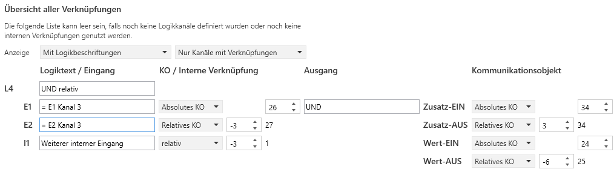

### **Anzeige**

Das Feld Anzeige bestimmt, welche Elemente in der Tabelle dargestellt werden.

#### **Mit Logikbeschriftungen**

Die Tabelle zeigt neben der Spalte L*n* (*n* ist die Nummer des Logikkanals) auch den Beschriftungstext, der für diesen Kanal vergeben wurde. Dies ist die ausführlichere Variante, benötigt aber pro dargestelltem Logikkanal eine zusätzliche Zeile.

#### **Ohne Logikbeschriftungen**

Es gibt nur eine Spalte mit den Logiknummern L*n*, aber ohne deren Texte. Diese Darstellung ist kompakter und erlaubt es, mehr Ein- und Ausgänge und deren interne KO-Verknüpfungen pro Seite zu sehen.

#### **Nur Kanäle mit Verknüpfungen**

Diese Ansicht zeigt nur Logikkanäle, die auch wirklich interne Verknüpfungen enthalten. Kanäle ohne interne Verknüpfungen werden nicht dargestellt.

#### **Alle Kanäle**

Diese Ansicht zeigt alle definierbaren Kanäle.

### **Übersichtstabelle mit internen Verknüpfungen**

Die Tabelle enthält 5 Spalten und bis zu 5 Zeilen pro Logikkanal. Alle eingabebereiten Felder kommen auch so in der Kanaldefinition selbst vor und haben die gleiche Funktion.

#### Spalte 1 (ohne Überschrift)

Diese Spalte zeigt, welcher Logikkanal L*n* dargestellt wird und um welchen Eingang es geht (E1, E2, I1 oder I2).

#### Spalte Logiktext / Eingang

Die in dieser Spalte erscheinenden Textfelder enthalten die Beschriftungen, die man dem Logikkanal bzw. den Eingängen gegeben hat. Die Textfelder sind änderbar.

#### Spalte KO / Interner Eingang

Diese Spalte muss man unterschiedlich interpretieren, je nachdem, ob es sich um Eingänge mit KO-Verknüpfungen oder um interne Eingänge handelt.

Bei KO-Verknüpfungen zeigt diese Spalte die KO-Nummern der Eingänge und wie sie ermittelt werden. Der Wert "Eigenes KO" zeigt immer die dann automatisch dem Eingang zugeordnete KO-Nummer, beim Wert "Bestehendes KO" erscheint ein Eingabefeld, in dem man die KO-Nummer eingeben kann. Steht da "Relatives KO", erscheint ein Eigabefeld, in dem man die Anzahl der KO angeben kann, die man vor- oder zurückspringen möchte (relative Angabe). Hinter dem Eingabefeld steht dann die ausgerechnete KO-Nummer, bei der man dann landet. Details kann man unter [Kommunikationsobjekt für Eingang](#kommunikationsobjekt-für-eingang) nachlesen.

Bei internen Eingängen zeigt diese Spalte die Nummer des Kanals mit dessen Ausgang dieser Eingang verknüpft ist und wie dieser ermittelt wird. Beim Wert "absolut" erscheint ein Eingabefeld, in dem man die Kanalnummer des Kanals eingeben kann. Beim Wert "relativ" erscheint ein Eingabefeld, in dem man die Anzahl der Kanäle, um die man vor- oder zurückspringen will, angeben kann. Dahinter erscheint noch die Nummer des Kanals, bei dem man landet.

#### Spalte Ausgang

Das in dieser Spalte erscheinende Textfeld enthält die Beschriftung, die man dem Ausgang gegeben hat. Das Textfeld ist änderbar.

#### Spalte Kommunikationsobjekt

In dieser Spalte sieht man alle möglichen Verknüpfungen von Ausgängen mit externen KO. Dazu zählen die KO, an die der Ausgang zusätzlich zum eigenen KO senden kann (Zusatz) und die KO, deren Wert dieser Ausgang lesen und senden kann (Wert). Da es beides jeweils getrennt für das EIN- und das AUS-Signal gibt, ergeben sich bis zu 4 Zeilen "Zusatz-EIN", "Zusatz-AUS", "Wert-EIN" und "Wert-AUS"
In dieser Spalte sieht man, ob für das EIN-Signal oder das AUS-Signal ein zusätzliches KO gewählt wurde und welche Nummer es hat.

Das Auswahlfeld dahinter zeigt "Eigenes KO", falls kein zusätzliches KO gewählt wurde, gefolgt von der Nummer des eigenen KO dieses Ausgangs.
Wählt man in dem Auswahlfeld "Absolutes KO", erscheint ein Eingabefeld, in dem man die Nummer des KO angeben kann, das genutzt werden soll. Wählt man "Relatives KO", erscheint ein Eingabefeld, in dem man die Anzahl der KO angibt, die man vor- oder zurückspringen möchte. Dahinter erscheint die berechnete KO-Nummer, bei der man dann landet.
Details kann man unter [Kommunikationsobjekt für Ausgang](#kommunikationsobjekt-für-ausgang) nachlesen.

## **Logiken**

Im Folgenden werden die generellen Konzepte und die grobe Funktion eines Logikkanals beschrieben. Die Parameter eines jeden Kanals werden später im Detail beschrieben.

Jeder Logikkanal, von denen bis zu 99 zur Verfügung stehen, ist identisch aufgebaut. Es stehen immer 2 externe Eingänge, 2 interne Eingänge und ein Ausgang zur Verfügung. Alternativ kann als Eingang der Funktionsblock "Zeitschaltuhr" genutzt werden.

Zwischen die Eingänge und den Ausgang können verschiedene Funktionsblöcke geschaltet werden, die die Eingangssignale beeinflussen und Verknüpfen können und so ein Ausgangssignal erzeugen.

Alle Funktionsblöcke kann man sich wie an einer Perlenschnur aufgereiht hintereinander vorstellen, das Ergebnis eines Funktionsblocks wird für den darauffolgenden Funktionsblock als Eingabe verwendet.

<kbd>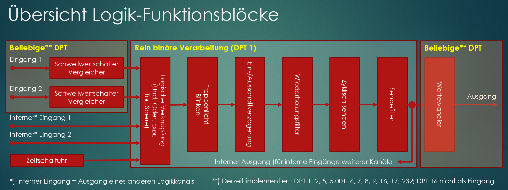</kbd>

**) Abweichend zum Bild: Derzeit implementiert: DPT 1, 2, 3, 5, 5.001, 6, 7, 8, 9, 12, 13, 14, 16, 17, 232; DPT 16 nicht als Eingang

Jeder Funktionsblock arbeitet rein binär, also nur mit den Werten 0 oder 1 (DPT 1). Damit auch andere DPT möglich sind, besitzen externe Eingänge Konverter-Funktionsblöcke, die von einem beliebigen DPT nach DPT 1 konvertieren. Derzeit sind Schwellwertschalter und Vergleicher als Konverterfunktionen implementiert. Interne Eingänge und die Zeitschaltuhr benötigen keinen Konverter, da sie rein binär funktionieren.

Die binäre Signalverarbeitung beginnt mit einer logischen Verknüpfung, die alle Eingänge zusammenbringt, gefolgt von

* Treppenlicht (mit einer Blinkfunktion)
* Ein- und Ausschaltverzögerung (getrennt einstellbar)
* Wiederholungsfilter
* Zyklisch senden
* Sendefilter

Wird ein Funktionsblock nicht genutzt (nicht parametrisiert), gibt er seine Eingabe unverändert als Ergebnis an den nächsten Funktionsblock weiter.

Das nach dem Sendefilter ermittelte Signal steht für die internen Eingänge der anderen Kanäle zur Verfügung. Ferner steht es auch einem Ausgangskonverter zur Verfügung, der als Wertwandler ausgelegt ist und den ermittelten Wert als einen anderen DPT ausgeben kann. Dabei können die Ausgabewerte festgelegt werden (Konstanten) oder ein am Eingang 1 oder Eingang 2 vorliegender Wert in den Ausgangs-DPT konvertiert werden.

### **Zeitschaltuhren**

Jeder Logikkanal kann statt interner oder externer Eingänge als Zeitschaltuhr-Kanal definiert werden. Dabei kann ein EIN- oder AUS-Signal anhand von bestimmten Zeitangaben erzeugt werden.

Es können bis zu 4 Jahresschaltpunkte (Tag/Monat/Stunde/Minute) oder 8 Tagesschaltpunkte (Wochentag/Stunde/Minute) pro Logikkanal definiert werden.

Folgende Zeitangaben sind möglich:

* Zeitpunkt (bis auf die Minute genau)
* Zeitpunkte an bestimmten Wochentagen
* Bestimmte Minuten jede Stunde
* Jede Minute zu bestimmten Stunden

Neben absoluten Zeitpunkten sind auch relative Zeitpunkte möglich:

* Zeitversatz (Stunde:Minute) relativ zum Sonnenauf-/-untergang
* Sonnenauf-/-untergang, aber frühstens um Zeitpunkt (Stunde:Minute)
* Sonnenauf-/-untergang, aber spätestens um Zeitpunkt (Stunde:Minute)
* Sonnenauf-/-untergang, mit Angabe des Sonnenstands als Winkel über/unter dem Horizont

Für die korrekte Berechnung von Sonnenauf- und -untergangszeit muss das Modul die korrekten Geokoordinaten (Standort) des Hauses wissen, wie auch die Zeitzone und ob es an diesem Ort eine Sommerzeitumschaltung gibt. Diese Informationen muss man für die korrekte Funktion einstellen.

Ferner können Feiertage und Urlaubstage bei den Zeitpunkten berücksichtigt werden. Dabei kann bestimmt werden, ob die Schaltzeitpunkte:

* Urlaub/Feiertage nicht beachten sollen
* Bei Urlaub/Feiertag nicht schalten sollen
* Nur bei Urlaub/Feiertag schalten sollen
* Einen Urlaub/Feiertag wie Sonntag behandeln sollen

Dies erlaubt sehr flexible Zeitschaltuhren für Urlaub/Feiertage.

Zeitschaltuhren beginnen mit ihrer Funktion erst, nachdem mindestens einmal über den Bus Zeit und Datum gesetzt worden sind.

### **Startverhalten**

Dem Startverhalten eines Logikkanals kommt eine besondere Bedeutung zu.

Initial sind alle Eingänge und der Ausgang unbestimmt. Es wäre möglicherweise fatal, wenn beim Start jeder Logikkanal erst mal für seinen Ausgang ein AUS auf den Bus senden würde. Ebenso sollte eine UND-Verknüpfung mit 2 Eingängen, die auf Eingang 1 noch kein Signal empfangen hat und auf dem Eingang 2 eine 1 empfängt, nicht automatisch annehmen, dass Eingang 1 auf AUS steht und dadurch bedingt eine 0 auf den Ausgang senden.

Es muss einstellbar sein, wie ein Logikkanal mit "undefinierten" Zuständen umgeht. Im folgenden werden die Möglichkeiten für jeden Logikkanal erläutert.

Jeder Eingang ist beim Start undefiniert und der Ausgang sendet erst einmal nichts. Man kann für einen Eingang festlegen, wie er seinen Anfangswert bekommen soll.

Die einfachste Variante ist eine Konstantenbelegung: Ein Eingang kann den Wert AUS oder EIN annehmen und das kann man über Parameter festlegen. Anmerkung: Obwohl Eingänge durchaus verschiedene DPT unterstützen, ist die Vorbelegung nur mit den Werten AUS oder EIN möglich, also quasi als Ergebnis des Eingangskonverters.

Eine weitere Möglichkeit ist, dass der Eingang seinen Anfangswert vom Bus liest. Damit würde der Eingang bei einem Neustart ein Lesetelegramm schicken und auf eine Antwort warten. Bis die Antwort eintrifft, ist der Eingang weiterhin undefiniert. Da bei einem Systemstart andere Geräte, die das Lesetelegramm beantworten könnten, eventuell selbst noch nicht in der Lage sind zu senden, kann man zusätzlich zum Parameter "Allgemeine Parameter -> Zeit bis das Gerät nach einem Neustart aktiv wird" auch noch pro Kanal eine Startverzögerung festlegen. Das Lesetelegramm für diesen Kanal wird erst nach der Summe der beiden Zeiten gesendet.

Die letzte Möglichkeit, einen Eingang vorzubelegen, ist mit dem letzten Wert, den er hatte. Dazu kann man einstellen, dass der Wert für diesen Eingang über einen Stromausfall bzw. Reset des Gerätes hinweg in einem nichtflüchtigen Speicher gespeichert wird. Bei einem Neustart des Gerätes wird der Wert aus dem nichtflüchtigen Speicher wieder gelesen und als Startwert angenommen.

Das bisher beschriebene führt zu der Situation, dass ein Logikkanal nach einem Neustart, der Zeit bis das Gerät aktiv wird und der Zeit, bis der Kanal aktiv wird in einem Zustand sein kann, bei dem immer noch einer oder beide Eingänge undefiniert sind.

Eine Logikverknüpfung, die aber an einigen Eingängen einen definierten und and anderen Eingängen einen undefinierten Wert hat, muss wissen, wie sie sich in so einem Fall verhalten soll, sprich, ob und wie die Verknüpfung durchgeführt werden soll.

Hier sind 2 Möglichkeiten implementiert (und somit parametrisierbar):

1. Die Verknüpfung soll erst durchgeführt werden, wenn alle Eingänge definierte Werte haben. Bevor dies nicht eintritt, passiert am Ausgang einfach nichts.
2. Die Verknüpfung soll bereits beim Eintreffen des ersten Signals reagieren. Ist dann der andere Eingang noch undefiniert, kann man für diesen vernünftigerweise weder ein EIN noch ein AUS annehmen. Der undefinierte Eingang wird dann als nicht existent behandelt und die Verknüpfung nur für die definierten Eingänge durchgeführt. Beispiel: Ein UND mit 3 Eingängen, von denen 2 auf EIN und einer auf undefiniert stehen, würde wie ein UND mit 2 Eingängen behandelt werden und ein EIN liefern.

Bei Zeitschaltuhren sind keine weiteren Eingänge vorhanden, somit kann nach einem Neustart nur die Zeitschaltuhr für einen definierten Eingang sorgen. Dies geschieht automatisch mit dem Erreichen des nächsten Schaltpunkts. Eine weitere Möglichkeit ist die Einstellung "Beim Neustart letzte Schaltzeit nachholen". Diese Einstellung führt dazu, dass der Schaltzeitpunkt erneut ausgeführt wird, der direkt vor dem "jetzt"-Zeitpunkt liegt. Damit hat der Eingang dann einen definierten Zustand.

Durch die dezidierten Einstellungsmöglichkeiten des Startverhaltens pro Kanal kann man sein KNX-System sehr detailliert bezüglich des Systemstart steuern. Da genau dieses Startverhalten von vielen KNX-Geräten eher stiefmütterlich behandelt wird, hat man mit diesem Logikmodul viele Möglichkeiten, hier einzugreifen und Unzulänglichkeiten auszugleichen.

### **Zusammenfassung**

Die hier für jeden Kanal zur Verfügung stehenden Möglichkeiten der Beeinflussung des Signalverlaufs ermöglichen die Realisierung von vielen Steuerungsaufgaben, die sonst über viele Einzelgeräte oder gar Logikmaschinen verteilt werden müssen. Durch unterschiedliche Parametrierung der Funktionsblöcke kann man folgende klassische und im KNX übliche Funktionen erreichen:

* NOT (logische Negierung eines Signals)
* Logische Verknüpfung AND, OR, EXOR (durch die Nutzung von internen Eingängen auch mit sehr vielen Eingängen)
* TOR/Sperre (lasse nur ein Signal durch/nicht durch, solange ein anderes anliegt)
* Treppenlicht
* Ein- und Ausschaltverzögerung
* Zyklisch senden
* Schwellwertschalter
* Vergleichen von 2 Werten
* Intervallvergleich (Ein Wert liegt in einem bestimmten Wertebereich)
* Hysteresevergleich (Schalte EIN oberhalb eines Wertes, AUS erst unterhalb eines anderen)
* Wiederhole n mal ein Signal
* Vervielfache ein Signal auf verschiedene GA
* Konvertiere ein DPT in einen anderen
* Verzögere ein Signal
* Zeitschaltuhr-Funktionen

## **Logik n: ...**

Da alle Kanäle identisch sind, wird hier nur ein Kanal repräsentativ beschrieben. Das gesagte kann für alle Kanäle eingestellt werden.

Ein Logikkanal wird durch einen Tab mit dem Namen "Logik n: \<Name der Logik>" repräsentiert, wobei n die Nummer des Kanals ist und der \<Name der Logik> anfänglich "..." lautet.

<kbd>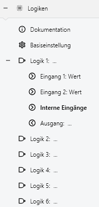</kbd>

Folgende Parameter kann man für einen Logikkanal angeben:

<kbd>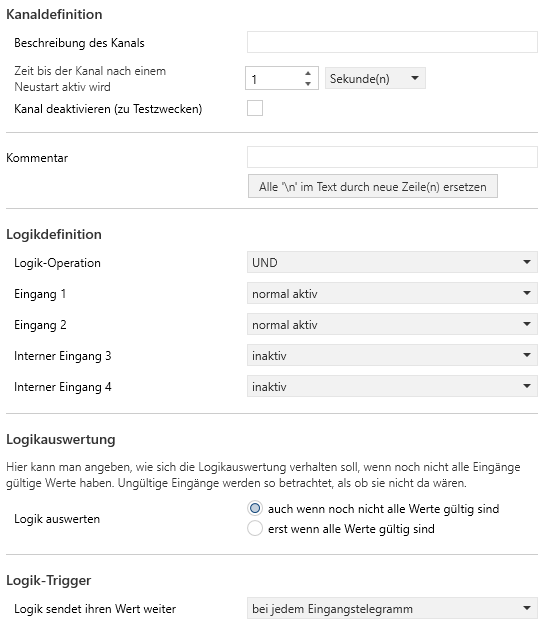</kbd>

## Kanaldefinition

Hier werden die Einstellungen vorgenommen, die für die Funktion des gesamten Kanals notwendig sind.

<!-- DOC -->
### **Beschreibung des Kanals**

Der hier vergebene Name hat keinen funktionalen Einfluss, erlaubt es aber, dem Kanal einen eigenen Namen zu geben, und ihn so leichter wiederzufinden. Der Name wird im Kanalbaum dargestellt und statt des Standardtextes "..." genommen.

<!-- DOC -->
### **Zeit bis der Kanal nach einem Neustart aktiv wird**

Neben "Allgemeine Parameter -> Zeit bis das Gerät nach einem Neustart aktiv wird" kann auch noch pro Kanal eine Startverzögerung sinnvoll sein. 

<!-- DOC Skip="1" -->
Der Grund ist in "Logikkanäle -> [Startverhalten](#startverhalten)" beschrieben.

Die Verzögerungszeit wird hier angegeben.

**Anmerkung:** Auch wenn man hier technisch bis zu 16.000 Stunden Verzögerung angeben kann, sind nur Einstellungen im Sekundenbereich sinnvoll.

<!-- DOC -->
### **Kanal deaktivieren (zu Testzwecken)**

Dieser Logikkanal ist außer Funktion. Er kann vollständig definiert sein und keine Einstellung geht verloren, aber der Ausgang wird kein Telegramm senden. Dies bietet die Möglichkeit, zu Testzwecken einen bereits parametrierten Logikkanal inaktiv zu setzen, um zu schauen, ob er die Ursache für eventuelles Fehlverhalten im Haus ist. Kann zur Fehlersuche hilfreich sein.

<!-- DOC -->
### **Kommentar**

Hier kann man einen Freitext eingeben, der die Logik beschreibt. Dieser Text kann mehrzeilig sein. Leider unterstützt die ETS von sich aus keine mehrzeiligen Texte. Mit dem Button unter der Textbox kann man alle Eingaben der Zeichenfolge '\n' in neue Zeilen umwandeln lassen. 

Ein Kommentar kann aus maximal 512 Zeichen bestehen.

## Logikdefinition

Hier werden die Einstellungen vorgenommen, die für die Logikausführung selbst wesentlich sind.

<kbd>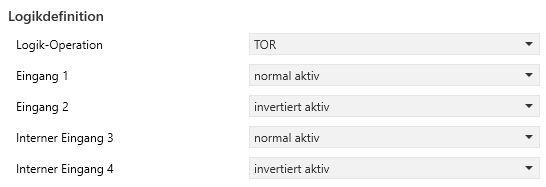</kbd>

<!-- DOC -->
### **Logik-Operation**

Mittels der Auswahlliste kann eine Operation und damit die Art der Verknüpfung der Eingänge dieses Logikkanals ausgewählt werden. Es stehen folgende Operationen zur Verfügung:

#### **aus**

Dieser Logikkanal nicht definiert und nicht aktiv. Es stehen keine Eingänge und kein Ausgang zur Verfügung. Alle entsprechenden KO sind ausgeblendet.

#### **UND**

Alle Eingänge werden über ein logisches UND verknüpft. Das Ergebnis der Verknüpfung ist EIN, wenn alle Eingänge des Funktionsblock EIN sind. Das Ergebnis ist AUS, wenn auch nur ein Eingang AUS ist.

#### **ODER**

Alle Eingänge werden über ein logisches ODER verknüpft. Das Ergebnis der Verknüpfung ist EIN, sobald nur ein Eingang des Funktionsblock EIN ist. Das Ergebnis ist AUS, wenn alle Eingänge AUS sind.

#### **EXKLUSIV-ODER**

Alle Eingänge werden über ein logisches Exklusiv-ODER verknüpft. Das Ergebnis der Verknüpfung ist EIN, wenn eine ungerade Anzahl von Eingängen des Funktionsblock EIN sind. Das Ergebnis ist AUS, wenn eine gerade Anzahl von Eingängen EIN sind.

#### **TOR**

Ein Tor hat normalerweise einen Dateneingang, Datenausgang und einen Toreingang. Wird das Tor über ein Signal am Toreingang geöffnet, können Daten vom Dateneingang zum Datenausgang fließen. Wird das Tor geschlossen, dann fließen keine Daten zwischen Dateneingang und Datenausgang.

Wird das Signal am Toreingang invertiert (negiert), dann sprechen wir von einer Sperre.

Da ein Logikkanal 4 Eingänge hat, ist bei einem Tor

    Dateneingang = Eingang 1 ODER Interner Eingang 3
    Toreingang = Eingang 2 ODER Interner Eingang 4

(in Worten: Jeweils ein externer und ein interner Eingang werden über ein ODER verknüpft und bilden den entsprechenden Eingang der TOR-Verknüpfung).

#### **ZEITSCHALTUHR**

Dieser Logikkanal hat keine Eingänge, sondern repräsentiert eine Zeitschaltuhr. Der Ausgang wird somit durch entsprechende Zeitschaltpunkte geschaltet. Der Ausgang kann immer noch passende Funktionsmodule enthalten.

#### **SCHALTER (RS-FLIP_FLOP)**

Dieser Logikkanal hat den Eingang 1, der bei einem EIN-Signal den Ausgang EINschaltet. Der Eingang 2 schaltet bei einem EIN-Signal den Ausgang AUS. Ein AUS-Signal auf einem der beiden Eingänge bewirkt nichts. 

Mit dem Schalter lassen sich viele Funktionen, die vorher nur mit 2 Kanälen zu lösen waren, jetzt mit nur einem Kanal lösen, was die Übersichtlichkeit der Logiken erhöht. 

Der Schalter ermöglicht die Realisierung eines einfachen Szenen-Controllers (siehe Beispiele). Ferner können damit Hysterese-Logiken aufgebaut werden, bei denen die Ein- und Ausschaltbedingung aus 2 verschiedenen Quellen kommt (z.B. verschiedene DPT).

<!-- DOC HelpContext="Eingang n" -->
### **Eingang 1/2**

<!-- DOC Skip="2" -->
Erscheint nur, wenn die Logik-Operation nicht auf "ZEITSCHALTUHR" gestellt wurde.

Jeder Eingang kann durch die Auswahlfelder deaktiviert bzw. normal oder invertiert (negiert) aktiviert werden.

#### **inaktiv**

Steht ein Eingang auf inaktiv, kann er nicht genutzt werden und es steht kein KO zur Verfügung, um ein Telegramm an diesen Eingang zu schicken.

#### **normal aktiv**

Für diesen Eingang erscheint ein Kommunikationsobjekt. Detailangaben zu diesem Eingang erfolgen auf einer eigenen Seite. Der aus den Einstellungen für den Eingang ermittelte binäre Wert wird direkt der oben ausgewählten logischen Operation zur Verfügung gestellt.

#### **invertiert aktiv**

Für diesen Eingang erscheint ein Kommunikationsobjekt. Detailangaben zu diesem Eingang erfolgen auf einer eigenen Seite. Der aus den Einstellungen für den Eingang ermittelte binäre Wert wird invertiert (negiert), bevor er der oben ausgewählten logischen Operation zur Verfügung gestellt wird. Invertieren (negieren) heißt, dass ein EIN-Signal zu einem AUS-Signal wird und umgekehrt.

<!-- DOC HelpContext="Interner Eingang n" -->
### **Interner Eingang 3/4**

<!-- DOC Skip="2" -->
Erscheint nur, wenn die Logik-Operation nicht auf ZEITSCHALTUHR gestellt wurde.

Es handelt sich um interne Eingänge, die mit einem Ausgang eines anderen Kanals verbunden sind. Jeder interne Eingang kann durch die Auswahlfelder deaktiviert bzw. normal oder invertiert (negiert) aktiviert werden.

#### **inaktiv**

Steht ein interner Eingang auf inaktiv, kann er nicht genutzt werden und er hat keinen Einfluss auf die logische Verknüpfung.

#### **normal aktiv**

Es erscheint eine eigene Seite für die Verknüpfung dieses Eingangs mit einem anderen Kanalausgang. Der Wert des Kanalausgangs wird direkt der oben ausgewählten logischen Operation zur Verfügung gestellt.

#### **invertiert aktiv**

Es erscheint eine eigene Seite für die Verknüpfung dieses Eingangs mit einem anderen Kanalausgang. Der Wert des Kanalausgangs wird invertiert (negiert), bevor er der oben ausgewählten logischen Operation zur Verfügung gestellt wird. Invertieren (negieren) heißt, dass ein EIN-Signal zu einem AUS-Signal wird und umgekehrt.

## Logikauswertung

Hier werden die Einstellungen vorgenommen, die für die Auswertung der Logik relevant sind.

<kbd></kbd>

<!-- DOC -->
### **Logik auswerten**

<!-- DOC Skip="2" -->
Erscheint nur, wenn die Logik-Operation nicht auf ZEITSCHALTUHR gestellt wurde.

Es ist notwendig, einer Logikverknüpfung zu sagen, wie sie mit undefinierten Eingängen umgehen soll.

<!-- DOC Skip="1" -->
Dies ist auch in "Logikkanäle -> [Startverhalten](#startverhalten)" beschrieben. 

#### **auch wenn noch nicht alle Werte gültig sind**

Die logische Verknüpfung betrachtet alle undefinierten Eingänge als ob sie mit "inaktiv" parametriert wären. Ein UND mit 3 Eingängen, das von den einer undefiniert ist, wird bereits ein EIN senden, wenn die 2 restlichen Eingänge EIN sind.

Ein TOR mit einem undefinierten Dateneingang oder einem undefinierten Toreingang kann nicht sinnvoll funktionieren und sendet dann gar nichts.

#### **erst wenn alle Werte gültig sind**

Die logische Verknüpfung wird erst dann einen Wert ermitteln, wenn an allen Eingängen gültige Werte vorliegen.

## Tordefinition

Hier wird das Verhalten vom Tor vorgegeben.

<kbd>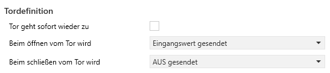</kbd>

<!-- DOC -->
### **Tor geht sofort wieder zu**

Ein Tor bleibt normalerweise offen, nachdem ein EIN-Telegramm am Toreingang empfangen wurde. Erst bei einem AUS-Telegramm am Toreingang geht das Tor wieder zu.

Wird "Tor geht sofort wieder zu" gewählt, geht das Tor beim Empfang eines EIN-Telegramms auf und danach sofort wieder zu. Es wird somit nicht auf ein AUS-Telegramm gewartet.

Man nennt einen solchen Eingang auch Impulseingang. Durch einen solchen Impulseingang kann man eine Taktung/Synchronisation der Werte erreichen, die am Eingang anliegen.

So kann z.B. ein Wert am Eingang, egal wie oft er sich ändert, nur jede Minute zum Ausgang durchgeschaltet werden. Oder ein Wert wird nur durchgelassen, wenn der Benutzer eine Taste betätigt.

Wenn man den Toreingang invertiert, kann man ein Tor realisieren, dass beim Empfang einer 0 kurz auf und sofort wieder zu geht.

> Abstrakt betrachtet entspricht ein Tor mit einem Impulseingang einem Tor mit einem normalen Eingang, vor den ein Treppenlicht geschaltet wurde, das sofort (z.B. nach 0.1 Sekunden) abläuft. Das Tor sendet dann nur beim öffnen, nichts beim schließen.

<!-- DOC -->
### **Beim öffnen vom Tor wird**

Das Auswahlfeld erscheint nur, wenn als logische Operation TOR gewählt wurde.

Mit dem Auswahlfeld kann man einstellen, ob das Tor zusätzliche Telegramme verschicken soll, wenn es gerade geöffnet wird (Toreingang geht auf EIN).

Normalerweise ist das Tor entweder geöffnet oder geschlossen. Ein geöffnetes Tor kann nicht nochmal öffnen. Wird also wiederholt ein EIN-Signal an den Toreingang gesendet, werden die folgenden Einstellungen nur beim ersten EIN (beim wirklichen öffnen) berücksichtigt, nicht bei den Folgetelegrammen.

Nach einem Neustart ist das Tor weder geöffnet noch geschlossen, das erste EIN-Telegramm am Toreingang führt somit auf jeden Fall zum öffnen und zur Berücksichtigung der folgenden Einstellungen.

#### **nichts gesendet**

Beim öffnen vom Tor wird nichts gesendet, erst das nächste Telegramm am Dateneingang wird gesendet.

#### **AUS gesendet**

Beim öffnen vom Tor wird immer ein AUS-Signal gesendet.

#### **EIN gesendet**

Beim öffnen vom Tor wird immer ein EIN-Signal gesendet.

#### **Eingangswert gesendet**

Beim öffnen vom Tor wird der Eingangswert gesendet. Damit kann man erreichen, dass das letzte Signal, das vom Tor blockiert worden ist, nach dem öffnen doch noch durchkommt.

<!-- DOC -->
### **Beim schließen vom Tor wird**

Das Auswahlfeld erscheint nur, wenn als Logik-Operation TOR gewählt wurde und das Tor nicht sofort nach dem Öffnen geschlossen wird.

Mit dem Auswahlfeld kann man einstellen, ob das Tor zusätzliche Telegramme verschicken soll, wenn es gerade geschlossen wird (Toreingang geht auf AUS).

Normalerweise ist das Tor entweder geöffnet oder geschlossen. Ein geschlossenes Tor kann nicht nochmal schließen. Wird also wiederholt ein AUS-Signal an den Toreingang gesendet, werden die folgenden Einstellungen nur beim ersten AUS (beim wirklichen schließen) berücksichtigt, nicht bei den Folgetelegrammen.

Nach einem Neustart ist das Tor weder geöffnet noch geschlossen, das erste AUS-Telegramm am Toreingang führt somit auf jeden Fall zum schließen und zur Berücksichtigung der folgenden Einstellungen.

#### **nichts gesendet**

Beim schließen vom Tor wird nichts gesendet.

#### **AUS gesendet**

Beim schließen vom Tor wird immer ein AUS-Signal gesendet.

#### **EIN gesendet**

Beim schließen vom Tor wird immer ein EIN-Signal gesendet.

#### **Eingangswert gesendet**

Beim schließen vom Tor wird der Eingangswert gesendet. Da dieser Wert ja faktisch schon mal gesendet worden ist (als das Tor noch offen war), ist das effektiv eine einmalige Wiederholung des letzten Wertes.

## Logik-Trigger

Bisher wurde detailliert beschrieben, wie das Logik-Funktionsmodul die Eingänge auswertet, es ist aber ebenso wichtig zu bestimmen, wann der ermittelte Ausgangswert der Logik an die folgenden Funktionsmodule weitergeschickt wird. Mit "Ergebnis" der Logik ist somit nicht der Ausgangswert des gesamten Logikkanals gemeint (der könnte ja wiederholt, invertiert oder verzögert werden), sondern das Ergebnis der Logik direkt nach dem UND, ODER, EXOR oder TOR, bevor die Ausgangs-Pipeline beginnt. 

> Information: Wie der Begriff "nur bei geändertem Ergebnis" gemeint ist, wird in der Applikation auch durch eine Infobox verdeutlicht.

<kbd>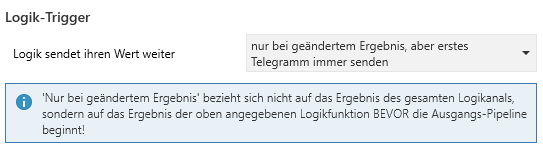</kbd>

<!-- DOC -->
### **Logik sendet ihren Wert weiter**

Diese Auswahlbox erlaubt eine Detaillierte Einstellung des Verhaltens.

#### **Nur bei geändertem Ergebnis**

Das Ergebnis der Logikauswertung wird nur dann weitergeschickt, wenn sich das Ergebnis geändert hat. Dazu wird das zuvor ermittelte Ergebnis der Logik (wichtig: nicht das Ergebnis am Ausgang des Logikkanals) herangezogen und mit dem aktuellen Ergebnis verglichen. Weicht es ab, wird das gerade ermittelte Ergebnis weitergeleitet.

#### **Nur bei geändertem Ergebnis, aber erstes Telegramm immer senden**

Diese Einstellung hat ein spezifisches Verhalten beim Neustart der Logik. Bei einem Neustart ist nicht klar, was "geändertes Ergebnis" heißt. Mit dieser Einstellung sagt man klar, dass das erste Ergebnis der Logik immer als "geändert" behandelt wird und so weitergeschickt wird. Gleichzeitig stellt das Ergebnis den Vergleichswert für die nächste Logikoperation dar, anhand dessen ein "geändertes Ergebnis" festgestellt werden kann.

#### **Nur bei geändertem Ergebnis, aber erstes Telegramm nicht senden**

Diese Einstellung hat ein spezifisches Verhalten beim Neustart der Logik. Bei einem Neustart ist nicht klar, was "geändertes Ergebnis" heißt. Mit dieser Einstellung sagt man klar, dass das erste Ergebnis der Logik immer als "nicht geändert" behandelt wird und somit nicht weitergeschickt wird. Gleichzeitig stellt das Ergebnis den Vergleichswert für die nächste Logikoperation dar, anhand dessen ein "geändertes Ergebnis" festgestellt werden kann.

#### **bei allen Eingangstelegrammen**

Sobald ein neues Eingangstelegramm eintrifft, wird das Ergebnis der logischen Verknüpfung ermittelt und an den nächsten Funktionsblock weitergeleitet.

#### **bei allen Eingangstelegrammen, aber erstes Telegramm nicht senden**

Sobald ein neues Eingangstelegramm eintrifft, wird das Ergebnis der logischen Verknüpfung ermittelt und an den nächsten Funktionsblock weitergeleitet. Allerdings wird das erste Telegramm nach einem Neustart unterdrückt. Damit kann man vermeiden, dass mögliche Statusmeldungen bei einem Neustart ungewollt Logiken bzw. Folgelogiken auslösen.

#### **bei folgenden Eingangstelegrammen**

<!-- DOC Skip="1" -->
<kbd>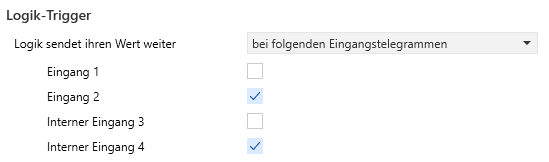</kbd>

Es erscheint eine Liste mit allen aktiven Eingängen. 
<!-- DOC HelpContext="Eingang-Trigger" -->
Man kann die Eingänge ankreuzen, auf die die Logikauswertung reagieren soll. Nur wenn ein Telegramm von einem dieser Eingänge kommt, wird die Logikauswertung angestoßen und das Ergebnis ermittelt und an den nächsten Funktionsblock weitergeleitet.

#### **bei folgenden Eingangstelegrammen, aber erstes Telegramm nicht senden**

Es erscheint eine Liste mit allen aktiven Eingängen. Man kann die Eingänge ankreuzen, auf die die Logikauswertung reagieren soll. Nur wenn ein Telegramm von einem dieser Eingänge kommt, wird die Logikauswertung angestoßen und das Ergebnis ermittelt und an den nächsten Funktionsblock weitergeleitet.
Allerdings wird das erste Telegramm nach einem Neustart unterdrückt. Damit kann man vermeiden, dass mögliche Statusmeldungen bei einem Neustart ungewollt Logiken bzw. Folgelogiken auslösen.

## **Eingang 1: ... / Eingang 2: ...**

Sobald für einen Logikkanal ein externer Eingang aktiviert wurde, erscheint für jeden Eingang eine Seite.

<kbd>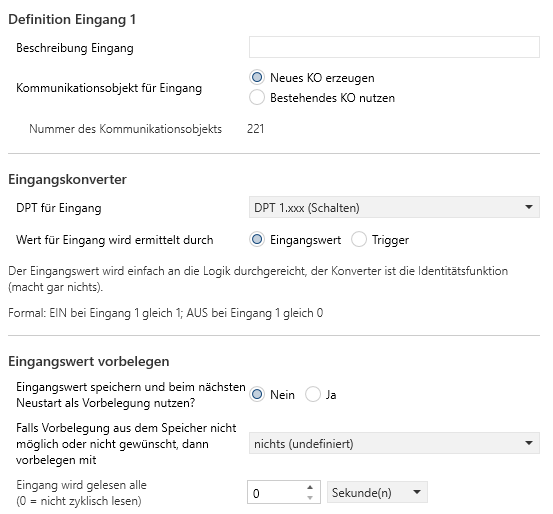</kbd>

## Definition Eingang 1

Jeder Eingang kann mit Hilfe der folgenden Einstellungen konfiguriert werden. Im Folgenden wird von Eingang n gesprochen, da die Beschreibung sowohl für Eingang 1 wie auch für Eingang 2 gilt.

> **Wichtig:** Wird ein Eingang als "invertiert aktiv" eingeschaltet, so passiert die Invertierung erst direkt bei der Wertübergabe an die logische Operation des Logik-Funktionsmoduls, also erst nach der Vorbelegung und nach dem Eingangskonverter.

<!-- DOC -->
### **Beschreibung Eingang**

Dieses Feld hat keine funktionale Auswirkung. Es erlaubt den Eingang zu benennen und diesen so leichter wiederzufinden, erhöht somit die Übersichtlichkeit.

Der hier angegebene Text erscheint in der Seitenbeschreibung "Eingang n: unbenannt" statt dem Wort "unbenannt" und als Name des Kommunikationsobjektes, das zu diesem Eingang gehört.

<!-- DOC -->
### **Kommunikationsobjekt für Eingang**

Ein Eingang des Logikobjekts wird durch ein Kommunikationsobjekt repräsentiert. Dabei kann jedes Kommunikationsobjekt des Gerätes verwendet werden, auch KO, die nicht vom Logikmodul verwaltet werden. Dies ermöglicht, KO intern zu verbinden und so die Kommunikation auf dem Bus zu reduzieren. Eine solche interne Verbindung verhält sich genau so, als wäre der Eingang mit einer GA verbunden und Telegramme erhalten würde.

Es gibt 2 Möglichkeiten, interne KO-Verknüpfungen zu realisieren: Absolut und relativ. 

* Absolute KO-Verknüpfungen werden über die Angabe einer KO-Nummer vorgenommen. Dieses KO wird dann für den Eingang benutzt.
* Relative KO-Verknüpfungen werden über die Angabe eines KO-Offsets vorgenommen. Das eigentliche KO wird dadurch ermittelt, dass der angegebene Offset zur Nummer des eigenen KO addiert wird und so das Ziel-KO ermittelt wird.

Relative und absolute KO-Verknüpfungen funktionieren absolut identisch. Relative Verknüpfungen sind von Vorteil, wenn man Logikblöcke baut, die aus mehreren Kanälen bestehen. Falls solche Logikblöcke mal verschoben oder auf ein anderes Gerät kopiert werden sollen, bekommen die Ein- und Ausgänge neue KO-Nummern. Wenn innerhalb der Logikblöcke mit relativen KO-Verknüpfungen gearbeitet wurde, funktionieren die Logikblöcke weiterhin, bei absoluten KO-Verknüpfungen müssen alle KO-Nummern angepasst werden.

#### **Eigenes KO**

Für den Eingang wird das Kommunikationsobjekt benutzt, dass für diesen Eingang vorgesehen ist. Dieses KO ist somit komplett vom Logikmodul kontrolliert und verwaltet.

#### **Absolutes KO"

Der Eingang wird durch ein existierendes Kommunikationsobjekt erzeugt, dessen KO-Nummer direkt angegeben wird. 

Das Kommunikationsobjekt wird anderweitig verwaltet, z.B. durch einen anderen Kanal oder eine andere Teilapplikation. Der Eingang "lauscht" somit nur auf die ankommenden Signale und kann keinerlei Aktionen an dem KO vornehmen, wie z.B. den DPT bestimmen oder Lese-Anforderungen verschicken.

#### **Relatives KO"

Der Eingang wird durch ein existierendes Kommunikationsobjekt erzeugt, dessen KO-Nummer berechnet wird, indem die eigene KO-Nummer genommen wird und der eingegebene Offset addiert wird. 

Das Kommunikationsobjekt wird anderweitig verwaltet, z.B. durch einen anderen Kanal oder eine andere Teilapplikation. Der Eingang "lauscht" somit nur auf die ankommenden Signale und kann keinerlei Aktionen an dem KO vornehmen, wie z.B. den DPT bestimmen oder Lese-Anforderungen verschicken.

<!-- DOC -->
### **Nummer des Kommunikationsobjekts**

Hier steht immer die Nummer des Kommunikationsobjekts, das als Eingang für diesen Kanal fungiert.

Falls ein neues Kommunikationsobjekt erzeugt wurde, ist die Nummer nicht änderbar und nur zur Information.

Falls ein bestehendes Kommunikationsobjekt genutzt werden soll, wird in dem Feld die Nummer des zu nutzenden Kommunikationsobjekts angegeben. Dieses KO muss existieren und es darf nicht ausgeblendet sein. Es muss keine GA mit dem Objekt verbunden sein.

## Eingangskonverter

Sobald für einen Eingang im Feld "DPT für Eingang n" etwas anderes als DPT 1 ausgewählt wird, erscheint ein DPT-Spezifischer Konverter, der eine Konvertierung in DPT 1 erlaubt. Dies ist zwingend notwendig, das die gesamte Logikverarbeitung nur mit binären Werten (DPT 1) erfolgt.

<!-- DOC -->
### **DPT für Eingang**

Dieses Auswahlfeld legt den DPT für den Eingang fest. Unterstützt werden:

* DPT 1: binärer Wert
* DPT 2: Zwangsführung
* DPT 3: Dimmen relativ
* DPT 5: vorzeichenlose Zahl (0 bis 255)
* DPT 5.001: Prozentzahl (0 bis 100)
* DPT 6: vorzeichenbehaftete Zahl (-128 bis 127)
* DPT 7: vorzeichenlose Zahl (0 bis 65.535)
* DPT 8: vorzeichenbehaftete Zahl (-32.768 bis 32.767)
* DPT 9: Gleitkommawert (-670.760,96 bis 670.760,96)
* DPT 12: vorzeichenlose Zahl (0 bis 4294967296)
* DPT 13: vorzeichenbehaftete Zahl (-2.147.483.648 bis 2.147.483.647)
* DPT 14: Gleitkommawert (-1.000.000.000.000 bis 1.000.000.000.000)
* DPT 17: Szenen Nummer (1-64)
* DPT 232: RGB-Wert (0-16.777.216)

Für jeden DPT erscheint ein passender Konverter, mit dem man den gewünschten Eingangs-DPT nach DPT 1 wandeln kann. Die gesamte weitere Verarbeitung des Eingangssignals erfolgt binär, also auf Basis von DPT 1.

> **Wichtig:** Wenn ein bestehendes Kommunikationsobjekt genutzt wird, muss der hier eingestellte DPT dem DPT des bestehenden KO entsprechen! Das kann nicht automatisch von der Applikation ermittelt werden. Wenn hier etwas falsch eingestellt wird und der falsche Eingangskonverter benutzt wird, kann der Logikkanal nicht korrekt funktionieren. 
<!-- DOCEND -->
Darauf wird in der Applikation durch die folgende Information hingewiesen:
<kbd></kbd>

### **DPT 1.xxx (Schalten)**

<kbd>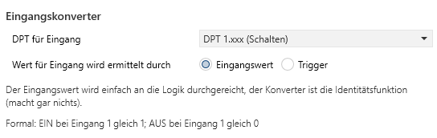</kbd>

Für DPT 1 ist der Konverter sehr einfach. Es gibt nur 2 Möglichkeiten:

#### **Eingangswert**

Der Eingangswert wird direkt weitergegeben (also 0 zu 0 bzw. 1 zu 1). Der Konverter macht somit nichts (Identitätsfunktion).

#### **Trigger**

Es wird immer nur das Eingangstelegramm ausgewertet, unabhängig von seinem Wert. Damit kann man aus einem Telegramm eine 1 erzeugen, was faktisch einen Trigger ergibt. Der Konverter bildet also eine 0 oder eine 1 auf 1 ab.

### **DPT 2.xxx (Zwangsführung)**

<kbd>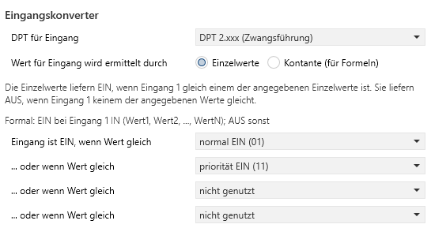</kbd>

Eine Zwangsführung kann aus genau 4 Werten bestehen. Im Konverter kann eingestellt werden, welche dieser Werte, falls er empfangen wird, zu einem EIN-Signal konvertiert wird. Logischerweise führen alle hier nicht aufgeführten Werte zu einem AUS-Signal.

In dem Bildschirmausschnitt ist der Konverter so konfiguriert, dass "normal EIN" oder "priorität EIN" zu einem EIN-Signal führen, "normal AUS" oder "priorität AUS" zu einem AUS-Signal.

In den Auswahlfeldern können folgende Werte ausgewählt werden:

#### **nicht genutzt**

Dieses Eingabefeld wird nicht beachtet.

#### **normal AUS (00)**

Wird der Zwangsführungs-Wert "normal AUS" empfangen (im KNX durch eine 00 repräsentiert), dann wird dieser zu einem EIN-Signal konvertiert.

#### **normal EIN (01)**

Wird der Zwangsführungs-Wert "normal EIN" empfangen (im KNX durch eine 01 repräsentiert), dann wird dieser zu einem EIN-Signal konvertiert.

##### **priorität AUS (10)**

Wird der Zwangsführungs-Wert "priorität AUS" empfangen (im KNX durch eine 10 repräsentiert), dann wird dieser zu einem EIN-Signal konvertiert.

#### **priorität EIN (11)**

Wird der Zwangsführungs-Wert "priorität EIN" empfangen (im KNX durch eine 11 repräsentiert), dann wird dieser zu einem EIN-Signal konvertiert.

### **DPT 3.xxx (Dimmen relativ)**

<kbd>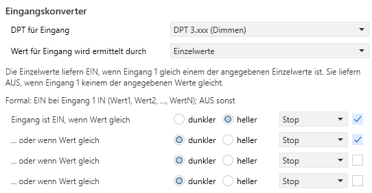</kbd>

Ein Dimm-Schritt besteht entweder aus einem Stop-Wert oder einem Dimm-Wert, der 100%, 50%, 25%, 13%, 6%, 3% oder 2% sein kann. Zusätzlich muss man noch sagen, ob es heller oder dunkler werden soll.

Somit gibt es 8 Werte pro Richtung, also 16 Werte insgesamt. In dem Eingangskonverter für DPT3 kann man 4 dieser Werte auswählen. Der Eingang wird EIN, wenn einer dieser Werte empfangen wird. Bei allen anderen Werten wird der Eingang ein AUS.

In dem Bildschirmausschnitt ist der Konverter so konfiguriert, dass Dimm-Stop zu einem EIN-Signal führt. Das Beispiel zeigt auch, dass es 2 verschiedene Stop-Befehle gibt, einen der das "Hoch-Dimmen" und einen, der das "Runter-Dimmen" stoppt.

In den Zeilen können folgende Werte ausgewählt werden:

#### **dunkler**

Es geht um ein "runter-dimmen" Telegramm. 

#### **hoch**

Es geht um ein "hoch-dimmen" Telegramm. 

#### **Wert**

Der eigentliche Dimm-Wert, er kann Stop oder 100%, 50%, 25%, 13%, 6%, 3% oder 2% sein.

#### **Checkbox**

Wird die Checkbox ausgewählt, wird die entsprechende Zeile beim Telegrammempfang berücksichtigt, wenn nicht, spielt die entsprechende Zeile keine Rolle.

### **DPT 17.001 (Szene)**

<kbd>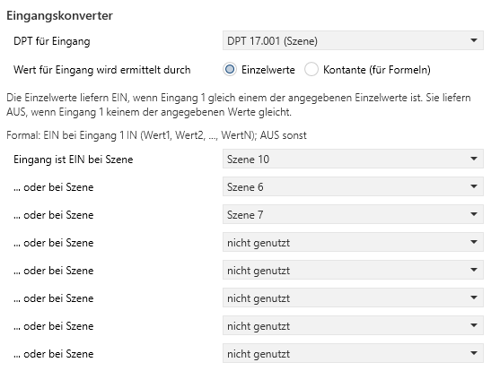</kbd>

Der Szenenkonverter kann bis zu 8 Szenennummern in eine EIN-Signal konvertieren. Alle anderen Szenennummern führen zu einem AUS-Signal. Sollten mehr Szenennummern benötigt werden, kann man mit einem weiteren Eingang oder einem weiteren Logikkanal jeweils 8 weitere Szenen einbeziehen.

In den Eingabefeldern werden die jeweiligen Szenennummern eingegeben, die zu einem EIN-Signal führen sollen. Der Wert "nicht genutzt" wird dann eingegeben, wenn das Eingabefeld nicht ausgewertet werden soll.

In dem Bildschirmausschnitt ist der Konverter so konfiguriert, dass aus Szene 6, 7 und 10 ein EIN-Signal generiert wird, aus allen anderen Szenen ein AUS-Signal.

### **Zahlenbasierte DPT**

Alle DPT, die Zahlen repräsentieren (das sind DPT 5.xxx, 5.001, 6.xxx, 7.xxx, 8.xxx, 9.xxx, 12.xxx, 13.xxx, 14.xxx und 232.xxx), können mittels 4 verschiedenen Zahlenkonvertern  in ein binäres Signal umgewandelt werden. Die Zahlenkonverter sind alle gleich in ihren Einstellungen, die einzugebenden Zahlen müssen nur innerhalb der Wertebereiche des jeweiligen DPT liegen.

<!-- DOC -->
#### **Wert für Eingang wird ermittelt durch**

Mit dem Auswahlfeld wird der passende Zahlenkonverter ausgewählt.

#### **Wertintervall**

<kbd>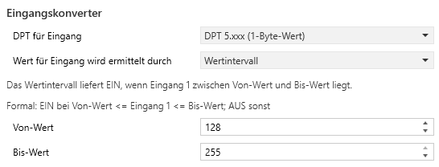</kbd>

Bei diesem Konverter legt man einen Von- und einen Bis-Wert fest. Wenn der Wert vom Eingang n innerhalb der Intervallgrenzen liegt (einschließlich der Grenzen selbst), wird er in ein EIN-Signal konvertiert, sonst in ein AUS-Signal.

Formal würde man schreiben:

    WENN Von-Wert <= Eingang n <= Bis-Wert DANN EIN SONST AUS

Falls man ein EIN-Signal möchte, wenn der Wert außerhalb des Intervalls liegt, muss man den Eingang invertiert einschalten.

In dem angezeigten Bildschirmausschnitt werden die Werte 0 bis 127 in ein AUS-Signal konvertiert, die Werte 128 bis 255 in ein EIN-Signal.

#### **Differenzintervall**

<kbd>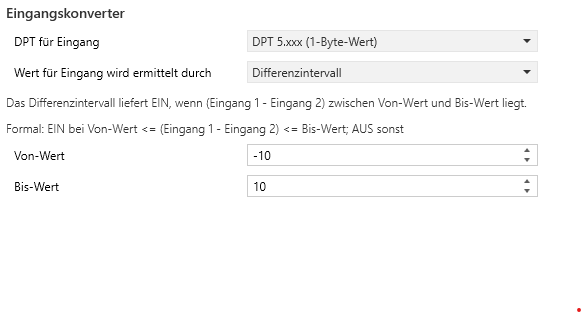</kbd>

Bei diesem Konverter legt man - wie beim Wertintervall - einen Von- und einen Bis-Wert fest. Der Wert, der mit diesem Intervall verglichen wird, ist allerdings die Differenz von dem Eingang n und dem anderen Eingang des Logikkanals. Bei Eingang 1 wird also (Eingang 1 - Eingang 2) gerechnet, bei Eingang 2 aber (Eingang 2 - Eingang 1). Wenn der errechnete Wert innerhalb der Intervallgrenzen liegt (einschließlich der Grenzen selbst), wird das Eingangssignal in eine EIN-Signal konvertiert, sonst in ein AUS-Signal.

Formal würde man (für Eingang 1) schreiben:

    WENN Von-Wert <= (Eingang 1 - Eingang 2) <= Bis-Wert DANN EIN SONST AUS

Falls man ein EIN-Signal möchte, wenn der Wert außerhalb des Intervalls liegt, muss man den Eingang invertiert einschalten.

In dem angezeigten Bildschirmausschnitt würde man bei Eingang 1 = 40 und Eingang 2 = 45 ein EIN-Signal bekommen, da 40 - 45 = -5 ist und dieser Wert innerhalb des Intervalls [-10;10] liegt.

Bei einem Differenzintervall muss der andere Eingang nicht vom gleichen DPT sein, er wird generisch in eine Zahl konvertiert. Allerdings kann das zu unerwarteten Ergebnissen führen. Empfohlen wird ein Differenzintervall für gleiche DPT.

Ein Differenzintervall kann auch als Vergleicher genutzt werden, in dem Von- und Bis-Wert auf 0 gesetzt werden. Dann wird nur bei einer Differenz = 0 (was nichts anderes als die Gleichheit der beiden Eingänge bedeutet) ein EIN-Signal erzeugt.

#### **Hysterese**

<kbd>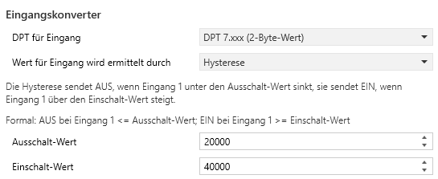</kbd>

Bei diesem Konverter legt man einen Einschalt- und einen Ausschalt-Wert fest. Der Einschaltwert sollte immer größer als der Ausschaltwert sein. Sobald der Wert vom Eingang n den Einschaltwert erreicht oder überschreitet, wird ein EIN-Signal erzeugt. Erst wenn der Wert wieder den Ausschaltwert erreicht oder diesen unterschreitet, wird ein AUS-Signal erzeugt.

Liegt der Wert zwischen dem Ein- und Ausschaltwert, so wird das zuletzt gültige Signal (EIN oder AUS) erzeugt. Falls vorher noch kein gültiges Signal erzeugt worden ist (z.B. beim Gerätestart), wird auch weiterhin kein Signal erzeugt. Somit beginnt ein Hysterese-Konverter nach einem Systemstart erst zu arbeiten, wenn einer der beiden Schwellwerte erreicht wurde.

Formal würde man schreiben:

    WENN Eingang n <= Ausschalt-Wert DANN AUS
    WENN Eingang n >= Einschalt-Wert DANN EIN

In dem angezeigten Bildschirmausschnitt könnte das ein Hystereseschalter für Helligkeit sein. Bei einer Helligkeit von mehr als 40000 Lux würde ein EIN-Signal erzeugt werden, das erst zu einem AUS-Signal führt, wenn die Helligkeit unter 20000 Lux sinkt.

#### **Differenzhysterese**

<kbd>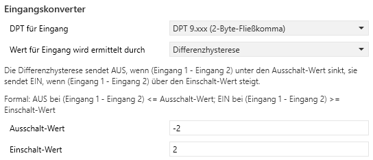</kbd>

Bei diesem Konverter legt man - wie bei der Hysterese - einen Einschalt- und einen Ausschalt-Wert fest. Der Wert, der mit den Grenzen verglichen wird, ist allerdings die Differenz von dem Eingang n und dem anderen Eingang des Logikkanals. Bei Eingang 1 wird also (Eingang 1 - Eingang 2) gerechnet, bei Eingang 2 aber (Eingang 2 - Eingang 1). Wenn der errechnete Wert den Einschaltwert erreicht oder überschreitet, wird ein EIN-Signal erzeugt. Erst wenn der errechnete Wert wieder den Ausschaltwert erreicht oder diesen unterschreitet, wird ein AUS-Signal erzeugt.

Liegt der Wert zwischen dem Ein- und Ausschaltwert, so wird das zuletzt gültige Signal (EIN oder AUS) erzeugt. Falls vorher noch kein gültiges Signal erzeugt worden ist (z.B. beim Gerätestart), wird auch weiterhin kein Signal erzeugt. Somit beginnt ein Hysterese-Konverter nach einem Systemstart erst zu arbeiten, wenn einer der beiden Schwellwerte erreicht wurde.

Formal würde man (z.B. für Eingang 1) schreiben:

    WENN (Eingang 1 - Eingang 2) <= Ausschalt-Wert DANN AUS
    WENN (Eingang 1 - Eingang 2) >= Einschalt-Wert DANN EIN

In dem angezeigten Bildschirmausschnitt könnte das ein Hystereseschalter für eine Zusatzheizung sein, bei der der Sollwert am Eingang 1 anliegt. Der Istwert am Eingang 2. Ist der Sollwert nun 2 Grad größer als der Istwert, wird ein EIN-Signal erzeugt. Erst wenn der Sollwert um 2 Grad kleiner als der Istwert ist, wird ein AUS-Signal erzeugt.

Die Differenzhysterese erlaubt eine Hysterese zu definieren, bei der man den Arbeitspunkt über den KNX-Bus einstellen kann.

### **Der "andere" Eingang bei Differenzkonvertern**

Zahlenbasierte Konverter können auch als Differenzkonverter genutzt werden. Dabei wird dann automatisch der "andere" Eingang aktiviert und für die Differenzberechnung genutzt.

Mit "anderer" Eingang ist folgendes gemeint:

* Für Eingang 1 ist der Differenzeingang der Eingang 2, es wird Eingang 1 - Eingang 2 gerechnet
* Für Eingang 2 ist der Differenzeingang der Eingang 1, es wird Eingang 2 - Eingang 1 gerechnet

Der Differenzeingang muss nicht vom gleichen DPT sein, er wird generisch in eine Zahl konvertiert. Allerdings kann das zu unerwarteten Ergebnissen führen. Empfohlen wird bei Differenzkonvertern der gleiche DPT.

Wird ein Differenzeingang genutzt, muss dieser nicht auch noch als "normal aktiv" oder "invertiert aktiv" bei einer logischen Operation genutzt werden. Der Differenzeingang wird automatisch verfügbar gemacht und nimmt nicht an der logischen Operation Teil. Jedes Telegramm, dass beim Differenzeingang eingeht, triggert die Auswertung der Logik so, als ob das Telegramm am eigentlichen Werteingang eingegangen wäre.

Wenn man den Differenzeingang aber explizit als "normal aktiv" oder "invertiert aktiv" aktiviert, gibt es einen kleinen Unterschied in dem Verhalten. Zum Einen nimmt der Eingang wie ein normaler Eingang an der Logikauswertung teil. Man muss also darauf achten, dass der Eingang ein passendes EIN- oder AUS-Signal für die Logik erzeugt. Des Weiteren kann man Einfluss auf das Triggerverhalten des Eingangs nehmen. Man kann also einstellen, ob der Werteingang, der Differenzeingang oder beide die Logikauswertung triggern.

Falls man einen Differenzeingang haben will, der explizit aktiviert wurde, um Einfluss auf das Triggerverhalten zu haben, der aber keine Auswirkungen auf die Logik haben soll, definiert man für den Differenzeingang den Eingangskonverter "Einzelwerte" und deaktiviert für alle Einzelwerte die dahinterliegende Checkbox. Dann triggert der Eingang die Logik, ist aber bei jedem Wert falsch. Ist die Logik ein ODER, aktiviert man den Differenzeingang als "normal aktiv", ist die Logik ein UND, aktiviert man ihn als "invertiert aktiv".   

Für den Standard-Nutzungsfall sollte man auf eine explizite Aktivierung des Differenzeingangs verzichten um die Logik nicht unnötig komplex zu gestalten.

<!-- DOC HelpContext="Von-Wert" -->
<!-- DOCCONTENT
Hier wird der Von-Wert (also die untere Grenze) eines Wertebereichs angegeben.
DOCCONTENT -->

<!-- DOC HelpContext="Bis-Wert" -->
<!-- DOCCONTENT
Hier wird der Bis-Wert (also die obere Grenze) eines Wertebereichs angegeben.
DOCCONTENT -->

### **Ganzzahlbasierte DPT**

Einige DPT, die ganze Zahlen repräsentieren (das sind DPT 5.xxx, 5.001, 6.xxx, 7.xxx, 8.xxx), können mittels eines weiteren Einzelwert-Konverters in ein binäres Signal umgewandelt werden. Er ist gleich für alle DPT, die einzugebenden Zahlen müssen nur innerhalb der Wertebereiche des jeweiligen DPT liegen.

#### **Einzelwert-Konverter**

<kbd>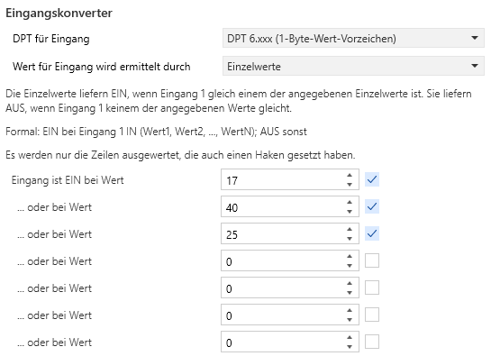</kbd>

Der Einzelwert-Konverter prüft, ob der Eingang einem der angegebenen Werte entspricht. Wenn ja, liefert der Eingang ein EIN-Signal an die Logik. Wenn er keinem der Werte entspricht, liefert er ein AUS-Signal. Geprüft wird jedes mal, wenn das Eingangs-KO einen Wert empfängt. Je nach DPT des Eingangs können unterschiedlich viele Werte geprüft werden:

DPT | Anzahl Werte
:---:|---:
DPT 5.xxx | 7 Werte
DPT 5.001 | 7 Werte
DPT 6.xxx | 7 Werte
DPT 7.xxx | 3 Werte
DPT 8.xxx | 3 Werte

Der Einzelwert-Konverter erspart einige ODER-Verknüpfungen und spart so Logikkanäle.

In dem angezeigten Bildschirmausschnitt wird bei den Werten 17, 25 und 40 ein EIN-Signal erzeugt, bei allen anderen Werten ein AUS-Signal.

> Anmerkung: Aufgrund der intern verwendeten Speicherstruktur können für die DPT 12.xxx und DPT 13.xxx keine Einzelwert-Konverter verwendet werden.

<!-- DOC HelpContext="Eingang ist EIN bei Wert" -->
<!-- DOCCONTENT
Hier wird ein Wert der Werteliste angegeben.
DOCCONTENT -->

<!-- DOC HelpContext="oder bei Wert" -->
<!-- DOCCONTENT
Hier wird ein weiterer Wert der Werteliste angegeben.
DOCCONTENT -->

<!-- DOC HelpContext="Eingang ist EIN wenn Wert gleich" -->
<!-- DOCCONTENT
Hier wird ein zu vergleichender Wert angegeben.
DOCCONTENT -->

<!-- DOC HelpContext="oder wenn Wert gleich" -->
<!-- DOCCONTENT
Hier wird ein weiterer Wert zum Vergleich angegeben.
DOCCONTENT -->

<!-- DOC HelpContext="Eingang ist EIN bei Szene" -->
<!-- DOCCONTENT
Hier wird eine Szene angegeben, die ausgewertet werden soll.
DOCCONTENT -->

<!-- DOC HelpContext="oder bei Szene" -->
<!-- DOCCONTENT
Hier wird eine weitere Szene angegeben, die ausgewertet werden soll.
DOCCONTENT -->

<!-- DOC HelpContext="Nächste Zeile auswerten" -->
<!-- DOCCONTENT
Wird die Checkbox angeklickt, wird die Zeile mit dem Wert ausgewertet, sonst nicht.
DOCCONTENT -->

<!-- DOC HelpContext="Eingang ist konstant" -->
<!-- DOCCONTENT
Der Eingang wird mit diesem konstanten Wert vorbelegt (z.B. um in Formeln weiter verrechnet zu werden).
DOCCONTENT -->

#### **Konstanten**

Alle Eingänge können auch mit einem Konstanten Wert vorbelegt werden. Dies geschieht DPT gerecht, also passend zum Eingangs-DPT. Konstanten können in Formeln verwendet werden oder direkt von Ausgängen genutzt werden. Wobei man sowieso jeden Ausgang einen konstanten Wert senden lassen kann, insofern macht es keinen Sinn, konstante Eingänge für Ausgänge zu definieren.

<kbd>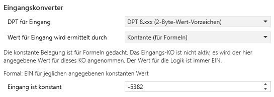</kbd>

Der Boolesche Wert einer Konstante ist immer EIN und kann in einer Logik normal genutzt werden. Natürlich ändert sich dieser Wert nie und kann auch keine Logik triggern.

Der Einsatz von Konstanten ist primär für Formeln gedacht. Wie die Konstanten der Eingänge in Formeln verwendet werden können, kann im Formel-Kapitel nachgelesen werden.

## Eingangswert vorbelegen

Die folgenden Einstellungen erlaubten ein dezidiertes Verhalten beim Neustart des Gerätes, wie im Kapitel "Logikkanäle -> Startverhalten" beschrieben.

Eingangswerte kann man nur vorbelegen, wenn sie nicht konstant sind.

<kbd>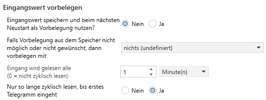</kbd>

<!-- DOC -->
### **Eingangswert speichern und beim nächsten Neustart als Vorbelegung nutzen**

Mit "Ja" legt man fest, dass der zuletzt an diesem Eingang empfangene Wert im nichtflüchtigen Speicher abgelegt wird und nach einem Neustart wieder gelesen wird. Der dann gelesene Wert wird als Vorbelegung für den Eingang genommen, falls nötig über den Eingangskonverter in einen DPT 1 konvertiert und dann die logische Operation getriggert. Ist der Eingang als interner Eingang über sein KO mit weiteren Eingängen verbunden (egal ob das KO im Logikmodul oder einem anderen Modul liegt, das das Logikmodul verwendet), empfangen auch alle verknüpften Eingänge den aus dem nichtflüchtigen Speicher geladenen Wert.

Normalerweise triggert der neu geladene Wert die zugeordnete Logikfunktion und kann über den zugehörigen Ausgang auf den Bus gesendet werden. Man kann allerdings den Wert auch direkt vom Eingang auf den Bus senden lassen:

* Über eine aktive Leseanforderung: Hierzu muss das L-Flag am zugehörigen Eingang gesetzt werden
* Aktives Senden gleich nach einem Neustart: Hierzu muss das Ü-Flag am zugehörigen Eingang gesetzt werden

> **Achtung:** Da das Lesen vom nichtflüchtigen Speicher direkt nach einem Neustart geschieht und alle Initialisierungen sofort laufen, werden beim Setzen des Ü-Flag am Eingang jegliche gelesenen Werte sofort gesendet und nicht erst, nachdem die Zeit abgelaufen ist, bis der Kanal aktiv wird. Das ist der Grund, warum das Ü-Flag nicht standardmäßig gesetzt ist. Würden alle 99 möglichen Kanäle bei einem Neustart ihre Werte von nichtflüchtigen Speicher lesen und sofort senden, würden die resultierenden 99 Telegramme sofort den Bus überlasten und einige davon verloren gehen. Um solche Situationen zu vermeiden, sollte man einen aus dem nichtflüchtigen Speicher gelesenen Wert über den Ausgang auf den Bus senden, dieser Wert wird dann erst gesendet, nachdem der entsprechende Kanal aktiv ist. 

Da nichtflüchtige Speicher nur eine relativ geringe Anzahl an Schreibzyklen zulassen, wird der Eingangswert nicht direkt nach dem Empfang im Speicher geschrieben, sondern erst beim Stromausfall, bei einem "Gerät zurücksetzen" über die ETS oder bei einer Neuprogrammierung über die ETS. Wird die RESET-Taste direkt am Gerät gedrückt, wird der nichtflüchtige Speicher nicht mit dem Eingangswert beschrieben.

> **Wichtig:** Das speichern der Werte in den nichtflüchtigen Speicher bei Stromausfall ist hardwareabhängig und wird nicht von jeder Hardware unterstützt. Auch in einem solchen Fall kann die Funktion sinnvoll sein, z.B. bie einem Neustart nach einer ETS-Programmierung, deswegen wird die Funktion immer angeboten. Ob ein Speichern beim Stromausfall unterstützt wird, steht (hoffentlich) in der Anleitung zum Hardware-Gerät, dass das Logikmodul verwendet.

<!-- DOC -->
### **Falls Vorbelegung aus dem Speicher nicht möglich oder nicht gewünscht, dann vorbelegen mit**

Dieses Auswahlfeld erlaubt eine Vorbelegung mit einem festgelegten Wert. Die Einstellung kommt aber nur zur Auswirkung, falls die vorhergehende Einstellung "Eingangswert speichern und beim nächsten Neustart als Vorbelegung nutzen" auf "Nein" steht oder der gespeicherte Wert nicht genutzt werden kann.

Es gibt einige wenige Gründe, warum ein gespeicherter Wert nicht genutzt werden kann:

* Der gespeicherte Wert hat einen anderen DPT. Das passiert, wenn man das Gerät mit der Einstellung "Speichern" in Benutzung hat, dann in der ETS den DPT für den Eingang ändert und das Gerät neu programmiert. Nach dem Neustart passen dann der gespeicherte DPT und der DPT vom Eingang nicht zusammen. Der gespeicherte Wert wird dann verworfen und die Einstellung dieses Feldes als Vorbelegung genommen.
* Es ist bisher gar kein Wert gespeichert worden, dann kann er natürlich auch nicht genutzt werden und stattdessen wird die Einstellung dieses Feldes als Vorbelegung genommen. Dies passiert immer, wenn man das erste Mal ein "Ja" beim "Eingangswert Speichern" geklickt hat.
* Es ist eine neue Firmware aufgespielt worden und die gespeicherten Werte wurden gelöscht. Das passiert immer, wenn die Werte im FLASH gespeichert werden.
* Durch einen Speicherfehler konnte vor einem Neustart der Wert vom Eingang nicht gespeichert werden. Auch dann wird die Einstellung dieses Feldes als Vorbelegung genutzt. Dieser Fall ist rein Theoretisch und noch nie in der Praxis aufgetreten.

Durch ein Einspielen einer neuen Applikation über die ETS werden die gespeicherten Werte im nichtflüchtigen Speicher nicht gelöscht.

#### **nichts (undefiniert)**

Der Eingang wird nicht vorbelegt und bleibt undefiniert, bis ein erstes Telegramm vom KNX-Bus empfangen wird.

#### **Wert vom Bus lesen**

Nach der eingestellten Startverzögerung für das gesamte Gerät zuzüglich der Startverzögerung für den Logikkanal wird ein Lesetelegramm auf den KNX-Bus geschickt. Bis die Antwort empfangen wurde ist der Eingang undefiniert.

Sollte in der Zeit, bis der Logikkanal startet, bereits ein Telegramm empfangen werden, dass das Lesetelegramm beantwortet hätte, wird das Lesetelegramm nicht gesendet. Damit wird verhindert, dass mehrere Eingänge, die mit der gleichen GA verbunden sind, viele Lesetelegramme auf die gleiche GA schicken.

#### **AUS (0)**

Der Eingang wird konstant mit einer 0 vorbelegt und hat somit sofort einen definierten Zustand.

#### **EIN (1)**

Der Eingang wird konstant mit einer 1 vorbelegt und hat somit sofort einen definierten Zustand.

<!-- DOC -->
### **Eingang vorbelegen mit**

<!-- DOC Skip="1" -->
Erscheint nur, wenn bei "Kommunikationsobjekt für Eingang" der Wert "Bestehendes KO nutzen" ausgewählt wurde.

Dieses Auswahlfeld erlaubt eine Vorbelegung mit einem festgelegten Wert beim Neustart des Logikmoduls.  

#### **nichts (undefiniert)**

Der Eingang wird nicht vorbelegt und bleibt undefiniert, bis ein erstes Telegramm vom KNX-Bus empfangen wird.

#### **AUS (0)**

Der Eingang wird konstant mit einer 0 vorbelegt und hat somit sofort einen definierten Zustand.

#### **EIN (1)**

Der Eingang wird konstant mit einer 1 vorbelegt und hat somit sofort einen definierten Zustand.

<!-- DOC HelpContext="Eingang wird gelesen alle" -->
### **Eingang wird alle n Sekunden gelesen (0=nicht zyklisch lesen)**

Erscheint nur, wenn bei "Kommunikationsobjekt für Eingang" der Wert "Eigenes KO" ausgewählt ist.

Manche Geräte können nicht von sich aus zyklisch senden. Hier kann man einstellen, dass ein Eingang aktiv den Wert zyklisch liest. In den Feld kann man angeben, wie viele Sekunden zwischen 2 Leseintervallen vergehen sollen.

<!-- DOC -->
### **Nur so lange zyklisch lesen, bis erstes Telegramm eingeht**

Erscheint nur, wenn bei "Eingang wird alle n Sekunden gelesen" ein Wert größer 0 eingegeben wurde.

Standardmäßig wird zyklisches lesen ununterbrochen durchgeführt. Mit einem 'Ja' kann man hier festlegen, dass nur so lange zyklisch gelesen wird, bis ein erstes Telegramm eingeht, dass den Wert bestimmt. Das kann sowohl ein Antworttelegramm (GroupValueResponse) wie auch ein Schreibtelegramm (GroupValueWrite) sein.

Diese Funktion wird vor allem nach einem Neustart des gesamten KNX-Busses von Nutzen sein, da Lesetelegramme womöglich nicht sofort beantwortet werden können, falls das antwortende Gerät sich selbst noch in der Startphase befindet. Hier kann man diese Lesetelegramme so lange wiederholen lassen, bis sie beantwortet werden können, anschließend kann ohne aktives Nachfragen auf normale Schreibtelegramme reagiert werden.

Dies erlaubt es, eine KNX-Anlage nach einem Neustart relativ schnell in einen Zustand zu versetzen, bei dem alle Initialisierungen erfolgt sind und alle Funktionen erwartungskonform ausgeführt werden.

> **Tipp:** Auch wenn die Logik selbst den gelesenen Wert nicht braucht, kann man mit der Funktion andere Geräte unterstützen, die selbst nicht nach einem Neustart lesen können. Denn auf das Antworttelegramm kann nicht nur das lesende Gerät reagieren, sondern alle Geräte am Bus.

## **Intern 3: ... / Intern 4: ...**

Wird für eine logische Operation "Interner Eingang 3" oder "Interner Eingang 4" als "normal aktiv" oder "invertiert aktiv" freigeschaltet, erscheint für diesen Eingang eine Seite.

Ausgänge von anderen Kanälen können dazu genutzt werden, große Logikblöcke zu bauen, ohne für jede Teillogik (jeden Logikkanal) eine eigene GA zur Verbindung von Eingang und Ausgang zu benötigen.

Eine weitere Möglichkeit, einen internen Eingang zu nutzen, ist die Auswertung eines Status des aktuellen Gerätes. So kann man einen Status (meist signalisiert durch einen LED-Zustand) auch als Quelle für Logikfunktionen heranziehen.

<kbd>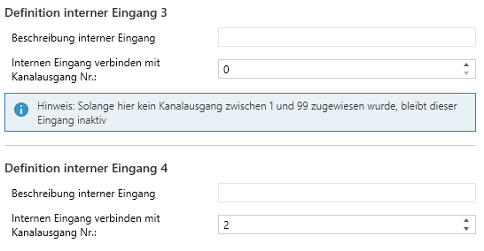</kbd>
Solange der Ausgang eines anderen Kanals nicht zugeordnet worden ist, wird der interne Eingang von der logischen Operation als undefiniert betrachtet.

## Definition Interner Eingang 3/4

Hier werden die Verbindungseinstellungen für den Internen Eingang 3 oder 4 gewählt.

Erscheint nur, wenn bei der logischen Operation "Interner Eingang 3" oder "Interner Eingang 4" als "normal aktiv" oder "invertiert aktiv" ausgewählt wurde.

<!-- DOC -->
### **Beschreibung interner Eingang**

Diese Feld erlaubt eine kurze Beschreibung, wozu dieser Eingang verwendet wird. Es hat keinen Einfluss auf die Funktion des Eingangs und dient rein zu Dokumentationszwecken.

<!-- DOC -->
### **Interner Eingang wird versorgt vom**

Zuerst muss man die Quelle für den internen Eingang wählen. 

* **Anderen Logikkanal** - Der Ausgang eines Logikkanals kann einem internen Eingang zugewiesen werden.
* **Statuskanal** - Der interne Status (üblicherweise signalisiert durch eine LED) kann als Eingang genutzt werden.

<!-- DOC -->
#### **Art der Verknüpfung**

<!-- DOC Skip="1" -->
Erscheint nur, wenn der interne Eingnag vom anderen Logikkanal versorgt wird.

Hier wird ausgewählt, wie die Verknüpfung erfolgen soll.

##### **absolut**

Wenn absolut ausgewählt wird, muss die Nummer des Kanals, dessen Ausgang mit diesem Eingang verknüpft werden soll, angegeben werden.

##### **relativ**

Wenn relativ ausgewählt wird, muss angegeben werden, wie viele Kanäle vor (positive Zahl) oder zurück (negative Zahl) der Kanal liegt, dessen Ausgang mit diesem Eingang verknüpft werden soll. In einem weiteren Feld wird die Nummer des Zielkanals ausgerechnet und ausgegeben.

<!-- DOC -->
#### **Internen Eingang verbinden mit Kanal Nr.**

<!-- DOC Skip="1" -->
Erscheint nur, wenn der interne Eingnag vom anderen Logikkanal versorgt wird.

Als Eingabe wird hier die Nummer der Logik erwartet, deren Ausgang als interner Eingang genutzt werden soll. Solange der Eingang nicht verbunden ist (Wert im Eingabefeld ist 0) erscheint eine Warnmeldung, dass der Eingang inaktiv (undefiniert) ist.

Es kann auch der Ausgang des aktuellen Kanals als interner Eingang verwendet werden. Da dies aber schwer abzusehende Seiteneffekte haben kann, die im Falle einer Schleife auch den Bus mit vielen Telegrammen fluten können, erscheint in einem solchen Fall eine Warnung:

<!-- DOC Skip="1" -->
<kbd>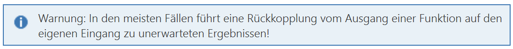</kbd>

<!-- DOC -->
#### **Statuskanal**

<!-- DOC Skip="1" -->
Erscheint nur, wenn der interne Eingang vom anderen Statuskanal versorgt wird.

Hier kann der Statuskanal gewählt werden, dessen Wert als Eingang genutzt werden soll. Der Wert ist EIN, wenn die zugehörige LED eingeschaltet ist (sei es dauer-an, blinkend, pulsierend etc.). Er ist AUS, wenn die zugehörige LED aus ist (wobei ein aus beim Blinken z.B. nicht als AUS zählt).

<!-- DOC -->
### **Internen Eingang als Trigger nutzen (ist immer logisch EIN)**

Man kann einen internen Eingang auch als reinen Trigger nutzen, unabhängig von seinem Wert. Dies entspricht genau dem Eingangskonverter eines Normalen (KO-Basierten) Eingangs.

Wird diese Funktion gewählt, wird jeder Wert, den der Eingang bekommt, in ein EIN gewandelt und damit die Logik getriggert. Falls die Logik ein AUS erfordert, kann man den Eingang invertiert aktivieren.  

## **Schaltzeiten: unbenannt**

<!-- DOC Skip="2" -->
Erscheint nur, wenn die Logik-Operation auf ZEITSCHALTUHR gestellt wurde.

Auf dieser Seite können die Schaltpunkte für eine Zeitschaltuhr eingegeben werden. Die Einstellmöglichkeiten sind bei jedem Logikkanal gleich, so dass nur ein Kanal beschrieben wird.

<kbd>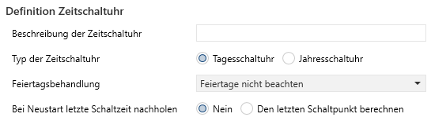</kbd>

## Definition Zeitschaltuhr

In diesem Bereich wird das generelle Verhalten der Zeitschaltuhr definiert.

<!-- DOC -->
### **Beschreibung der Zeitschaltuhr**

Diese Feld erlaubt eine kurze Beschreibung, wozu diese Zeitschaltuhr verwendet wird. Es hat keinen Einfluss auf die Funktion und dient rein zu Dokumentationszwecken. Der Text wird in der Seitenbeschreibung statt dem Wort "unbenannt" genommen und erlaubt so ein einfacheres wiederfinden der Zeitschaltuhr.

<!-- DOC -->
### **Typ der Zeitschaltuhr**

Es werden folgende Typen von Zeitschaltuhren unterstützt:

* Tagesschaltuhr: Erlaubt die Angabe von Wochentag, Stunde und Minute und ist somit für tägliche/wöchentliche Schaltungen gedacht. Diese Schaltuhr erlaubt 8 Schaltzeiten zu definieren.
* Jahresschaltuhr: Erlaubt die Angabe von Monat, Tag, Wochentag, Stunde und Minute und ist somit für seltener im Jahr/Monat vorkommende Schaltungen gedacht. Diese Schaltuhr erlaubt 4 Schaltzeiten zu definieren.
* Tagesschaltuhr (verbunden): Wie Tagesschaltuhr, nur werden die Schaltzeiten dieser Zeitschaltuhr mit einer anderen Zeitschaltuhr verbunden und als eine Einheit behandelt.
* Jahresschaltuhr (verbunden): Wie Jahresschaltuhr, nur werden die Schaltzeiten dieser Zeitschaltuhr mit einer anderen Zeitschaltuhr verbunden und als eine Einheit behandelt.

Verbundene Zeitschaltuhren erlauben es, mehr als die möglichen 4 oder 8 Schaltzeiten zu definieren.

<!-- DOC -->
### **Feiertagsbehandlung**

Erscheint nur bei Zeitschaltuhren, die nicht verbunden sind. Bei verbundenen Zeitschaltuhren gilt die Definition der ersten (nicht verbundenen) Zeitschaltuhr.

Über dieses Auswahlfeld kann man definieren, wie sich die Zeitschaltuhr (also alle Schaltpunkte) bei einem Feiertag verhalten.

#### **Feiertage nicht beachten**

Für diese Zeitschaltuhr ist die Feiertagsinformation nicht relevant. Ein Feiertag wird nicht beachtet, die Schaltzeitpunkte werden normal ausgeführt.

#### **An Feiertagen nicht schalten**

An einem Feiertag wird diese Zeitschaltuhr ignoriert und nicht ausgeführt. Dies ist dann eine Zeitschaltuhr für "normale" Tage.

#### **Nur an Feiertagen schalten**

Diese Zeitschaltuhr wird nur an einem Feiertag ausgeführt und nicht an anderen Tagen. Somit ist dies eine Zeitschaltuhr für reine Feiertage.

#### **Feiertage wie Sonntage behandeln**

Bei dieser Zeitschaltuhr werden die Schaltzeiten normal behandelt, an einem Feiertag werden aber die Schaltzeiten für einen Sonntag ausgeführt, unabhängig von dem Wochentag des Feiertages.

<!-- DOC -->
### **Urlaubsbehandlung**

Erscheint nur bei Zeitschaltuhren, die nicht verbunden sind und unter "Urlaub/Feiertage" die Einstellung "Urlaubsbehandlung aktivieren?" mit "Ja" eingestellt wurde. Bei verbundenen Zeitschaltuhren gilt die Definition der ersten (nicht verbundenen) Zeitschaltuhr.

Über dieses Auswahlfeld kann man definieren, wie sich die Zeitschaltuhr (also alle Schaltpunkte) bei einem Urlaubstag verhalten. Ein Urlaubstag muss dem Modul extern über das KO 4 mitgeteilt werden.

#### **Urlaub nicht beachten**

Für diese Zeitschaltuhr ist die Urlaubsinformation nicht relevant. Ein Urlaubstag wird nicht beachtet, die Schaltzeitpunkte werden normal ausgeführt.

#### **Bei Urlaub nicht schalten**

An einem Urlaubstag wird diese Zeitschaltuhr ignoriert und nicht ausgeführt. Dies ist dann eine Zeitschaltuhr für "normale" Tage.

#### **Nur bei Urlaub schalten**

Diese Zeitschaltuhr wird nur an einem Urlaubstag ausgeführt und nicht an anderen Tagen. Somit ist dies eine Zeitschaltuhr für reine Urlaubstage.

#### **Urlaub wie Sonntag behandeln**

Bei dieser Zeitschaltuhr werden die Schaltzeiten normal behandelt, an einem Urlaubstag werden aber die Schaltzeiten für einen Sonntag ausgeführt, unabhängig vom Wochentag des Urlaubstages.

<!-- DOC -->
### **Bei Neustart letzte Schaltzeit nachholen**

Erscheint nur bei Zeitschaltuhren, die nicht verbunden sind und die Urlaubsbehandlung aktiviert haben. Bei verbundenen Zeitschaltuhren gilt die Definition der ersten (nicht verbundenen) Zeitschaltuhr.

Nach einem Neustart des Moduls kann die letzte Schaltzeit erneut ausgeführt werden. Sobald das Datum und die Uhrzeit erstmals über den Bus gesetzt worden sind, wird nach der spätesten Schaltzeit gesucht, die noch vor dem aktuellen Datum/Uhrzeit liegt. Dieser Schaltzeitpunkt wird dann ausgeführt.

Da eine Nachberechnung aller Schaltzeiten für bis zu 99 Zeitschaltuhren inklusive Feiertagsbehandlung direkt nach dem ersten Setzen der Zeit über den Bus sehr lange dauern würde und in dieser Zeit (mehrere Sekunden) die Funktion des Moduls gestört wäre, wird die Nachberechnung der Schaltzeiten durch einen Nebenprozess während der normalen Funktion des Moduls durchgeführt. Der Nebenprozess funktioniert in kleinen Schritten, die wenig Rechenzeit kosten und die Normalfunktion nicht behindern. Als Konsequenz kann es etwas dauern, bis der entsprechende nachberechnete Zeitschaltpunkt nachgeholt wird.

Wie lange es dauert, bis ein nachberechneter Zeitschaltpunkt nachgeholt wird, hängt wiederum vom Zeitschaltpunkt selbst ab.

Der Nebenprozess wird pro Sekunde zweimal aufgerufen und geht dabei jeweils einen weiteren Tag zurück, berechnet für diesen Tag die Feiertage und prüft für jede Zeitschaltuhr, die bisher noch keinen definierten Ausgangswert hat (sie könnte ja schon von sich aus im Rahmen der Normalfunktion geschaltet haben), ob diese Zeitschaltuhr an diesem Tag schalten sollte. Wenn ja, dann schaltet diese Zeitschaltuhr mit dem für diesen Tag zeitlich spätesten Wert. Damit ist der zeitlich späteste Schaltpunkt vor dem Modulneustart gegeben.

Obiges bedeutet, dass der Nebenprozess für Tagesschaltuhren, die auch Wochentage enthalten können, bis zu 3 Sekunden benötigen kann, um eine (Tages-)Schaltzeit nachzuholen, da er 2 Tage pro Sekunde zurückgeht.

Bei Jahresschaltuhren wird der späteste Schaltzeitpunkt, der nachberechnet wurde, 366 / 2 = 183 Sekunden nach dem ersten setzen der Zeit über den Bus erreicht, also etwa 3 Minuten nach dem Neustart. Dies ist ein theoretischer Wert, da in diesem Fall der Schaltzeitpunkt vor einem Jahr liegen müsste und sich zwischendurch nicht geändert hat. Da man meistens aber einen Schaltzeitpunkt für EIN und einen für AUS definiert, wird bei Jahresschaltzeiten wahrscheinlich einer der Schaltzeitpunkte bereits früher erreicht.

Der Nebenprozess beendet sich selbst, sobald alle Zeitschaltuhren einen definierten Ausgangswert haben.

> **Achtung:** Zeitschaltuhren, die Urlaubstage berücksichtigen, können bei der Nachberechnung der Zeitschaltpunkte nicht mit einbezogen werden, da die Information "Urlaubstag" per KO von extern dem Modul über den Bus gemeldet wird und somit nicht für die (historische) Nachberechnung zur Verfügung steht. Somit werden bei der Nachberechnung alle Zeitschaltuhren mit einer anderen Angabe als "Urlaub nicht beachten" ignoriert.

<!-- DOC -->
### **Schaltzeiten fortsetzen von Kanal**

Wenn bei einem Schaltkanal nicht genügend Schaltzeiten vorhanden sind oder man Jahres- und Tagesschaltuhren kombinieren möchte, dann kann man mehrere Zeitschaltuhr-Kanäle zu einem verbinden. Es werden dann alle Aktionen über die erste (unverbundene) Zeitschaltuhr abgehandelt. Die verbundene Zeitschaltuhr dient nur dazu, zusätzliche Schaltzeiten anzugeben. 

Als Verbindung wird die Nummer des Schaltzeituhr-Kanals angegeben, der fortgesetzt werden soll. Es können auch mehrere Kanäle verbunden werden, dies muss dann immer als Fortsetzung der Fortsetzung formuliert werden, also 3 ist die Fortsetzung von 10, 5 die Fortsetzung von 3, 15 die Fortsetzung von 5 usw.

Die Verbindung kann absolut oder relativ formuliert werden.

<!-- DOC -->
#### **Art der Verbindung**

Man kann die Angabe absolut machen (direkt die Nummer des Logikkanals) oder relativ (wie viele Kanäle vor- oder zurückzuspringen sind).

<!-- DOC -->
#### **Relative Angabe**

Als Eingabe wird Anzahl der Kanäle erwartet, die vor- oder zurückzuspringen sind. Dabei meint eine negative Zahl ein zurückspringen Richtung 1, eine positive Zahl ein Vorspringen Richtung 99.

<!-- DOC -->
#### **Absolute Ausgabe**

Bei relativer Angabe wird die absolute Nummer des Kanals ausgerechnet, dessen Zeitschaltuhr fortgesetzt werden soll.

<!-- DOC -->
#### **Absolute Angabe**

Als Eingabe wird die Nummer des Logikkanals erwartet, dessen Zeitschaltuhr fortgesetzt werden soll.

## **Schaltzeitpunkte Tagesschaltuhr**

Schaltzeitpunkte werden in einer Tabelle definiert, eine Zeile per Schaltpunkt. Im folgenden werden nur die Eingaben einer Zeile erklärt, da alle Zeilen gleich definiert werden.

Im folgenden werden die Spalten der Tagesschaltuhr beschrieben.

<kbd>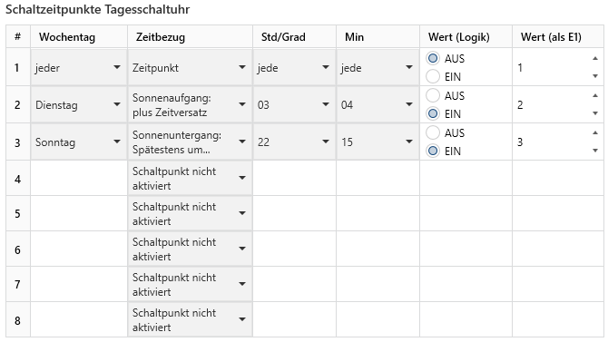</kbd>

<!-- DOC HelpContext="Zeitbezug" -->
### **Spalte: Zeitbezug**

Ist sowohl bei Tagesschaltuhr und Jahresschaltuhr vorhanden.

Hier wird angegeben, wie eine Zeitangabe interpretiert werden soll. Je nach Einstellung dieses Feldes wirken sich Zeitangaben in den Spalten Stunde und Minute unterschiedlich aus.

#### **Schaltpunkt nicht aktiviert**

Dieser Schaltpunkt ist nicht aktiv und wird nicht ausgewertet.

#### **Zeitpunkt**

Es wird ein Zeitpunkt bestimmt, zu dem geschaltet werden soll. Die Angabe des Zeitpunktes erfolgt über die Spalten Stunde und Minute.

#### **Sonnenaufgang: plus Zeitversatz**

Der Schaltzeitpunkt ist der Sonnenaufgang, zu dem die Zeitangabe, die in den Spalten Stunde und Minute steht, hinzuaddiert wird. Es wird somit um die angegebenen Stunden und Minuten nach Sonnenaufgang geschaltet. 

#### **Sonnenaufgang: minus Zeitversatz**

Der Schaltzeitpunkt ist der Sonnenaufgang, von dem die Zeitangabe, die in den Spalten Stunde und Minute steht, abgezogen wird. Es wird somit um die angegebenen Stunden und Minuten vor Sonnenaufgang geschaltet. Falls der Zeitversatz zu einer Zeit vor Mitternacht führt, wird nicht geschaltet. Man muss sich somit beim Zeitversatz innerhalb des selben Tages bewegen.

#### **Sonnenaufgang: Frühestens um**

Der Schaltzeitpunkt ist der Sonnenaufgang oder die Uhrzeit, die in den Spalten Stunde und Minute steht. Geht die Sonne vor der angegebenen Uhrzeit auf, wird erst um die angegebene Uhrzeit geschaltet, sonst erst beim Sonnenaufgang. Es wird somit beim Sonnenaufgang, aber nicht früher als die angegebene Uhrzeit geschaltet.

#### **Sonnenaufgang: Spätestens um**

Der Schaltzeitpunkt ist der Sonnenaufgang oder die Uhrzeit, die in den Spalten Stunde und Minute steht. Geht die Sonne nach der angegebenen Uhrzeit auf, wird bereits um die angegebene Uhrzeit geschaltet, sonst schon beim Sonnenaufgang. Es wird somit beim Sonnenaufgang, aber nicht später als die angegebene Uhrzeit geschaltet.

#### **Sonnenaufgang: Über Horizont**

Der Schaltzeitpunkt ist morgens, sobald die Sonne den Winkel über dem Horizont erreicht hat, der angegeben worden ist. Der Winkel kann in Grad und Minuten angegeben werden. Der Wertebereich geht von 0° bis 63°59'.

#### **Sonnenaufgang: Unter Horizont**

Der Schaltzeitpunkt ist morgens, sobald die Sonne den Winkel unter dem Horizont erreicht hat, der angegeben worden ist. Der Winkel kann in Grad und Minuten angegeben werden. Der Wertebereich geht von 0° bis 63°59'.

#### **Sonnenuntergang: plus Zeitversatz**

Der Schaltzeitpunkt ist der Sonnenuntergang, zu dem die Zeitangabe, die in den Spalten Stunde und Minute steht, hinzuaddiert wird. Es wird somit um die angegebenen Stunden und Minuten nach Sonnenuntergang geschaltet. Falls der Zeitversatz zu einer Zeit nach Mitternacht führt, wird nicht geschaltet. Man muss sich somit beim Zeitversatz innerhalb des selben Tages bewegen.

#### **Sonnenuntergang: minus Zeitversatz**

Der Schaltzeitpunkt ist der Sonnenuntergang, von dem die Zeitangabe, die in den Spalten Stunde und Minute steht, abgezogen wird. Es wird somit um die angegebenen Stunden und Minuten vor Sonnenuntergang geschaltet.

#### **Sonnenuntergang: Frühestens um**

Der Schaltzeitpunkt ist der Sonnenuntergang oder die Uhrzeit, die in den Spalten Stunde und Minute steht. Geht die Sonne vor der angegebenen Uhrzeit unter, wird erst um die angegebene Uhrzeit geschaltet, sonst erst beim Sonnenuntergang. Es wird somit beim Sonnenuntergang, aber nicht früher als die angegebene Uhrzeit geschaltet.

#### **Sonnenuntergang: Spätestens um

Der Schaltzeitpunkt ist der Sonnenuntergang oder die Uhrzeit, die in den Spalten Stunde und Minute steht. Geht die Sonne nach der angegebenen Uhrzeit unter, wird bereits um die angegebene Uhrzeit geschaltet, sonst schon beim Sonnenuntergang. Es wird somit beim Sonnenuntergang, aber nicht später als die angegebene Uhrzeit geschaltet.

#### **Sonnenuntergang: Über Horizont**

Der Schaltzeitpunkt ist abends, sobald die Sonne den Winkel über dem Horizont erreicht hat, der angegeben worden ist. Der Winkel kann in Grad und Minuten angegeben werden. Der Wertebereich geht von 0° bis 63°59'.

#### **Sonnenuntergang: Unter Horizont**

Der Schaltzeitpunkt ist abends, sobald die Sonne den Winkel unter dem Horizont erreicht hat, der angegeben worden ist. Der Winkel kann in Grad und Minuten angegeben werden. Der Wertebereich geht von 0° bis 63°59'.

<!-- DOC HelpContext="Stunde" -->
### **Spalte: Stunde/Grad**

Ist sowohl bei Tagesschaltuhr und Jahresschaltuhr vorhanden.

In dieser Spalte werden Stunden eingestellt, entweder als absolute Uhrzeit oder als Versatz zum Sonnenauf- oder -untergang.

Wird hier der Wert "jede" ausgewählt, wird der Schaltpunkt jede Stunde ausgeführt, natürlich unter Berücksichtigung der angegebenen Minuten. So kann man stündlich wiederkehrende Aktionen definieren. Der Wert "jede" steht nur zur Verfügung, wenn der Zeitbezug auf "Zeitpunkt" steht.

Bei Sonnenstandsangaben (Winkel über/unter dem Horizont) wird in dieser Spalte der Winkel angegeben.

<!-- DOC HelpContext="Sonnen auf-/untergang" -->
<!-- DOCCONTENT 
In dieser Spalte werden Stunden eingestellt als Versatz zum Sonnenauf- oder -untergang.
DOCCONTENT -->

<!-- DOC HelpContext="Grad" -->
<!-- DOCCONTENT 
In dieser Spalte wird der Sonnenwinkel über oder unter dem Horizont eingestellt als Winkel in Grad.
DOCCONTENT -->

<!-- DOC HelpContext="Minute" -->
### **Spalte: Minute**

Ist sowohl bei Tagesschaltuhr und Jahresschaltuhr vorhanden.

In dieser Spalte werden Minuten eingestellt, entweder als absolute Uhrzeit oder als Versatz zum Sonnenauf- oder -untergang.

Wird hier der Wert "jede" ausgewählt, wird der Schaltpunkt jede Minute ausgeführt, natürlich unter Berücksichtigung der angegebenen Stunde. So kann man minütlich wiederkehrende Aktionen definieren. Der Wert "jede" steht nur zur Verfügung, wenn der Zeitbezug auf "Zeitpunkt" steht.

Bei Sonnenstandsangaben (Winkel über/unter dem Horizont) wird in dieser Spalte der Winkelbruchteil in (Winkel-)Minuten angegeben.

<!-- DOC HelpContext="Schaltwert" -->
### **Spalte: Wert (Logik)**

Ist sowohl bei Tagesschaltuhr und Jahresschaltuhr vorhanden.

In dieser Spalte wird der Wert eingestellt, den der Schaltpunkt an den Ausgang senden soll. Dieser (rein boolesche) Wert durchläuft dann das normale Ausgangs-Processing des Logikkanals und steht am Ausgangs-KO zur Verfügung.

<!-- DOC HelpContext="Zahlenwert" -->
### **Spalte: Wert (als E1)**

Ist sowohl bei Tagesschaltuhr und Jahresschaltuhr vorhanden.

In dieser Spalte wird der Wert eingestellt, den der Schaltpunkt als Zahl repräsentieren soll. Es ist nur 1 Byte (0-255) möglich. 
Im Ausgangskonverter kann der Wert so angesprochen werden wie bei normalen Logiken der Wert vom Eingang E1. Man kann diesen Wert also über den Ausgang senden lassen, in Formeln verrechnen oder in Benutzerformeln als E1 nutzen.

<!-- DOC HelpContext="Wochentag" -->
### **Spalte: Wochentag**

Ist nur bei der Tagesschaltuhr vorhanden.

In dieser Spalte wird der Wochentag eingestellt, an dem der Schaltpunkt ausgeführt werden soll. Es kann nur genau ein Wochentag ausgewählt werden.

Wird hier der Wert "jeder" ausgewählt, wird der Schaltpunkt an jedem Wochentag ausgeführt, natürlich unter Berücksichtigung der restlichen Angaben. So kann man täglich wiederkehrende Aktionen definieren.

## Schaltzeitpunkte Jahresschaltuhr

Im folgenden werden die Spalten der Jahresschaltuhr beschrieben.

<kbd>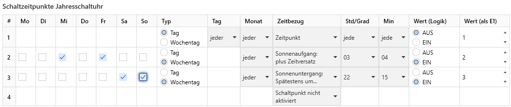</kbd>

Bei der Jahresschaltuhr sind fast alle Spalten der Tagesschaltuhr vorhanden. Im folgenden werden die zusätzlichen Spalten der Jahresschaltuhr beschrieben.

### **Spalte: Typ**

Ist nur bei der Jahresschaltuhr vorhanden.

Bestimmt, ob der Schaltpunkt an einem bestimmten Tag erfolgt, oder ob mehrere Wochentage angegeben werden können. Wird "Tag" ausgewählt, kann man in der Spalte Tag einen bestimmten Tag angeben. Wird "Wochentag" ausgewählt, kann man in den Spalten "Mo" (Montag) bis "So" (Sonntag) die Wochentage auswählen, an den geschaltet wird.

<!-- DOC HelpContext="Wochentage" -->
### **Spalten: Mo, Di, Mi, Do, Fr, Sa, So**

Sind nur bei der Jahresschaltuhr vorhanden.

Die Spalten sind nur eingabebereit, wenn in der Spalte Typ der Wert "Wochentag" ausgewählt wurde.

Man kann die Wochentage auswählen, an den für diesen Schaltpunkt geschaltet werden soll, natürlich unter Berücksichtigung der restlichen Angaben. So kann man Aktionen an bestimmten Wochentagen definieren.

<!-- DOC HelpContext="Tag" -->
### **Spalte: Tag**

Ist nur bei der Jahresschaltuhr vorhanden.

Die Spalte ist nur eingabebereit, wenn in der Spalte Typ der Wert "Tag" ausgewählt wurde.

In dieser Spalte wird der Tag eingestellt, an dem geschaltet werden soll.

Wird hier der Wert "jeder" ausgewählt, wird der Schaltpunkt jeden Tag ausgeführt, natürlich unter Berücksichtigung des angegebenen Monats. So kann man täglich wiederkehrende Aktionen definieren.

<!-- DOC HelpContext="Monat" -->
### **Spalte: Monat**

Ist nur bei der Jahresschaltuhr vorhanden.

In dieser Spalte wird der Monat eingestellt, an dem geschaltet werden soll.

Wird hier der Wert "jeder" ausgewählt, wird der Schaltpunkt jeden Monat ausgeführt, natürlich unter Berücksichtigung des angegebenen Tages. So kann man Monatlich wiederkehrende Aktionen definieren.

## **Signalverarbeitung**

Zwischen dem Ausgang der Logik-Operation und dem physikalischen Ausgang des Logikkanals (als Kommunikationsobjekt, um KNX-Telegramme zu verschicken) können Funktionsblöcke aktiviert werden (dargestellt im Kapitel Logikblöcke), die das Ausgangssignal beeinflussen.

In der Grundeinstellung sind alle Funktionsblöcke deaktiviert und die Signale der logischen Operation gelangen direkt zum physikalischen Ausgang.

## Treppenlicht

<kbd>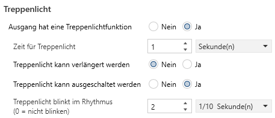</kbd>

Mit den Einstellungen kann ein Treppenlicht mit Blinkfunktion konfiguriert werden. Ein Treppenlicht erzeugt, sobald es durch ein EIN-Signal getriggert wird, ein EIN-Signal, dass nach einer gewissen Zeit zu einem AUS-Signal wird. Man kann bestimmen, ob ein weiterer Trigger mit einem EIN-Signal dazu führt, dass die Treppenlichtzeit erneut anfängt und somit der Trigger das Treppenlicht verlängert. Ferner kann man festlegen, ob ein weiterer Trigger mit einem AUS-Signal das Treppenlicht ausschaltet oder nicht.

Solange das Treppenlicht aktiv ist, kann ein Blinkmodul den Ausgang des Funktionsmoduls in einem festgelegten Intervall EIN- und AUSschalten.

<!-- DOC -->
### **Ausgang hat eine Treppenlichtfunktion**

Wird hier ein "Ja" ausgewählt, erscheinen die Parameter für die Treppenlichtfunktion.

<!-- DOC -->
#### **Zeit für Treppenlicht**

Hier gibt man die Zeit an, die das Treppenlicht eingeschaltet bleiben soll.

<!-- DOC -->
#### **Treppenlicht kann verlängert werden**

Wählt man hier "Ja", führt ein erneutes EIN-Signal am Eingang des Funktionsblocks zum erneuten Anlaufen der Zeitzählung bei 0. Somit wird die Treppenlichtzeit zurückgesetzt und beginnt von neuem, die Treppenlichtzeit wurde somit verlängert.

<!-- DOC -->
#### **Treppenlicht kann ausgeschaltet werden**

Wählt man hier ein "Ja", führt ein AUS-Signal am Eingang des Funktionsmoduls zum sofortigen Beenden des Treppenlichts und einem AUS-Signal am Ausgang des Funktionsmoduls.

Ist ein "Nein" ausgewählt, wird ein AUS-Signal am Eingang des Funktionsmoduls ignoriert und hat keine Auswirkungen, solange das Treppenlicht eingeschaltet ist.

<!-- DOC -->
#### **Treppenlicht blinkt im Rhythmus**

Bei einer Eingabe einer Zahl größer 0 wird, solange das Treppenlicht eingeschaltet ist, in dem angegebenen Takt der Ausgang des Funktionsmoduls abwechselnd ein EIN- und ein AUS-Signal erzeugt. Ist der Takt z.B. 2 Sekunden, wird nach 2 Sekunden von EIN auf AUS gewechselt, nach wieder 2 Sekunden dann von AUS auf EIN und so fort. Sobald das Treppenlicht beendet ist, sei es durch den Ablauf der Treppenlichtzeit oder durch ein AUS-Signal von Außen, wird das Blinken beendet und ein finales AUS-Signal gesendet.

Bei der Eingabe einer 0 wird die Blinkfunktion deaktiviert.

Der Bildschirmausschnitt oben zeigt ein Beispiel für ein 3-maliges Blinken in einer Sekunde, wobei die einzelnen Blinkzyklen nur 0,2 Sekunden dauern. Wenn man den Ausgang mit einem Buzzer verbindet, erhält man eine akustische Rückmeldung (3 mal Piep) für z.B. einen Fehlerfall.

## Ein-/Ausschaltverzögerung

<kbd>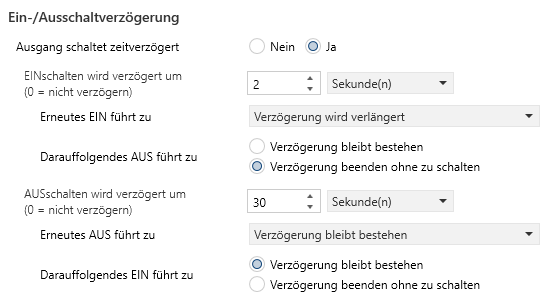</kbd>

Jedes EIN- oder AUS-Signal, dass bei diesem Funktionsblock ankommt, kann verzögert werden, mit unterschiedlichen Zeiten für die EINschalt- und AUSschaltverzögerung. Die kleinste Auflösung sind 1/10 Sekunden, um auch kurze Verzögerungen erreichen zu können.

<!-- DOC -->
### **Ausgang schaltet zeitverzögert**

Wird hier ein "Ja" ausgewählt, kann man im Folgenden angeben, was mit folgenden EIN- bzw. AUS-Signalen passieren soll.

##<!-- DOC -->
## **EINschalten wird verzögert um**

Wird hier eine Zahl größer 0 eingegeben, wird das EIN-Signal entsprechend der eingestellten Zeit verzögert am Ausgang des Funktionsmoduls ausgegeben.

Wird eine 0 eingegeben, findet keine Verzögerung statt.

<!-- DOC -->
#### **Erneutes EIN führt zu**

Dieses Auswahlfeld erscheint nur, wenn eine EINschaltverzögerung stattfinden soll.

Während das Funktionsmodul ein EIN-Signal verzögert, muss definiert werden, wie ein weiteres EIN-Signal während der Verzögerung behandelt werden soll.

##### **Verzögerung bleibt bestehen**

Während eine Verzögerung von einem EIN-Signal aktiv ist, werden darauffolgende EIN-Signale ignoriert. Nur das erste EIN-Signal wird verzögert und nach der festgelegten Zeit weitergesendet.

##### **Verzögerung wird verlängert**

Während eine Verzögerung von einem EIN-Signal aktiv ist, führt ein darauffolgendes EIN-Signal zum Neustart der Verzögerungszeit. Somit läuft die Verzögerung erneut an. Dies hat zur Folge, dass das letzte EIN-Signal verzögert weitergeleitet wird und faktisch alle vorhergehenden ignoriert werden.

##### **Sofort schalten ohne Verzögerung**

Kommt während eine Verzögerung eines EIN-Signals aktiv ist ein weiteres EIN-Signal, wird die Verzögerung sofort beendet und das zweite EIN-Signal sofort weitergeleitet. So kann man eine Aktion, die automatisiert verzögert laufen soll, durch ein manuelles Signal sofort beginnen lassen.

<!-- DOC -->
#### **Darauffolgendes AUS führt zu**

Dieses Auswahlfeld erscheint nur, wenn eine EINschaltverzögerung stattfinden soll.

Während das Funktionsmodul ein EIN-Signal verzögert, muss definiert werden, wie ein weiteres AUS-Signal während der Verzögerung behandelt werden soll.

##### **Verzögerung bleibt bestehen**

Während eine Verzögerung von einem EIN-Signal aktiv ist, führt ein darauffolgendes AUS-Signal zu keiner Reaktion, es wird ignoriert. Das EIN-Signal wird nach der eingestellten Verzögerungszeit gesendet.

##### **Verzögerung beenden ohne zu schalten**

Kommt während eine Verzögerung eines EIN-Signals aktiv ist ein AUS-Signal, wird die Verzögerung beendet und das EIN-Signal ignoriert. Auch das AUS-Signal wird nicht gesendet, da der Ausgang des Funktionsmoduls ja bereits aus war.

<!-- DOC -->
#### **AUSschalten wird verzögert um**

Wird hier eine Zahl größer 0 eingegeben, wird das AUS-Signal entsprechend der eingestellten Zeit verzögert am Ausgang des Funktionsmoduls ausgegeben.

Wird eine 0 eingegeben, findet keine Verzögerung statt.

<!-- DOC -->
#### **Erneutes AUS führt zu**

Dieses Auswahlfeld erscheint nur, wenn eine AUSschaltverzögerung stattfinden soll.

Während das Funktionsmodul ein AUS-Signal verzögert, muss definiert werden, wie ein weiteres AUS-Signal während der Verzögerung behandelt werden soll.

##### **Verzögerung bleibt bestehen**

Während eine Verzögerung von einem AUS-Signal aktiv ist, werden darauffolgende AUS-Signale ignoriert. Nur das erste AUS-Signal wird verzögert und nach der festgelegten Zeit weitergesendet.

##### **Verzögerung wird verlängert**

Während eine Verzögerung von einem AUS-Signal aktiv ist, führt ein darauffolgendes AUS-Signal zum Neustart der Verzögerungszeit. Somit läuft die Verzögerung erneut an. Dies hat zur Folge, dass das letzte AUS-Signal verzögert weitergeleitet wird und faktisch alle vorhergehenden ignoriert werden.

##### **Sofort schalten ohne Verzögerung**

Kommt während eine Verzögerung eines AUS-Signals aktiv ist ein weiteres AUS-Signal, wird die Verzögerung sofort beendet und das zweite AUS-Signal sofort weitergeleitet. So kann man eine Aktion, die automatisiert verzögert ausgeschaltet werden soll, durch ein manuelles Signal sofort beenden.

<!-- DOC -->
#### **Darauffolgendes EIN führt zu**

Dieses Auswahlfeld erscheint nur, wenn eine AUSschaltverzögerung stattfinden soll.

Während das Funktionsmodul ein AUS-Signal verzögert, muss definiert werden, wie ein weiteres EIN-Signal während der Verzögerung behandelt werden soll.

##### **Verzögerung bleibt bestehen**

Während eine Verzögerung von einem AUS-Signal aktiv ist, führt ein darauffolgendes EIN-Signal zu keiner Reaktion, es wird ignoriert. Das AUS-Signal wird nach der eingestellten Verzögerungszeit gesendet.

##### **Verzögerung beenden ohne zu schalten**

Kommt während eine Verzögerung eines AUS-Signals aktiv ist ein EIN-Signal, wird die Verzögerung beendet und das AUS-Signal ignoriert. Auch das EIN-Signal wird nicht gesendet, da der Ausgang des Funktionsmoduls ja bereits an war.

## Wiederholungsfilter

<kbd></kbd>

Durch verschiedene Kombinationen von logischer Operation, Treppenlicht, Blinken, EIN- und AUSschaltverzögerung kann es passieren, dass mehrere EIN- oder AUS-Signale hintereinander gesendet werden und zu ungewollten Effekten auf dem KNX-Bus oder bei weiteren Logikkanälen führen.

<!-- DOC -->
### **Wiederholungsfilter**

Das Auswahlfeld erlaubt das Ausfiltern von unerwünschten Wiederholungen.

#### **Alle Wiederholungen durchlassen**

Es wird nichts gefiltert, sowohl mehrfach aufeinanderfolgende EIN-Signale wie auch mehrfach aufeinanderfolgende AUS-Signale werden durchgelassen und stehen auf Ausgang des Funktionsmoduls zur Verfügung.

#### **Nur EIN-Wiederholungen durchlassen**

Mehrfach aufeinanderfolgende EIN-Signale werden durchgelassen. Wenn mehrere AUS-Signale aufeinanderfolgen, wird nur das erste AUS-Signal zum Ausgang des Funktionsmoduls durchgelassen.

#### **Nur AUS-Wiederholungen durchlassen**

Mehrfach aufeinanderfolgende AUS-Signale werden durchgelassen. Wenn mehrere EIN-Signale aufeinanderfolgen, wird nur das erste EIN-Signal zum Ausgang des Funktionsmoduls durchgelassen.

#### **Keine Wiederholungen durchlassen**

Alle Wiederholungen von EIN- oder AUS-Signalen werden ignoriert, es wird immer nur das erste EIN- oder AUS-Signal durchgelassen. Somit stehen am Ausgang des Funktionsmoduls effektiv nur Signalwechsel zur Verfügung.

## Zyklisch senden

<kbd>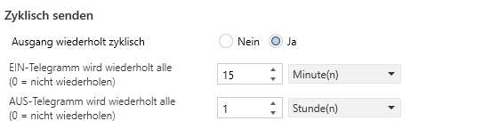</kbd>

Nachdem durch den Wiederholungsfilter unbeabsichtigte Wiederholungen ausgefiltert wurden, werden in diesem Funktionsblock beabsichtigte Wiederholungen definiert.

<!-- DOC -->
### **Ausgang wiederholt zyklisch**

Wird hier ein "Ja" ausgewählt, kann man im Folgenden angeben, in welchen Zeitintervallen die EIN- bzw. AUS-Signale wiederholt werden sollen.

Man kann sowohl das EIN- wie auch das AUS-Signal in unterschiedlichen Zeitintervallen wiederholen lassen.

> **Achtung:** Auch wenn es möglich ist, eine Zeitbasis von 1/10 Sekunden zu wählen, sollte man vorsichtig mit Wiederholungsintervallen unter 1 Minute umgehen, da man damit sehr leicht den KNX-Bus lahmlegen kann.

Man kann natürlich auch nur das EIN- oder das AUS-Signal wiederholen lassen.

In dem oben dargestellten Bildschirmausschnitt würde das EIN-Signal alle 15 Minuten wiederholt werden, das AUS-Signal jede Stunde.

<!-- DOC -->
#### **EIN-Telegramm wird wiederholt alle**

Das Feld erscheint nur, wenn bei "Ausgang wiederholt zyklisch" ein "Ja" ausgewählt wurde.

Die hier eingegebene Zahl bestimmt das Zeitintervall, in dem dem das EIN-Signal wiederholt wird.

Die Eingabe einer 0 deaktiviert eine Wiederholung.

<!-- DOC -->
#### **AUS-Telegramm wird wiederholt alle**

Das Feld erscheint nur, wenn bei "Ausgang wiederholt zyklisch" ein "Ja" ausgewählt wurde.

Die hier eingegebene Zahl bestimmt das Zeitintervall, in dem dem das AUS-Signal wiederholt wird.

Die Eingabe einer 0 deaktiviert eine Wiederholung.

## Interne Eingänge

<kbd>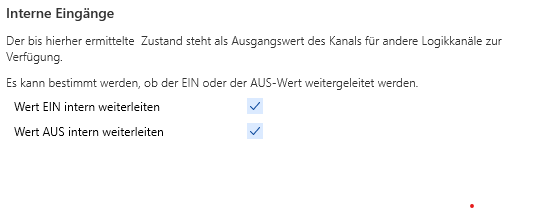</kbd>

An dieser Stelle endet die binäre Verarbeitung. Alle hier ankommenden EIN- oder AUS-Signale werden, sofern verbunden, an die entsprechenden internen Eingänge weitergeleitet und triggern dort die entsprechenden logischen Operationen.

Mit den beiden Auswahlfeldern kann man bestimmen, ob nur das EIN-Signal, nur das AUS-Signal oder das EIN- und das AUS-Signal an die verbundenen internen Eingänge weitergeleitet werden.

<!-- DOC -->
#### **Wert EIN intern weiterleiten**

Wird dieses Auswahlfeld gewählt, wird ein für diesen Ausgang ermitteltes EIN-Signal an alle internen Eingänge weitergeleitet, die mit diesem Ausgang verbunden sind.

<!-- DOC -->
#### **Wert AUS intern weiterleiten**

Wird dieses Auswahlfeld gewählt, wird ein für diesen Ausgang ermitteltes AUS-Signal an alle internen Eingänge weitergeleitet, die mit diesem Ausgang verbunden sind.

## **Ausgang**

## Definition Ausgang

Im folgenden Werden die Ausgangskonverter und deren Einstellungsmöglichkeiten beschrieben.

<kbd>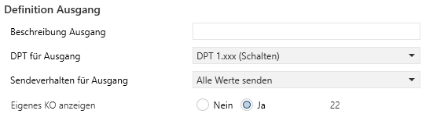</kbd>

<!-- DOC -->
### **Beschreibung Ausgang**

Diese Einstellung hat keine funktionale Auswirkung, erlaubt es aber, dem Ausgang einen Text zu geben, um ihn einfacher zu finden.

Der eingegebene Text erscheint auf dem Ausgang-Tag des Logikkanals und als Name des Kommunikationsobjekts, das diesem Ausgang zugeordnet ist.

<!-- DOC -->
### **DPT für Ausgang**

Dieses Auswahlfeld legt den DPT für den Ausgang fest. Unterstützt werden:

* DPT 1: binärer Wert
* DPT 2: Zwangsführung
* DPT 3: Dimmen
* DPT 5: vorzeichenlose Zahl (0 bis 255)
* DPT 5.001: Prozentzahl (0 bis 100)
* DPT 6: vorzeichenbehaftete Zahl (-128 bis 127)
* DPT 7: vorzeichenlose Zahl (0 bis 65.535)
* DPT 8: vorzeichenbehaftete Zahl (-32.768 bis 32.767)
* DPT 9: Gleitkommawert (-670.760,96 bis 670.760,96)
* DPT 12: vorzeichenlose Zahl (0 bis 4294967296)
* DPT 13: vorzeichenbehaftete Zahl (-2.147.483.648 bis 2.147.483.647)
* DPT 14: Gleitkommawert (-1.000.000.000.000 bis 1.000.000.000.000)
* DPT 16: Text (bis 14 Byte)
* DPT 17: Szenen Nummer (1-64)
* DPT 232: RGB-Wert (3*8 Bit Rot-, Grün-, Blauwert)

Je nach gewähltem DPT unterscheiden sich die folgenden Felder leicht. Es werden erst mal die Parameter beschrieben, die für alle DPT passen und anschließend die DPT-spezifischen.

<!-- DOC -->
### **Sendeverhalten für Ausgang**

In dieser Auswahlbox kann für den Ausgangskonverter festgelegt werden, ob das wiederholte Senden des gleichen Wertes erlaubt ist oder nicht. 

<!-- DOC Skip="1" -->
Dies darf nicht mit dem [Wiederholungsfilter](#wiederholungsfilter) verwechselt werden.
<!-- DOCCONTENT 
Dies darf nicht mit dem Wiederholungsfilter verwechselt werden.
DOCCONTENT -->

Der Wiederholungsfilter arbeitet mit den logischen Werten EIN und AUS, die in der Logikverarbeitung verwendet werden.
Der Ausgangskonverter übersetzt den logischen Wert z.B. in das Ergebnis einer Formel, die aus den beiden Eingangswerten berechnet wird, also einer Zahl eines anderen DPT. Das Sendeverhalten arbeitet mit dem zuletzt durch das KO gesendeten Wert und vergleicht diesen mit dem neu zu sendenden Wert. Je nachdem, wie das Sendeverhalten eingestellt ist, wird dann gesendet oder nicht.

#### **Alle Werte senden**

Jeder Wert wird auf den Bus gesendet, auch wenn er gleich dem zuletzt gesendetem Wert ist. Das ist das Standardverhalten.

#### **Nur geänderte Werte senden**

Der neu zu sendende Wert wird passend zum DPT des KO gewandelt und mit dem bisherigen KO-Wert vergleichen. Nur wenn sich die Werte unterscheiden, wird der neue Wert gesendet.

<!-- DOC -->
### **Eigenes KO anzeigen?**

Dieses Auswahlfeld ist standardmäßig vorausgewählt und führt dazu, dass das zu diesem Ausgang zugehörige Kommunikationsobjekt in der Liste der Kommunikationsobjekte angezeigt wird. Wird die Auswahl entfernt, wird auch das KO nicht mehr angezeigt. War bereits vorher eine GA diesem KO zugewiesen, fragt die ETS, ob man diese Gruppenadresse auch entfernen möchte. In der gleichen Zeile wird die Nummer des eigenen KO angezeigt und eine Zusatzinformation, falls es nicht in der KO-Liste erscheint.

In früheren Versionen vom Logikmodul wurde die Anzeige vom eigenen KO intern berechnet. Es gibt aber Fälle, in denen das KO als "angezeigt" berechnet wird, obwohl man es verstecken möchte (z.B. bei internen KO-Verknüpfungen). Um dieses zu erlauben, wurde die automatische Berechnung der Sichtbarkeit entfernt und eine manuelle Auswahl erlaubt.

Nach einem Update von einer älteren Version sind alle KO sichtbar, auch wenn sie vor dem Update unsichtbar waren. Hier ist eine manuelle Aktion notwendig, um die nicht benötigten KO auszublenden.

Für Spezialfunktionen wie "Gerät zurücksetzen", "Tonwiedergabe (Buzzer)" oder "RGB-LED schalten" wird kein KO benötigt und kann über diese Auswahlbox ausgeblendet werden.

## Wert für EIN

<kbd>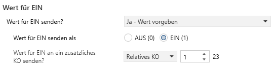</kbd>

Dieser Ausgangskonverter bestimmt, was bei einem logischen EIN-Signal auf den Bus gesendet werden soll.

<!-- DOC -->
### **Wert für EIN senden?**

<!-- DOC Skip="1" -->
<kbd>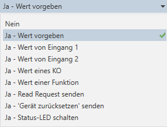</kbd>

In dieser Auswahlbox wird festgelegt, ob und was für ein Wert bei einem EIN-Signal gesendet werden soll.

#### **Nein**

Für ein EIN-Signal wird kein Wert auf den Bus gesendet. Das entspricht einem Ausgangsfilter, der alle EIN-Signale unterdrückt.

#### **Ja - Wert vorgeben**

Hier kann der Wert, der für ein EIN-Signal gesendet wird, konstant vorgegeben werden. In einem weiteren Feld kann der konstante Wert DPT gerecht eingegeben werden.

#### **Ja - Wert von Eingang 1**

Bei einem EIN-Signal wird der Wert gesendet, der am Eingang 1 anliegt. Sollte der Wert nicht den passenden DPT haben, wird er generisch gewandelt.

#### **Ja - Wert von Eingang 2**

Bei einem EIN-Signal wird der Wert gesendet, der am Eingang 2 anliegt. Sollte der Wert nicht den passenden DPT haben, wird er generisch gewandelt.

#### **Ja - Wert eines KO**
Bei einem EIN-Signal wird der Wert gesendet, der am angegebenen KO anliegt. Sollte der Wert nicht den passenden DPT haben, wird er generisch gewandelt.

Man kann somit einen Wert senden, der an irgendeinem KO des Gerätes anliegt. Es sind explizit alle KO-Nummern erlaubt, nicht nur die KO-Nummern des Logikmoduls. Einzige Einschränkung: Es sind nur DPT erlaubt, die von einem Eingang des Logikmoduls unterstützt werden.

#### **Ja - Wert einer Funktion**

Bei einem EIN-Signal wird ein berechneter Wert gesendet. In einem weiteren Feld kann die Funktion ausgewählt werden, die angewendet werden soll. Sollte der Wert nicht den passenden DPT haben, wird er generisch gewandelt.

Im Kapitel Funktionen kann nachgelesen werden, wie Funktionen und Benutzerfunktionen verwendet werden können.

#### **Ja - ReadRequest senden**

Bei einem EIN-Signal wird kein Wert auf die GA am Ausgang gesendet sondern ein Lesetelegramm. Damit kann man für Geräte, die kein zyklisches Senden unterstützen, bei Bedarf eine Abfrage eines Ausgangs erreichen.

#### **Ja - 'Gerät zurücksetzen' senden**

Bei einem EIN-Signal wird kein Wert gesendet, sondern die ETS-Funktion "Gerät zurücksetzen" an eine bestimmte PA geschickt. So kann man bestimmte Geräte überwachen und bei Bedarf zurücksetzen, ohne die ETS starten zu müssen.

In einem weiteren Feld kann die PA ausgegeben werden.

#### **Ja - Status-LED schalten**

Bei einem EIN-Signal wird kein Wert gesendet, sondern der angegebene Statuskanal angesprochen.

In weiteren Feldern wird der Status-LED Kanal angegeben und der darauf auszugebende LED-Effekt.

<!-- DOC -->
### **Wert für EIN senden als**

<!-- DOC Skip="1" -->
<kbd>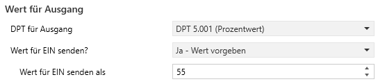</kbd>

Das Feld erscheint nur, wenn für "Wert für EIN senden" ein "Ja - Wert vorgeben" ausgewählt wurde.

Hier wird ein konstanter Wert erwartet, der zu dem Ausgewählten DPT für den Ausgang passt. Dieser eingegebene Wert wird auf den KNX-Bus bei einem EIN-Signal gesendet.

Man kann dies z.B. auch zur Invertierung nutzen, indem bei einem DPT 1 für ein EIN-Signal der Wert AUS gesendet wird und umgekehrt.

### **Nummer des Kommunikationsobjekts**

Das Feld erscheint nur, wenn für "Wert für EIN senden" ein "Ja - Wert eines KO senden" ausgewählt wurde.

Hier wird die Nummer des KO erwartet, dessen Wert übernommen und über den Ausgang des Logikkanals gesendet werden soll.

<!-- DOC -->
### **DPT des Kommunikationsobjekts**

<!-- DOC Skip="1" -->
Das Feld erscheint nur, wenn für "Wert für EIN senden" ein "Ja - Wert eines KO senden" ausgewählt wurde.

Hier wird der DPT des KO erwartet, dessen Wert übernommen und über den Ausgang des Logikkanals gesendet werden soll. Falls dieser DPT anders ist als der DPT des Ausgangs, wird generisch konvertiert. 

<!-- DOC -->
### **Physikalische Adresse**

<!-- DOC Skip="3" -->
<kbd>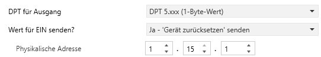</kbd>

Das Feld erscheint nur, wenn für "Wert für EIN senden" ein "Ja - 'Gerät zurücksetzen' senden" ausgewählt wurde.

Hier wird eine physikalische Adresse in der üblichen Punkt-Notation erwartet. Das KNX-Gerät mit dieser physikalischen Adresse wird zurückgesetzt.

Dies entspricht genau der Funktion "Gerät zurücksetzen" in der ETS.

<!-- DOC -->
### **Status-LED Kanal**

Hier wird angegeben, über welchen Logikstatus-Kanal die LED angesprochen wird.

<!-- DOC -->
#### **Status-LED Farbe**

<kbd>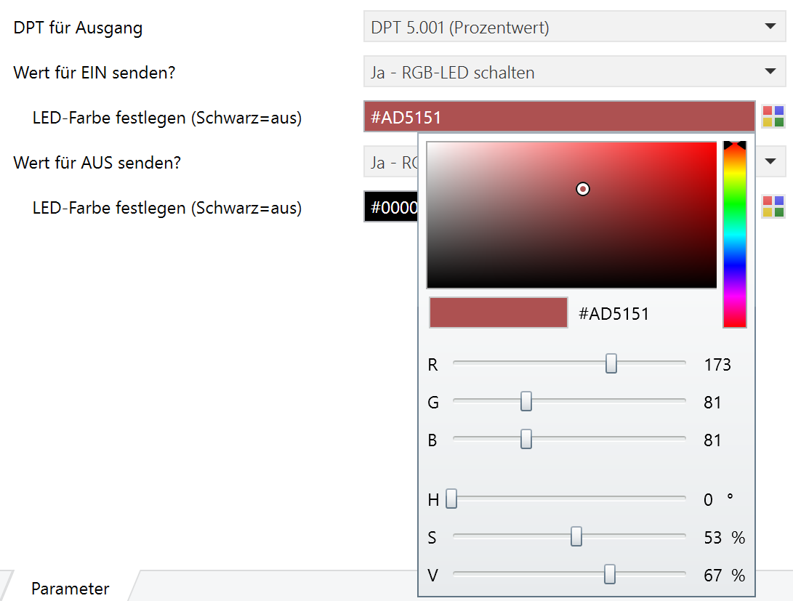</kbd>

Das Feld erscheint nur, wenn für "Wert für EIN senden" ein "Ja - Status-LED schalten" ausgewählt wurde.

Hier wird die Farbe der LED bestimmt, in der sie leuchten soll. Wird die Farbe Schwarz gewählt (#000000), geht die LED aus. Für die Auswahl der Farbe kann auch ein Farbauswahldialog verwendet werden.

<!-- DOC -->
#### **Status-LED Effekt**

Hier kann angegeben werden, wie sich die LED verhalten soll. 

* **Aus** - Die LED wird ausgeschaltet
* **Ein** - Die LED wird in der angegebenen Farbe eingeschaltet
* **Blinken** - Die LED blinkt in der angegebenen Farbe und Dauer
* **Pulsieren** - Die LED pulsiert in der angegebenen Farbe und Dauer
* **Aufblitzen** - Die LED blitzt kurz in der angegebenen Farbe auf

<!-- DOC -->
#### **Status-LED Effektdauer**

Dauer des Effekts in ms.

<!-- DOC -->
### **Wert für EIN senden (als 3 Byte RGB)**

<!-- DOC Skip="1" -->
Das Feld erscheint nur, wenn für "DPT für Ausgang" ein "DPT 323.xxx (3-Byte-Wert)" ausgewählt wurde.

Hier wird die Farbe bestimmt, deren Wert gesendet werden soll. Wird die Farbe Schwarz gewählt (#000000), entspricht das einem Ausschalt-Signal. Für die Auswahl der Farbe kann auch ein Farbauswahldialog verwendet werden.

<!-- DOC -->
### **Wert für EIN an ein zusätzliches KO senden**

<!-- DOC Skip="1" -->
<kbd></kbd>

Ein Ausgang kann seinen EIN-Wert nicht nur über das ihm zugewiesene KO senden, sondern auch zusätzlich an ein internes KO. Das bedeutet, der Wert wird in ein beliebiges KO des Gerätes (nicht nur des Logikmoduls) geschrieben, ohne dass dafür eine GA-Verknüpfung notwendig ist.

> Wichtig: Der DPT des Ziel-KO muss der gleiche sein wie der DPT des Ausgangs. Falls nicht, sind die Ergebnisse nicht abschätzbar.

#### **Eigenes KO**

Das ist der Standardwert und bedeutet, dass der Wert des Ausgangs an das KO, dass für diesen 
Ausgang vorgesehen ist, gesendet wird.

Zu Informationszwecken wird die Nummer des KO angegeben, das diesem Ausgang zugeordnet ist.

#### **Absolutes KO**

Wird absolutes KO ausgewählt, kann man die Nummer des KO angeben, an das der Wert des Ausgangs gesendet wird. Das kann ein beliebiges KO des Gerätes sein, auf dem das Logikmodul läuft. Es können auch KO anderer Module angegeben werden.

Ist eine GA mit dem eigenen KO des Ausgangs verknüpft, wird der Wert des Ausgangs auch an diese GA gesendet.

#### **Relatives KO**

Wie bei "Absolutes KO" wird der Wert des Ausgangs an ein anderes KO gesendet. Man gibt aber einen relativen Wert (Offset) ein und die Nummer des Ziel-KO wird ausgerechnet. Den berechneten Wert sieht man zur Information direkt hinter dem Eingabefeld.

Relative KO sind von Vorteil, wenn man häufiger mit Logiken arbeitet, die aus mehreren Logikkanälen bestehen (Logikblock). Verbindet man die Logiken eines Logikblocks über relative KO-Verknüpfungen, können diese Logikblöcke innerhalb des Logikmoduls verschoben werden oder auf ein anderes Logikmodul kopiert werden (mittels Konfigurationstransfer), ohne dass die KO-Verknüpfungen invalidiert werden.

Ist eine GA mit dem eigenen KO des Ausgangs verknüpft, wird der Wert des Ausgangs auch an diese GA gesendet.

## Wert für AUS

<kbd>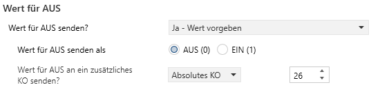</kbd>

Dieser Ausgangskonverter bestimmt, was bei einem logischen AUS-Signal auf den Bus gesendet werden soll.

<!-- DOC -->
### **Wert für AUS senden?**

In dieser Auswahlbox wird festgelegt, ob und was für ein Wert bei einem AUS-Signal gesendet werden soll.

#### **Nein**

Für ein AUS-Signal wird kein Wert auf den Bus gesendet. Das entspricht einem Ausgangsfilter, der alle AUS-Signale unterdrückt.

#### **Ja - Wert vorgeben**

Hier kann der Wert, der für ein AUS-Signal gesendet wird, konstant vorgegeben werden. In einem weiteren Feld kann der konstante Wert DPT gerecht eingegeben werden.

#### **Ja - Wert von Eingang 1**

Bei einem AUS-Signal wird der Wert gesendet, der am Eingang 1 anliegt. Sollte der Wert nicht den passenden DPT haben, wird er generisch gewandelt.

#### **Ja - Wert von Eingang 2**

Bei einem AUS-Signal wird der Wert gesendet, der am Eingang 2 anliegt. Sollte der Wert nicht den passenden DPT haben, wird er generisch gewandelt.

#### **Ja - Wert eines KO**
Bei einem AUS-Signal wird der Wert gesendet, der am angegebenen KO anliegt. Sollte der Wert nicht den passenden DPT haben, wird er generisch gewandelt.

Man kann somit einen Wert senden, der an irgendeinem KO des Gerätes anliegt. Es sind explizit alle KO-Nummern erlaubt, nicht nur die KO-Nummern des Logikmoduls. Einzige Einschränkung: Es sind nur DPT erlaubt, die von einem Eingang des Logikmoduls unterstützt werden.

#### **Ja - Wert einer Funktion**

Bei einem AUS-Signal wird ein berechneter Wert gesendet. In einem weiteren Feld kann die Funktion ausgewählt werden, die angewendet werden soll. Sollte der Wert nicht den passenden DPT haben, wird er generisch gewandelt.

Im Kapitel Funktionen kann nachgelesen werden, wie Funktionen und Benutzerfunktionen verwendet werden können.

#### **Ja - ReadRequest senden**

Bei einem AUS-Signal wird kein Wert auf die GA am Ausgang gesendet sondern ein Lesetelegramm. Damit kann man für Geräte, die kein zyklisches Senden unterstützen, bei Bedarf eine Abfrage eines Ausgangs erreichen.

#### **Ja - 'Gerät zurücksetzen' senden**

Bei einem AUS-Signal wird kein Wert gesendet, sondern die ETS-Funktion "Gerät zurücksetzen" an eine bestimmte PA geschickt. So kann man bestimmte Geräte überwachen und bei Bedarf zurücksetzen, ohne die ETS starten zu müssen.

#### **Ja - Status-LED schalten**

Bei einem AUS-Signal wird kein Wert gesendet, sondern der angegebene Statuskanal angesprochen.

In weiteren Feldern wird der Status-LED Kanal angegeben und der darauf auszugebende LED-Effekt.

<!-- DOC -->
### **Wert für AUS senden als**

Das Feld erscheint nur, wenn für "Wert für AUS senden" ein "Ja - Wert vorgeben" ausgewählt wurde.

Hier wird ein konstanter Wert erwartet, der zu dem Ausgewählten DPT für den Ausgang passt. Dieser eingegebene Wert wird auf den KNX-Bus bei einem AUS-Signal gesendet.

Man kann dies z.B. auch zur Invertierung nutzen, indem bei einem DPT 1 für ein AUS-Signal der Wert EIN gesendet wird und umgekehrt.

### **Nummer des Kommunikationsobjekts**

Das Feld erscheint nur, wenn für "Wert für AUS senden" ein "Ja - Wert eines KO senden" ausgewählt wurde.

Hier wird die Nummer des KO erwartet, dessen Wert übernommen und über den Ausgang des Logikkanals gesendet werden soll.

### **DPT des Kommunikationsobjekts**

Das Feld erscheint nur, wenn für "Wert für AUS senden" ein "Ja - Wert eines KO senden" ausgewählt wurde.

Hier wird der DPT des KO erwartet, dessen Wert übernommen und über den Ausgang des Logikkanals gesendet werden soll. Falls dieser DPT anders ist als der DPT des Ausgangs, wird generisch konvertiert. 

### **Physikalische Adresse**

Das Feld erscheint nur, wenn für "Wert für AUS senden" ein "Ja - 'Gerät zurücksetzen' senden" ausgewählt wurde.

Hier wird eine physikalische Adresse in der üblichen Punkt-Notation erwartet. Das KNX-Gerät mit dieser physikalischen Adresse wird zurückgesetzt.

Dies entspricht genau der Funktion "Gerät zurücksetzen" in der ETS.

### **Status-LED Kanal**

Hier wird angegeben, über welchen Logikstatus-Kanal die LED angesprochen wird.

<!-- DOC -->
#### **Status-LED Farbe**

<kbd></kbd>

Das Feld erscheint nur, wenn für "Wert für EIN senden" ein "Ja - Status-LED schalten" ausgewählt wurde.

Hier wird die Farbe der LED bestimmt, in der sie leuchten soll. Wird die Farbe Schwarz gewählt (#000000), geht die LED aus. Für die Auswahl der Farbe kann auch ein Farbauswahldialog verwendet werden.

<!-- DOC -->
#### **Status-LED Effekt**

Hier kann angegeben werden, wie sich die LED verhalten soll. 

* **Aus** - Die LED wird ausgeschaltet
* **Ein** - Die LED wird in der angegebenen Farbe eingeschaltet
* **Blinken** - Die LED blinkt in der angegebenen Farbe und Dauer
* **Pulsieren** - Die LED pulsiert in der angegebenen Farbe und Dauer
* **Aufblitzen** - Die LED blitzt kurz in der angegebenen Farbe auf

<!-- DOC -->
#### **Status-LED Effektdauer**

Dauer des Effekts in ms.

<!-- DOC -->
### **Wert für AUS senden (als 3 Byte RGB)**

Das Feld erscheint nur, wenn für "DPT für Ausgang" ein "DPT 323.xxx (3-Byte-Wert)" ausgewählt wurde.

Hier wird die Farbe bestimmt, deren Wert gesendet werden soll. Wird die Farbe Schwarz gewählt (#000000), entspricht das einem Ausschalt-Signal. Für die Auswahl der Farbe kann auch ein Farbauswahldialog verwendet werden.

<!-- DOC -->
### **Wert für AUS an ein zusätzliches KO senden**

Ein Ausgang kann seinen AUS-Wert nicht nur über das ihm zugewiesene KO senden, sondern auch zusätzlich an ein internes KO. Das bedeutet, der Wert wird in ein beliebiges KO des Gerätes (nicht nur des Logikmoduls) geschrieben, ohne dass dafür eine GA-Verknüpfung notwendig ist.

> Wichtig: Der DPT des Ziel-KO muss der gleiche sein wie der DPT des Ausgangs. Falls nicht, sind die Ergebnisse nicht abschätzbar.

#### **Eigenes KO**

Das ist der Standardwert und bedeutet, dass der Wert des Ausgangs an das KO, dass für diesen 
Ausgang vorgesehen ist, gesendet wird.

Zu Informationszwecken wird die Nummer des KO angegeben, das diesem Ausgang zugeordnet ist.

#### **Absolutes KO**

Wird absolutes KO ausgewählt, kann man die Nummer des KO angeben, an das der Wert des Ausgangs gesendet wird. Das kann ein beliebiges KO des Gerätes sein, auf dem das Logikmodul läuft. Es können auch KO anderer Module angegeben werden.

Ist eine GA mit dem eigenen KO des Ausgangs verknüpft, wird der Wert des Ausgangs auch an diese GA gesendet.

#### **Relatives KO**

Wie bei "Absolutes KO" wird der Wert des Ausgangs an ein anderes KO gesendet. Man gibt aber einen relativen Wert (Offset) ein und die Nummer des Ziel-KO wird ausgerechnet. Den berechneten Wert sieht man zur Information direkt hinter dem Eingabefeld.

Relative KO sind von Vorteil, wenn man häufiger mit Logiken arbeitet, die aus mehreren Logikkanälen bestehen (Logikblock). Verbindet man die Logiken eines Logikblocks über relative KO-Verknüpfungen, können diese Logikblöcke innerhalb des Logikmoduls verschoben werden oder auf ein anderes Logikmodul kopiert werden (mittels Konfigurationstransfer), ohne dass die KO-Verknüpfungen invalidiert werden.

Ist eine GA mit dem eigenen KO des Ausgangs verknüpft, wird der Wert des Ausgangs auch an diese GA gesendet.

<!-- DOC -->
### **Alarmausgabe (Buzzer oder LED trotz Sperre schalten)?**

<!-- DOC Skip="2" -->
Diese Einstellung erscheint nur, wenn die LED- oder Buzzer-Ausgabe aktiviert ist.

Wenn die Einstellung aktiviert ist, wird eine akustische oder optische Ausgabe trotz Sperre vorgenommen.

So können bestimmte Töne oder RGB-Anzeigen als Alarm definiert werden. Alarme können nicht durch entsprechende Sperren abgeschaltet werden.

## **Formeln**

Das Logikmodul enthält eine Implementierung zur Verwendung von einfachen (bzw. elementaren) Formeln. Formeln können immer die Werte von einem oder zwei Eingängen eines Logikkanals verrechnen. Wird ein Ausgang so definiert, dass er den Wert einer Formel senden soll, wird die dort ausgewählte Formelfunktion aufgerufen, die Berechnung anhand der beiden Eingangswerte durchgeführt und das Ergebnis an den Ausgang gesendet.

<!-- DOC HelpContext="Wert für EIN ermitteln als" -->
<!-- DOCCONTENT 
Der Wert des Ausgangs wird ermittelt durch die Berechnung der eingestellten Funktion.
DOCCONTENT -->

<!-- DOC HelpContext="Wert für AUS ermitteln als" -->
<!-- DOCCONTENT 
Der Wert des Ausgangs wird ermittelt durch die Berechnung der eingestellten Funktion.
DOCCONTENT -->

### **Berechnungszeitpunkt**

Die Formelfunktionalität innerhalb des Logikmoduls ist eingebettet in die (boolesche) Logikfunktionalität. Man konnte schon immer bei einem Ausgang verschiedene konstante Werte für EIN oder AUS senden lassen (nicht nur DPT1) bzw. auswählen, dass man statt einem konstanten Wert den Wert vom Eingang 1 oder Eingang 2 senden lassen will. Formeln stellen eine konsequente Erweiterung dieses Konzeptes vor, indem sie erlauben, den Wert von Eingang 1 und Eingang 2 erst zu verrechnen und dann das Ergebnis zu senden.

Somit wird der Berechnungszeitpunkt einer Formel durch die Logik eines Kanals bestimmt. Soll der Logikkanal ein EIN senden und am Ausgang ist eine Formel eingestellt, wird diese berechnet und deren Ergebnis gesendet.

Somit muss man neben der eigentlichen Berechnung immer auch den logischen Anteil berücksichtigen, damit die Berechnung zum gewünschten Zeitpunkt erfolgt. Es ergeben sich folgende typische Fälle:

#### **Formel soll berechnet werden, sobald sich irgendein Eingangswert ändert**

In einem solchen Fall ist der Logische Anteil unwichtig, man muss nur erreichen, dass bei jeder Wertänderung am Eingang der Ausgang senden soll.

Dazu wird eine ODER-Logik benutzt, die bei jedem Eingangssignal senden soll. Die Eingangskonverter beider Eingänge werden so eingestellt, dass sie immer zu einem EIN konvertieren. Der Ausgang sendet dann nichts bei einem AUS und die gewünschte Formel bei einem EIN.

#### **Formel soll nur berechnet werden, wenn sich ein Eingang ändert**

In einem solchen Fall darf der Logische Anteil auch nur bei einer Wertänderung an dem gewünschten Eingang getriggert werden.

Dazu wird wie zuvor eine ODER-Logik benutzt, die sendet aber nur bei dem gewünschten Eingang. Der Rest ist wie beim vorherigen Punkt.

#### **Formel soll nur zu bestimmten Zeitpunkten oder Ereignissen berechnet werden**

Hier muss die Logik des Formelkanals so aufgebaut werden, dass sie nur sendet, wenn das externe Triggersignal eingeht.

Dazu verwenden wir die selben Einstellungen wie im ersten Fall, nur nehmen wir eine UND-Logik und zusätzlich noch einen internen Eingang. Gesendet wird nur bei einem Signal auf dem internen Eingang.

Jetzt nutzen wir einen weiteren Logikkanal, um das gewünschte Triggersignal auf den Ausgang zu bringen (das kann eine Zeitschaltuhr oder ein externes Signal sein). Den Ausgang der Hilfslogik verbinden wir mit dem internen Eingang der Formellogik.

#### **Formel soll nur für bestimmte Werte von einem (oder beiden) Eingängen rechnen, sonst soll immer 0 ausgegeben werden**

Wieder muss die Logik des Formelkanals so aufgebaut werden, dass sie nur im gewünschten Fall sendet.

Wir benutzen eine UND-Logik und senden nur bei Wertänderungen. Die Eingangskonverter beider Kanäle werden so eingestellt, dass sie bei gewünschten Werten ein EIN liefern, sonst AUS. Der Ausgang senden bei EIN das Formelergebnis, bei AUS konstant 0.

### **Standardformeln**

Das Logikmodul enthält wenige bereits implementierte Standardformeln. In Zukunft können noch weitere Standardformeln hinzukommen.

<kbd>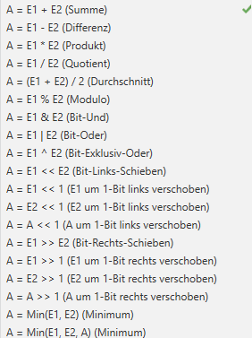</kbd> | <kbd>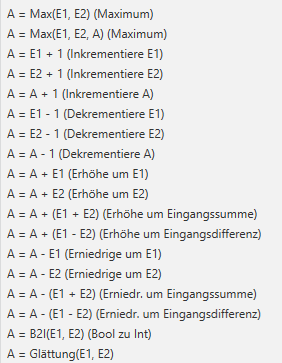</kbd>

Man kann Eingänge auch auf einen konstanten Wert setzen, um anschließend mit diesem Wert zu rechnen. Will man z.B. nur 10% eines Wertes haben, kann man am Eingang 1 den entsprechenden Wert empfangen, den Eingang 2 konstant auf 10 setzen und dann Eingang 1 / Eingang 2 rechnen.

Will man in einer Formel das Ergebnis einer anderen Formel nutzen, so geht das über die Verwendung von bestehenden KO. So kann man verhindern, dass für Formelkaskaden Zwischenergebnisse auf den Bus geschickt werden müssen.

#### **A = E1 + E2 (Summe)**

Die Werte der beiden Eingänge werden summiert und als Ergebnis am Ausgang ausgegeben.

Ist nur ein Eingang aktiv, ist der andere 0 und man bekommt den Wert des aktiven Eingangs.

#### **A = E1 - E2 (Differenz)**

Der Wert von Eingang 2 wird vom Wert von Eingang 1 subtrahiert und als Ergebnis am Ausgang ausgegeben.

Ist nur Eingang 1 aktiv, ist der andere 0 und man bekommt den Wert des aktiven Eingangs.

Ist nur Eingang 2 aktiv, ist der andere 0 und man bekommt den negativen Wert des aktiven Eingangs.

#### **A = E1 * E2 (Produkt)**

Die Werte der beiden Eingänge werden multipliziert und als Ergebnis am Ausgang ausgegeben.

Ist nur ein Eingang aktiv, ist der andere 0 und man bekommt 0 als Ergebnis.

#### **A = E1 / E2 (Quotient)**

Der Wert von Eingang 1 wird durch den Wert von Eingang 2 dividiert und als Ergebnis am Ausgang ausgegeben.

Ist nur Eingang 1 aktiv, ist der andere 0 und man bekommt keinen Wert ausgegeben.

Ist nur Eingang 2 aktiv, ist der andere 0 und man bekommt den  Wert 0 ausgegeben.

#### **A = E1 ^ E2 (Potenz)**

Der Wert von Eingang 1 wird mit dem Wert von Eingang 2 potenziert und als Ergebnis am Ausgang ausgegeben.

Ist nur Eingang 1 aktiv, ist der andere 0 und man bekommt den Wert 1 ausgegeben.

Ist nur Eingang 2 aktiv, ist der andere 0 und man bekommt den  Wert 0 ausgegeben.

#### **A = (E1 + E2) / 2 (Durchschnitt)**

Es wird der Durchschnitt der Werte der beiden Eingänge gebildet und als Ergebnis am Ausgang ausgegeben.

Ist nur ein Eingang aktiv, ist der andere 0 und man bekommt den halben Wert des aktiven Eingangs.

#### **A = E1 % E2 (Modulo)**

Es wird eine Division mit Rest vorgenommen und der Rest als Ergebnis am Ausgang ausgegeben. Das Ergebnis liegt somit immer zwischen 0 und (E2 - 1).

Ist nur Eingang 1 aktiv, ist der andere 0 und man bekommt keinen Wert ausgegeben.

Ist nur Eingang 2 aktiv, ist der andere 0 und man bekommt den  Wert 0 ausgegeben.

#### **A = E1 & E2 (Bit-Und)**

Es wird bitweise UND-Verknüpft. Jedes Bit von E1 wird mit dem entsprechenden Bit von E2 über ein UND verknüpft. Das Ergebnis wird am Ausgang ausgegeben.

Ist nur ein Eingang aktiv, ist der andere 0 und man bekommt den Wert 0 ausgegeben.

#### **A = E1 | E2 (Bit-Oder)**

Es wird bitweise ODER-Verknüpft. Jedes Bit von E1 wird mit dem entsprechenden Bit von E2 über ein ODER verknüpft. Das Ergebnis wird am Ausgang ausgegeben.

Ist nur ein Eingang aktiv, ist der andere 0 und man bekommt den Wert des aktiven Eingangs ausgegeben.

#### **A = E1 ^ E2 (Bit-Exklusiv-Oder)**

Es wird bitweise EXOR-Verknüpft. Jedes Bit von E1 wird mit dem entsprechenden Bit von E2 über ein EXOR verknüpft. Das Ergebnis wird am Ausgang ausgegeben.

Ist nur ein Eingang aktiv, ist der andere 0 und man bekommt den Wert des aktiven Eingangs ausgegeben.

#### **A = E1 << E2 (Bit-Links-Schieben)**

Der Wert vom Eingang 1 wird bitweise nach links verschoben, um so viele Stellen wie der Wert vom Eingang 2. Das Ergebnis wird am Ausgang ausgegeben.

Ist nur Eingang 1 aktiv, ist der andere 0 und man bekommt den Wert von Eingang 1 ausgegeben.

Ist nur Eingang 2 aktiv, ist der andere 0 und man bekommt den  Wert 0 ausgegeben.

#### **A = E1 << 1 (E1 um 1-Bit links verschoben)**

Der Wert vom Eingang 1 wird um 1 Bit nach links verschoben. Das Ergebnis wird am Ausgang ausgegeben.

Ist nur Eingang 2 aktiv, ist der andere 0 und man bekommt den  Wert 0 ausgegeben.

#### **A = E2 << 1 (E2 um 1-Bit links verschoben)**

Der Wert vom Eingang 2 wird um 1 Bit nach links verschoben. Das Ergebnis wird am Ausgang ausgegeben.

Ist nur Eingang 1 aktiv, ist der andere 0 und man bekommt den  Wert 0 ausgegeben.

#### **A = A << 1 (A um 1-Bit links verschoben)**

Der Wert vom Ausgang wird um 1 Bit nach links verschoben. Das Ergebnis wird am Ausgang ausgegeben.

Ist der Ausgang initial, wird 0 angenommen und man bekommt den  Wert 0 ausgegeben.

#### **A = E1 >> E2 (Bit-Rechts-Schieben)**

Der Wert vom Eingang 1 wird bitweise nach rechts verschoben, um so viele Stellen wie der Wert vom Eingang 2. Das Ergebnis wird am Ausgang ausgegeben.

Ist nur Eingang 1 aktiv, ist der andere 0 und man bekommt den Wert von Eingang 1 ausgegeben.

Ist nur Eingang 2 aktiv, ist der andere 0 und man bekommt den  Wert 0 ausgegeben.

#### **A = E1 >> 1 (E1 um 1-Bit rechts verschoben)**

Der Wert vom Eingang 1 wird um 1 Bit nach rechts verschoben. Das Ergebnis wird am Ausgang ausgegeben.

Ist nur Eingang 2 aktiv, ist der andere 0 und man bekommt den  Wert 0 ausgegeben.

#### **A = E2 >> 1 (E2 um 1-Bit rechts verschoben)**

Der Wert vom Eingang 2 wird um 1 Bit nach rechts verschoben. Das Ergebnis wird am Ausgang ausgegeben.

Ist nur Eingang 1 aktiv, ist der andere 0 und man bekommt den  Wert 0 ausgegeben.

#### **A = A >> 1 (A um 1-Bit rechts verschoben)**

Der Wert vom Ausgang wird um 1 Bit nach rechts verschoben. Das Ergebnis wird am Ausgang ausgegeben.

Ist der Ausgang initial, wird 0 angenommen und man bekommt den  Wert 0 ausgegeben.

#### **A = Min(E1, E2) (Minimum)**

Die Werte der beiden Eingänge werden verglichen und der kleinere Wert wird als Ergebnis am Ausgang ausgegeben.

Ist nur ein Eingang aktiv, ist der andere 0 und man bekommt 0, falls der aktive Eingang positiv ist. Falls der aktive Eingang negativ ist, bekommt man den Wert des aktiven Eingangs.

#### **A = Min(E1, E2, A) (Minimum)**

Die Werte der beiden Eingänge und des Ausgangs werden verglichen und der kleinste Wert wird als Ergebnis am Ausgang ausgegeben.

Ist einer der Ausgänge inaktiv oder der Ausgang initial, wird für ihn der Wert 0 angenommen.

#### **A = Max(E1, E2) (Maximum)**

Die Werte der beiden Eingänge werden verglichen und der größere Wert wird als Ergebnis am Ausgang ausgegeben.

Ist nur ein Eingang aktiv, ist der andere 0 und man bekommt 0, falls der aktive Eingang negativ ist. Falls der aktive Eingang positiv ist, bekommt man den Wert des aktiven Eingangs.

#### **A = Max(E1, E2, A) (Maximum)**

Die Werte der beiden Eingänge und des Ausgangs werden verglichen und der größte Wert wird als Ergebnis am Ausgang ausgegeben.

Ist einer der Ausgänge inaktiv oder der Ausgang initial, wird für ihn der Wert 0 angenommen.

#### **A = E1 + 1 (Inkrementiere E1)**

Der Wert vom Eingang 1 wird um 1 erhöht und am Ausgang ausgegeben.

Ist Eingang 1 inaktiv, wird für ihn der Wert 0 angenommen und man erhält eine 1 am Ausgang.

#### **A = E2 + 1 (Inkrementiere E2)**

Der Wert vom Eingang 2 wird um 1 erhöht und am Ausgang ausgegeben.

Ist Eingang 2 inaktiv, wird für ihn der Wert 0 angenommen und man erhält eine 1 am Ausgang.

#### **A = A + 1 (Inkrementiere A)**

Der Wert vom Ausgang wird um 1 erhöht und am Ausgang ausgegeben.

Ist der Ausgang initial, wird für ihn der Wert 0 angenommen und man erhält eine 1 am Ausgang.

#### **A = E1 - 1 (Dekrementiere E1)**

Der Wert vom Eingang 1 wird um 1 erniedrigt und am Ausgang ausgegeben.

Ist Eingang 1 inaktiv, wird für ihn der Wert 0 angenommen und man erhält eine -1 am Ausgang.

#### **A = E2 - 1 (Dekrementiere E2)**

Der Wert vom Eingang 2 wird um 1 erniedrigt und am Ausgang ausgegeben.

Ist Eingang 2 inaktiv, wird für ihn der Wert 0 angenommen und man erhält eine -1 am Ausgang.

#### **A = A - 1 (Dekrementiere A)**

Der Wert vom Ausgang wird um 1 erniedrigt und am Ausgang ausgegeben.

Ist der Ausgang initial, wird für ihn der Wert 0 angenommen und man erhält eine -1 am Ausgang.

#### **A = A + E1 (Erhöhe um E1)**

Der Wert vom Ausgang wird um den Wert vom Eingang 1 erhöht und am Ausgang ausgegeben.

Ist Eingang 1 inaktiv oder der Ausgang initial, wird dafür jeweils eine 0 angenommen.

#### **A = A + E2 (Erhöhe um E2)**

Der Wert vom Ausgang wird um den Wert vom Eingang 2 erhöht und am Ausgang ausgegeben.

Ist Eingang 2 inaktiv oder der Ausgang initial, wird dafür jeweils eine 0 angenommen.

#### **A = A + (E1 + E2) (Erhöhe um Eingangssumme)**

Die Werte von Eingang 1 und Eingang 2 werden addiert und der Wert vom Ausgang wird um diese Summe erhöht und am Ausgang ausgegeben.

Ist einer der Eingänge inaktiv oder der Ausgang initial, wird dafür jeweils eine 0 angenommen.

#### **A = A + (E1 - E2) (Erhöhe um Eingangsdifferenz)**

Die Werte von Eingang 1 und Eingang 2 werden subtrahiert und der Wert vom Ausgang wird um diese Differenz erhöht und am Ausgang ausgegeben.

Ist einer der Eingänge inaktiv oder der Ausgang initial, wird dafür jeweils eine 0 angenommen.

#### **A = A - E1 (Erniedrige um E1)**

Der Wert vom Ausgang wird um den Wert vom Eingang 1 erniedrigt und am Ausgang ausgegeben.

Ist Eingang 1 inaktiv oder der Ausgang initial, wird dafür jeweils eine 0 angenommen.

#### **A = A - E2 (Erniedrige um E2)**

Der Wert vom Ausgang wird um den Wert vom Eingang 2 erniedrigt und am Ausgang ausgegeben.

Ist Eingang 2 inaktiv oder der Ausgang initial, wird dafür jeweils eine 0 angenommen.

#### **A = A - (E1 + E2) (Erniedr. um Eingangssumme)**

Die Werte von Eingang 1 und Eingang 2 werden addiert und der Wert vom Ausgang wird um diese Summe erniedrigt und am Ausgang ausgegeben.

Ist einer der Eingänge inaktiv oder der Ausgang initial, wird dafür jeweils eine 0 angenommen.

#### **A = A - (E1 - E2) (Erniedr. um Eingangsdifferenz)**

Die Werte von Eingang 1 und Eingang 2 werden subtrahiert und der Wert vom Ausgang wird um diese Differenz erniedrigt und am Ausgang ausgegeben.

Ist einer der Eingänge inaktiv oder der Ausgang initial, wird dafür jeweils eine 0 angenommen.

#### **A = -E1 (Negiere E1)**

Der Wert von E1 wird negiert (mit minus 1 multipliziert) und am Ausgang ausgegeben. 

Ist der Eingang E1 initial, wird eine 0 angenommen und somit auch 0 ausgegeben.

#### **A = -E2 (Negiere E2)**

Der Wert von E2 wird negiert (mit minus 1 multipliziert) und am Ausgang ausgegeben. 

Ist der Eingang E2 initial, wird eine 0 angenommen und somit auch 0 ausgegeben.

#### **A = ABS(E1) (Betrag von E1)**

Das Vorzeichen von E1 wird ignoriert und E1 als positive Zahl am Ausgang ausgegeben. 

Ist der Eingang E1 initial, wird eine 0 angenommen und somit auch 0 ausgegeben.

#### **A = ABS(E2) (Betrag von E2)**

Das Vorzeichen von E2 wird ignoriert und E2 als positive Zahl am Ausgang ausgegeben. 

Ist der Eingang E2 initial, wird eine 0 angenommen und somit auch 0 ausgegeben.

#### **A = B2I(E1, E2) (Bool zu Int)**

Die Werte der beiden Eingänge werden als 2 Bit betrachtet und zu einer Integer-Zahl gewandelt nach der Formel 2 * E2 + E1 (E2 entspricht dem höherwertigen, E1 dem niederwertigem Bit).
Das erlaubt die Konvertierung von 2 Einzelbits zu einem Wert (im Wertebereich 0 bis 3) oder einer Szene 1 bis 4. Ein Nutzungsbeispiel wäre die Berechnung einer Tagesphase für den VPM aus 2 Einzelbits.

Die Werte von E1 und E2 werden zuerst nach Boolean konvertiert. Dabei gilt: 

    E gleich 0   --> false bzw. 0
    E ungleich 0 --> true  bzw. 1

Ist nur ein Eingang aktiv, ist der andere 0.

#### **A = Glättung(E1, E2)**

Der Wert E1 wird mit Hilfe eines Dämpfungswertes E2 geglättet ausgegeben und erlaubt es so, einen Messwertverlauf zu glätten, indem starke Wertschwankungen ausgeglichen werden.

Die Glättung wird nach folgender Formel berechnet:

Aneu = Aalt + (E1 - Aalt) / E2

wobei Aneu der neue Berechnete Wert des KO ist, das den neuen Wert sendet und Aalt der letzte (vorherige) Wert ist, der gesendet wurde.

Ist noch kein Glättungswert berechnet worden (Aalt ist initial), so gilt

Aneu = E1

Die Funktion nimmt somit initial den ersten Messwert als Startwert.

> Achtung: Der Initialwert für die Berechnung kann auch von außen gesetzt werden, indem am Ausgangs-KO ein S-Flag gesetzt wird und das KO dann mit dem Initialwert beschrieben wird. 

Die Funktion kann zwar mit allen Eingangs-DPT arbeiten, ist aber besonders für DPT9 und DPT14 geeignet und auch nur mit diesen getestet.

Die Funktion liefert 0, wenn nur einer der beiden Eingänge aktiv sein sollte oder E2 = 0 ist.

### **Benutzerfunktionen**

> ACHTUNG: Benutzerfunktionen sollten nicht mehr verwendet werden, sie wurden durch [Benutzerformeln](#benutzerformeln) ersetzt. Falls Benutzerfunktionen in bisheriger Firmware implementiert worden sind, sollten diese in Benutzerformeln überführt werden. Die neuen Benutzerformeln sind updatefähig und können benutzt werden, ohne die Firmware zu modifizieren. 

Die eigentliche Stärke des Formelansatzes liegt sicherlich nicht in den implementierten Standardfunktionen, sondern in den 30 zur Verfügung stehenden Benutzerfunktionen.

Man kann direkt in der Firmware bis zu 30 eigene Funktionen definieren und die beliebigen Logikausgängen zuweisen. So kann man z.B. aus einer Entfernungsmessung, wohl wissend dass dies der Füllstand einer Zisterne ist, den Messwert direkt in Liter umrechnen, indem man im Coding der Firmware alle weiteren Parameter (Tankhöhe, Tankfläche usw.) in einer passenden Formel hinterlegt. Insofern dürften Benutzerfunktionen besonders im Zusammenhang mit dem Sensormodul genutzt werden.

Um eigene Benutzerfunktionen zu implementieren, muss man die gesamte Entwicklungsumgebung installieren und alle Programmdateien runterladen.

<kbd>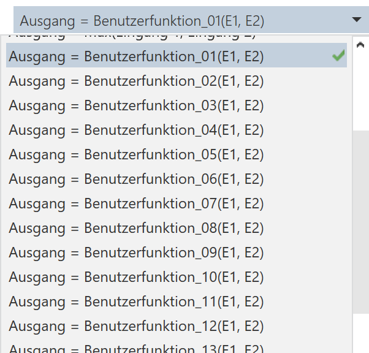</kbd>

Alle Benutzerfunktionen werden gleichartig aufgerufen, im Folgenden wird nur eine behandelt.

#### **A = B*xx*(E1, E2, A)**

Sobald der Ausgang senden soll, ruft er die angegebene Benutzerfunktion mit den Werten der Eingänge 1 und 2 und dem aktuellen Wert des Ausgangs auf. Nachdem die Berechnung erfolgt ist, sendet der Ausgang den berechneten Wert.

Nichtaktive Eingänge bekommen den Wert 0 beim Aufruf der Funktion.

#### **Definition einer Benutzerfunktion in der Firmware**

Eine Benutzerfunktion kann in der Firmware entsprechend programmiert werden. Dies erfolgt im Projekt OAM-LogicModule.

In der Datei

    src/LogicFunctionUser.cpp

stehen bereits 30 Benutzerfunktionen bereit, die nur noch mit dem notwendigen Code gefüllt werden müssen.

    // user functions, may be implemented by Enduser
    // for DPT-Check you can use constants beginning with VAL_DPT_*
    LogicValue LogicFunction::userFunction01(uint8_t _channelIndex, uint8_t DptE1, LogicValue E1, uint8_t DptE2, LogicValue E2, uint8_t *DptOut, LogicValue iOld)
    {
        return E1; // just an example, result is first parameter value
    }

In der Beispielimplementierung für die Benutzerfunktion_01 wird der Wert vom Eingang 1 zurückgegeben.

Jeder Funktion stehen die Variablen E1 und E2 zur Verfügung, die die Werte der Eingänge 1 und 2 enthalten. Über die Variable iOld wird der aktuelle Wert des Ausgang dieses Logikkanals bereitgestellt. Die Variable _channelIndex gibt die Nummer des aktuellen Kanals aus. Ferner stehen über die Variablen DptE1 und DptE2 die DPT der Eingänge E1 und E2 zur Verfügung, über DptOut der DPT des Ausgangs. Die DPT-Werte können mittels Konstanten beginnend mit VAL_DPT_* abgefragt werden. Diese Konstanten sind folgendermaßen definiert:

    // enum supported dpt
    #define VAL_DPT_1 0
    #define VAL_DPT_2 1
    #define VAL_DPT_5 2
    #define VAL_DPT_5001 3
    #define VAL_DPT_6 4
    #define VAL_DPT_7 5
    #define VAL_DPT_8 6
    #define VAL_DPT_9 7
    #define VAL_DPT_16 8
    #define VAL_DPT_17 9
    #define VAL_DPT_232 10
    #define VAL_DPT_10 11 // Time
    #define VAL_DPT_11 12 // Date
    #define VAL_DPT_12 13
    #define VAL_DPT_13 14
    #define VAL_DPT_14 15
    #define VAL_DPT_19 16 // Date-Time

### **Beispiele von Benutzerfunktionen**

**Wie bekommt man die frühere Funktion "Feiertag heute" (die ein Bool, also DPT1 ausgibt) wieder?**

Folgende Definition eines Logikkanals macht das gewünschte:

* Beschreibung des Kanals: Feiertag heute
* Zeit bis der Kanal nach einem Neustart aktiv wird: 5
* Logik-Operation: ODER
* Eingang 1: normal aktiv
* Logik sendet ihren Wert weiter: nur bei geändertem Ergebnis

Eingang 1:

* Beschreibung Eingang 1: Welcher Feiertag ist heute
* DPT für Eingang 1: DPT 5.xxx (1-Byte-Wert)
* Wert für Eingang 1 wird ermittelt durch: Wertintervall
* Von-Wert: 1
* Bis-Wert: 50
* Falls Vorbelegung aus dem Speicher nicht möglich: Wert von Bus lesen

Ausgang:

* Beschreibung: Feiertag heute

Auf diese Weise bekommt man die Funktionalität des früheren Logikmoduls wieder. Man muss den Eingang des Logikkanals mit der gleichen GA verbinden, die auch mit "Welcher Feiertag ist heute" verbunden ist.

Anlog für "Feiertag morgen".

## **Endlosschleifen-Erkennung**

Man kann mit dem Logikmodul relativ einfach Endlosschleifen bauen, indem man Ausgänge von Logikkanälen auf Eingänge zurückführt, die wiederum den den sendenden Logikkanal beeinflussen. 

Beispiel:

    Kanal 1, Eingang 1: 1/1/1
    Kanal 1, Ausgang:   1/1/2
    Kanal 2, Eingang 1: 1/1/2
    Kanal 2, Ausgang:   1/1/1

Sobald im obigen Beispiel auf 1/1/1 oder 1/1/2 ein Telegramm gesendet wird, sieht man im Gruppenmonitor ein Haufen Telegramme, die nicht aufhören, das Logikmodul ist nicht mehr per KNX zu erreichen und muss manuell mit Reset zurückgesetzt werden.
Und falls das Logikmodul selbst beim Neustart ein Telegramm auf 1/1/1 oder 1/1/2 schickt, beginnt die Endlosschleife sofort nach dem Neustart vom neuem, bevor man irgendwie das Logikmodul umprogrammieren kann.
In so einem Falle musste man sogar des Flash löschen und die Firmware neu aufspielen, bevor man wieder was machen konnte.

Ab der Version 3.2 des Logikmoduls gibt es eine Endlosschleifen-Erkennung. Wird ein Logikkanal mehr als 50 mal pro Sekunde aufgerufen, wird er deaktiviert und funktioniert nicht mehr. Alle anderen Logikkanäle funktionieren noch weiter. Der deaktivierte Logikkanal wird erst nach einem Neustart des Logikmodul wieder aktiv oder indem über das Diagnoseobjekt das Kommando

    logic chNN res

gesendet wurde, wobei NN die Nummer des deaktivierten Kanals ist.

Diese neue Funktion ermöglicht es, gravierende Logikfehler zu korrigieren, ohne dass man das Logikmodul erneut ausbauen oder gar die Firmware neu aufspielen muss. Es wird nur der fehlerhaft parametrisierte Kanal deaktiviert, alle anderen Funktionen bleiben erhalten. Vor allem ist es möglich, das Logikmodul neu zu programmieren.

Ob ein Kanal durch die Endlosschleifen-Erkennung deaktiviert wurde, kann man erkennen, indem man über das Diagnoseobjekt das Kommando
 
    logic limit

sendet. Falls die Antwort 'LIM 50, CHnn' ist, dann ist Kanal nn deaktiviert, weil er mehr als 50 mal pro Sekunde aufgerufen worden ist. Es können auch mehr als dieser eine Kanal deaktiviert sein, man sieht nur den Kanal, der zuerst deaktiviert wurde.

Im Kapitel Diagnoseobjekt sind weitere Diagnosemöglichkeiten für die Endlosschleifen-Erkennung beschrieben.

## **Diagnoseobjekt**

Das Diagnoseobjekt dient primär zu Debug-Zwecken, kann aber auch vom Enduser genutzt werden, um bestimmte interne Zustände vom Logikmodul zu überprüfen. 

Es funktioniert wie ein einfaches Terminal. Man sendet an das KO 7 ein Kommando (Groß-Kleinschreibung beachten) und erhält über das gleiche KO eine Antwort. Im folgenden sind die Kommandos und die Antworten beschrieben.

### **Kommando 'logic help' - Kurzhilfe der Befehle**

Gibt die verfügbaren Befehle für die Logik aus. Da im Diagnoseobjekt nur 14 Zeichen zur Verfügung stehen, ist die Ausgabe sehr komprimiert. Es werden mehrere Antworten (Zeilen) an das Diagnoseobjekt geschickt, der Inhalt sind die möglichen Argumente für das "logic" Kommando.

Auf KO 7 (Diagnoseobjekt) muss der Befehl 'logic help' (klein) gesendet werden. Die Antwort erfolgt auf KO 7 (Diagnoseobjekt). Folgende Liste wird sichtbar:

    -> time
    -> easter
    -> sun
    -> sun[+-]DDMM
    -> lim
    -> lim res
    -> chNN
    -> chNN lim
    -> chNN res

### **Kommando 'logic time' - interne Zeit**

Gibt die interne Zeit aus. Eine Zeit kann jederzeit von außen über die KO 2 (Uhrzeit) und KO 3 (Datum) gesetzt werden und läuft dann intern weiter. Die Genauigkeit der internen Uhr ist nicht besonders hoch, ein erneutes senden der Uhrzeit auf KO 2 korrigiert die interne Uhrzeit wieder. Die interne Uhrzeit kann mit diesem Kommando abgefragt werden.

Auf KO 7 (Diagnoseobjekt) muss der Befehl 'logic time' (klein) gesendet werden. Die Antwort erfolgt auf KO 7 (Diagnoseobjekt) im Format 'HH:MM:SS DD.MM', also als 'Stunden:Minuten:Sekunden Tag.Monat'.

### **Kommando 'logic easter' - Ostern**

Gibt das intern berechnete Datum für den Ostersonntag aus. Das Datum wird erst berechnet, nachdem mindestens einmal das Datum auf KO 3 gesetzt worden ist, dann bei jedem Jahreswechsel, egal ob dieser Wechsel intern ermittelt oder durch ein neues von extern gesetztes Datum erfolgt.

Auf KO 7 (Diagnoseobjekt) muss der Befehl 'logic easter' (klein) gesendet werden. Die Antwort erfolgt auf KO 7 (Diagnoseobjekt) im Format 'ODD.MM'. Dabei steht "O" für **O**stern, gefolgt von Tag.Monat. Alle anderen Feiertage, die von Ostern abhängig sind, werden in Abhängigkeit von diesem Datum errechnet.

### **Kommando 'logic sun' - Sonnenauf-/-untergang**

Gibt die intern berechneten Zeiten für Sonnenauf- und -untergang aus. Die Zeiten werden erst berechnet, nachdem mindestens einmal das Datum auf KO 3 gesetzt worden ist, dann bei jedem Datumswechsel, egal ob dieser Wechsel intern ermittelt oder durch ein neues von extern gesetztes Datum erfolgt. Die korrekte Berechnung von Zeiten für den Sonnenauf- und -untergang hängt auch von der korrekten Angabe der Geokoordinaten für den Standort ab.

Man kann hinter **sun** noch den Winkel über den Horizont angeben und so die Zeiten rausfinden, an denen der Sonnenmittelpunkt entsprechend über oder unter dem Horizont liegt. Die Notation ist

    [+-]DDMM

wobei plus (+) die Position über dem Horizont, minus (-) die Position unter dem Horizont, DD den Winkel in Grad (Degree) angibt und MM die Winkelminuten angibt. Das Kommando 

    logic sun-0600

gibt somit die Uhrzeit (=Schaltzeit) aus, an der der Sonnenmittelpunkt 6° unter dem Horizont ist. Das entspricht dem Zeitpunkt, an dem der obere Rand der Sonne am Horizont auftaucht -> Beginn der Dämmerung.

Auf KO 7 (Diagnoseobjekt) muss der Befehl 'logic sun' oder 'logic sun+DDMM' oder 'logic sun-DDMM' (alle Buchstaben klein) gesendet werden. Die Antwort erfolgt auf KO 7 (Diagnoseobjekt) im Format 'RHH:MM SHH:MM'. Dabei bedeutet "R" den Sonnenaufgang (Sun**R**ise), gefolgt von Stunden:Minuten, und "S" den Sonnenuntergang (Sun**S**et), gefolgt von Stunden:Minuten.

### **Kommando 'logic lim' - Endlosschleifen-Erkennung**

Gibt den Kanal aus, der am Häufigsten pro Sekunde aufgerufen wurde und wie häufig er aufgerufen wurde. Das Kommando

    logic lim

gibt den Wert im Format 'LIM NN, CH CC' aus, wobei CC der Kanal mit den meisten Aufrufen und NN die Anzahl der Aufrufe darstellt.

Solange noch kein einziger Kanal aufgerufen wurde, ist der Wert 'LIM 00, CH 01'. Falls der Wert 50 ist, bedeutet das, dass eine Endlosschleife erkannt wurde und der Kanal deaktiviert worden ist. Es können noch weitere Kanäle deaktiviert worden sein, hier wird nur der erste deaktivierte Kanal angezeigt.

### **Kommando 'logic lim res' - Endlosschleifen-Erkennung zurücksetzen**

Mit dem Kommando

    logic lim res

kann man alle Kanäle, die durch die Endlosschleifen-Erkennung deaktiviert wurden, erneut aktivieren. Sobald wieder eine Endlosschleife auftritt, werden die Kanäle erneut deaktiviert. 

Kanäle wieder zu aktivieren macht Sinn, wenn man im Gruppenmonitor verfolgen möchte, welche Kanäle an der Endlosschleife beteiligt sind und dient somit der Ursachenfindung. Es macht keinen Sinn, periodisch das Zurücksetzen aufzurufen, um fehlerhaft konfigurierte Kanäle aktiv zu halten.

### **Kommando 'logic ch\<nn>' - interner Zustand vom Logikkanal \<nn>**

Gibt den internen Zustand des Logikkanals \<nn> aus. Konkret geht es um die Werte, die am Eingang des Funktionsblocks "Logische Verknüpfung" liegen und dessen Ausgang. Da die Werte am Eingang durch die Konverter-Funktionsblöcke erzeugt werden, ist es im Fehlerfalle interessant, die Eingangswerte zu kennen. Ebenso ist der Ausgangswert interessant, da dieser durch die Einstellungen des Funktionsblocks "Logische Verknüpfung" bestimmt wird.

Auf KO 7 (Diagnoseobjekt) muss der Befehl 'logic ch' (klein) gefolgt von der Nummer des Kanals (zweistellig, ohne Leerzeichen dazwischen) gesendet werden (z.B. logic ch01). Die Antwort erfolgt auf KO 7 (Diagnoseobjekt) im Format 'Aa Bb Cc Dd Qq', wobei

* A der Eingang 1
* B der Eingang 2
* C der interne Eingang 1
* D der interne Eingang 2
* Q der Ausgang

ist. Die möglichen Werte a, b, c, d und q sind:

* 0 für den logischen Wert AUS
* 1 für den logischen Wert EIN
* X für den Wert "undefiniert" bzw. "inaktiv"

### **Kommando 'logic ch\<nn> lim' - Deaktiviert durch Endlosschleifen-Erkennung**

Mit dem Kommando

    logic chNN lim

kann man abfragen, ob Kanal NN durch die Endlosschleifen-Erkennung deaktiviert wurde. Die Antwort ist

    Disabled: no

wenn der Kanal noch aktiv ist oder

    Disabled: yes

falls er deaktiviert wurde.

### **Kommando 'logic ch\<nn> res' - Übersteuern der Endlosschleifen-Erkennung**

Mit dem Kommando

    logic chNN res

kann man den Kanal NN, der von der Endlosschleifen-Erkennung deaktiviert wurde, erneut aktivieren. Dabei wird der Aufrufzähler für diesen Kanal zurückgesetzt. Der Zähler für "logic lim" wird auf den nächsten deaktivierten Kanal gesetzt, falls es noch einen gibt, sonst wird er auch gelöscht.

Sollte der Kanal erneut 50 Aufrufe pro Sekunde überschreiten, wird er erneut deaktiviert. Falls noch weitere Kanäle deaktiviert sind, müssen diese einzeln über das entsprechende Kommando zurückgesetzt werden oder alternativ mit "logic lim res" alle gleichzeitig zurückgesetzt werden.

Einen Kanal wieder zu aktivieren macht Sinn, wenn man im Gruppenmonitor verfolgen möchte, welche Kanäle an der Endlosschleife beteiligt sind und dient somit der Ursachenfindung. Es macht keinen Sinn, periodisch das Zurücksetzen aufzurufen, um fehlerhaft konfigurierte Kanäle aktiv zu halten.

## **DPT Konverter**

Das Gerät hat ein Funktionsmodul DPT-Konverter eingebaut, dass parameterlos funktioniert (deswegen wird es auch generischer Konverter bezeichnet).

Der DPT Konverter konvertiert einen Von-DPT in einen Nach-DPT und wird implizit an Stellen aufgerufen, an den das notwendig ist, wenn also für Berechnungen oder Zuweisungen unterschiedliche DPT vorliegen.

Derzeit passiert das...

* ... bei einem Differenzkonverter, wenn die beiden Eingänge unterschiedliche DPT haben. Hier ist der Nach-DPT immer der DPT, den der Eingang besitzt, der den Differenzkonverter nutzt. Der Von-DPT ist der DPT des "anderen" Eingangs.
* ... bei einem Ausgang, wenn dieser den Wert eines Eingangs senden soll und die unterschiedliche DPT haben. Hier ist der Von-DPT immer der Eingangs-DPT und der Nach-DPT der Ausgangs-DPT.

Da die Konvertierung nicht parametrierbar ist, erfolgt sie nach einfachen (generischen) Regeln. Auch wenn prinzipiell von jedem Von-DPT zu jedem Nach-DPT konvertiert werden kann, müssen für einige Konvertierungen die Rahmenbedingungen bekannt sein, vor allem wie in Grenzfällen verfahren wird. Es ist z.B. offensichtlich, dass ein 2-Byte-Wert 365 nicht verlustfrei in einen 1-Byte-Wert (Wertebereich 0-255) konvertiert werden kann.

Konvertierungen erfolgen nach folgender Tabelle, wobei der Von-DPT in den Zeilen, der Nach-DPT in den Spalten steht:

DPT | 1 | 2 | 5 | 5.001 | 6 | 7 | 8 | 9 | 16 | 17 | 232
:---:|---:|---:|---:|---:|---:|---:|---:|---:|---:|---:|---:
1 | I | ZB | GB | GB | GB | GB | GB | GB | TB | SB | GB
2 | B | I | GZ | GZ | GZ | GZ | GZ | GZ | TZ | SZ | GZ
5 | B | Z | I | GW | G | G | G | G | T | S  | G
5.001 | B | Z | G | I | G | G | G | G | T | S | G
6 | B | Z | GV | GVW | I | GV | G | G | T | S  | G
7 | B | Z | GW | GW | GW | I | G | G | T | S  | G
8 | B | Z | GVW | GVW | GW | GV | I | G | T | S  | G
9 | B | Z | GVW | GVW | GW | GVW | GW | I | T | S  | G
17 | B | Z | G | G | G | G | G | G | T | I | G
232 | B | Z | GVW | GVW | GW | GVW | GW | GW | T | S  | I

> Achtung: Die obige Tabelle kann nur zur Orientierung dienen. In Laufe der Zeit hat sich einiges an der Behandlung der DPT im Logikmodul geändert. Das führt implizit zu Änderungen der Konvertierungen zwischen den DPT. Die Tabelle wird nochmal komplett überarbeitet werden, nachdem ein finaler Stand der zu verarbeitenden DPT im Logikmodul erreicht ist.

Die Einträge an den Schnittpunkten haben folgende Bedeutung:

Eintrag | Konverter | Bedeutung
:---:|:---|:---
I | Identität | keine Konvertierung notwendig, DPT sind gleich
B | Binär | Wert wird in eine Ganzzahl gewandelt. Eine 0 wird in ein AUS-Signal konvertiert, alle anderen Werte in ein EIN-Signal.
G | Generisch | Wert wird in eine Ganzzahl gewandelt und anschließend zugewiesen.
GB | Generisch (von Binär) | AUS wird in eine 0 konvertiert, EIN in eine 1.
GV | Generisch (mit geändertem Vorzeichen) | Wie G, nur hat der Von-DPT möglicherweise ein Vorzeichen. Falls der Wert negativ ist, wird vor der Zuweisung das Vorzeichen entfernt (mit -1 multipliziert).
GW | Generisch (mit Werteinschränkung) | Wie G, nur hat der Von-DPT einen größeren Wertebereich als der Nach-DPT. Vor der Zuweisung wird noch modulo Wertebereich des Nach-DPT gerechnet.
GVW | Generisch (mit geändertem Vorzeichen und Werteinschränkung) | Wie GV gefolgt von GW.
GZ | Generisch (von Zwang) | "normal aus" (00) wird in eine 0 konvertiert, "normal ein" (01) in eine 1, "priorität aus" (10) in eine 2 und "priorität ein" (11) in eine 3.
S | Szene | Wert wird in eine Ganzzahl gewandelt. Falls negativ, wird das Vorzeichen entfernt (mit -1 multipliziert). Anschließend werden die untersten 6 Bit (Bit0 bis Bit5) genommen. Resultat ist Szene 1-64.
SB | Szene (von Binär) | AUS wird in die Szene 1 konvertiert, EIN in eine Szene 2.
SZ | Szene (von Zwang) | Wie GZ, nur ist die resultierende Szene der konvertierte Wert + 1. Es kommen somit Szenen 1-4 raus.
T | Text | Wert wird in eine Zahl gewandelt und anschließend als Text ausgegeben.
TB | Text (von Binär) | AUS wird in in den Text "0" konvertiert, EIN in den Text "1".
TZ | Text (von Zwang) | Wie GZ, nur werden die Zahlen als Text ausgegeben.
Z |Zwang | Wert wird in eine Ganzzahl gewandelt. Falls negativ, wird das Vorzeichen entfernt (mit -1 multipliziert). Anschließend werden die letzten beiden Bit (Bit0 und Bit1) genommen. Resultat sind die Werte 0 bis 3.
ZB |Zwang (von Binär) | Ein AUS wird nach "normal aus" (00) konvertiert, EIN nach "normal ein" (01). Die Werte "priorität aus" (10) und "priorität ein" sind nicht möglich.

----

## **Beispiele**

### **Zeitschaltuhr soll jeden n-ten Tag schalten**

Bei einer Zeitschaltuhr kann man aktuell jeden Tag was schalten lassen oder bestimmte Wochentage auswählen. Jeden n-ten Tag kann man derzeit nicht einstellen.

Um jeden n-ten Tag zu schalten (im Beispiel jeden 3-ten Tag), kann man folgendes machen:

- man macht eine Zeitschaltuhr mit Schaltzeiten für jeden Tag
- hinter den Ausgang der Zeitschaltuhr hängt man ein Tor, dass nur jeden 3. Tag öffnet
- Um das Tor jeden dritten Tag zu öffnen, braucht man
    - einen Zähler
    - den Zähler triggert man täglich (über eine weitere Zeitschaltuhr)
    - Wenn der Zähler den Wert n (im Beispiel 3) erreicht, muss man ihn auf 0 zurücksetzen.

Im folgenden wird ein funktionierendes Beispiel mit allen Eingaben gezeigt.

#### **Zeitschaltuhr mit den passenden Schaltzeiten**

Definition der Zeitschaltuhr mit den Schaltzeiten, die alle 3 Tage gesendet werden sollen.

<kbd>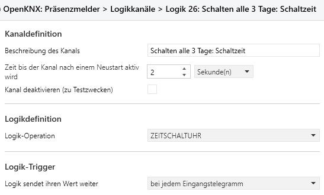</kbd>

Hier wird nur beispielhaft eine Einschaltzeit um 10 Uhr und Ausschaltzeit um 12 Uhr definiert.

<kbd>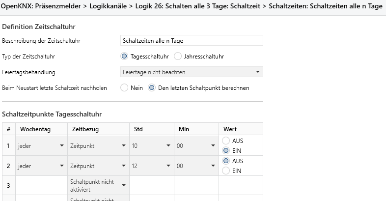</kbd>

Der Ausgang für die Schaltzeit kann so definiert sein, dass keine Daten auf den Bus gesendet werden und alle Werte intern verbunden werden.

<kbd>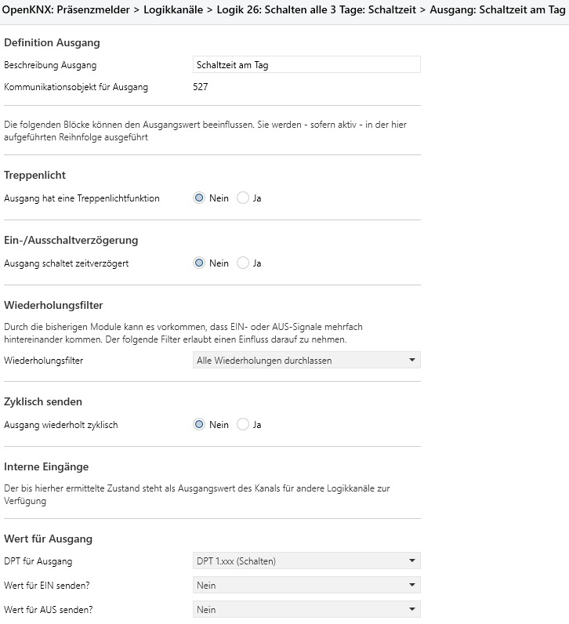</kbd>

#### **Täglicher Trigger für den Zähler**

Definition der Trigger-Zeitschaltuhr täglich um 00:01.

<kbd>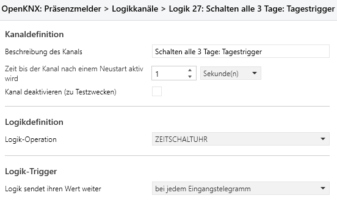</kbd>

Es wird nur eingeschaltet...

<kbd>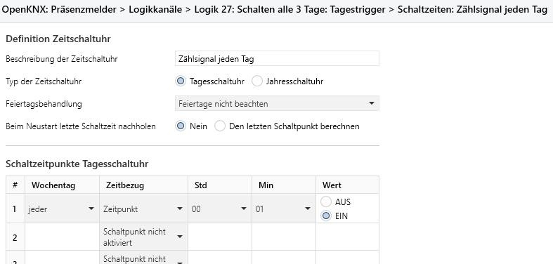</kbd>

Das Ausschaltsignal vom Trigger wird durch ein Treppenlicht von 3 Sekunden erzeugt. Auch dieser Ausgang sendet nichts auf den Bus, die Werte werden intern verknüpft.

<kbd></kbd>

#### **Zähler**

Hier werden 3 Eingänge über ein UND verknüpft. Ganz wichtig ist, dass nur der interne Kanalausgang X zur Auswertung der UND-Verknüpfung führt. 

<kbd>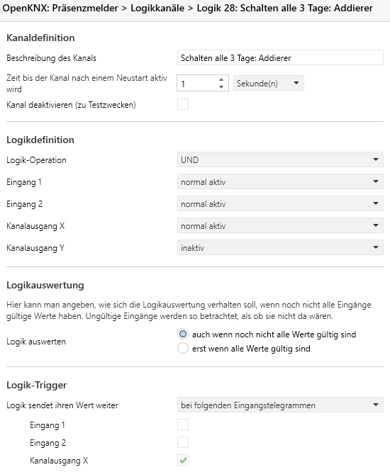</kbd>

Der erste Eingang ist das Zähler-Kommunikationsobjekt, das in unserem Beispiel bis 3 zählt, also die Werte 0, 1 und 2. Damit das UND funktioniert, muss der Wert von diesem Eingang immer EIN sein. Deswegen ist das Wertintervall von 0 bis 255, also alle möglichen Werte. Damit bei einer Neuprogrammierung bzw. Stromausfall der Zähler nicht wieder bei 0 anfängt, wird der Wert gespeichert und bei einem Neustart vorbelegt.

<kbd>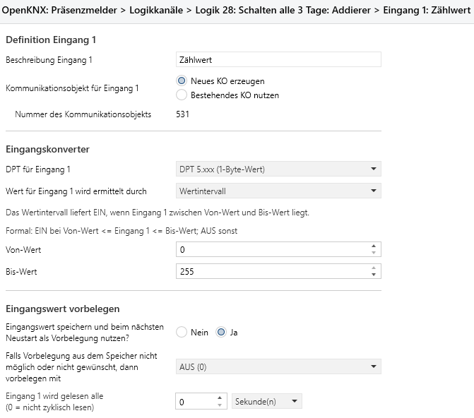</kbd>

Der zweite Eingang ist konstant 1. Das ist der Wert, um den der Zähler erhöht wird. Eine Konstante hat immer den Wert EIN, somit ist das für das UND genügend.

<kbd>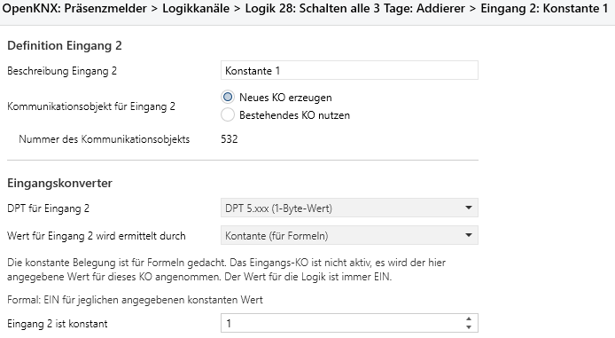</kbd>

Die interne Verknüpfung mit dem Kanalausgang vom Kanal 27 verbindet mit dem Ausgang vom Täglichen Trigger. Die gelb markierte Nummer muss den korrekten Kanal adressieren, falls das Beispiel nachgebaut wird.

<kbd></kbd>

Die Addition wird nur vorgenommen, wenn das UND wahr wird. Da Eingang 1 und Eingang 2 immer wahr sind, wird das UND immer wahr, wenn der (interne) Triggereingang wahr wird (also jeden Tag um 00:01 Uhr).

Der Ausgang sendet nur bei einer 1, dann immer einen Wert um 1 höher als der alte Wert. 

<kbd></kbd>

> Achtung: Wenn auf der Hauptseite das Häkchen nicht nur bei *Kanalausgang X* und nirgendwo anders gesetzt ist, würde die Erhöhung um 1 sofort eine erneute Addition um 1 auslösen, die wiederum eine erneute Addition um 1 auslösen würde usw. Wir hätten hier aus Endlosschleife und eine hohe Buslast. 

#### **Zähler zurücksetzen**

Immer wenn der Zähler den Wert 3 erreicht, muss er wieder auf 0 gesetzt werden. Dieser Kanal ist nichts anderes als ein IF:

> if Zähler >= 3 then Zähler = 0

Auf der ersten Seite definiert eine Logik mit einem Eingang, üblicherweise ein ODER.

<kbd>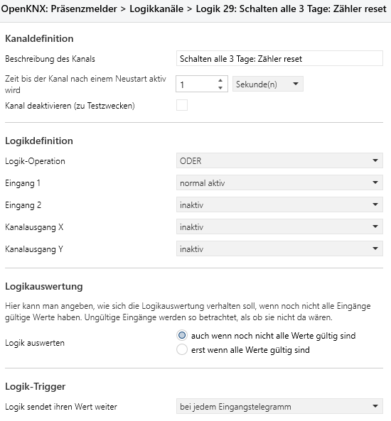</kbd>

Der Eingang spezifiziert das Wertintervall, in dem der Zähler zurückgesetzt werden soll. Falls man bis zu einem anderen Wert als 3 zählen will, muss man die gelbe 3 durch den Zielwert ersetzen.

<kbd>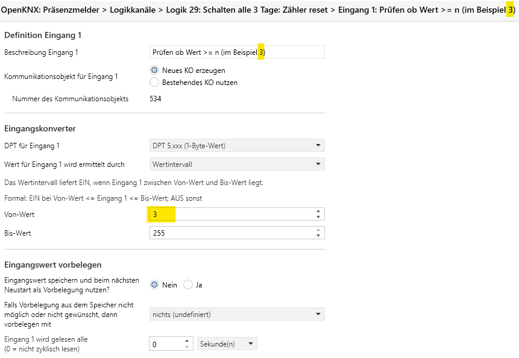</kbd>

Der Ausgang sendet eine 0 an den Zähler. Sobald der Zähler einen Wert 3 bis 255 erreicht.

<kbd>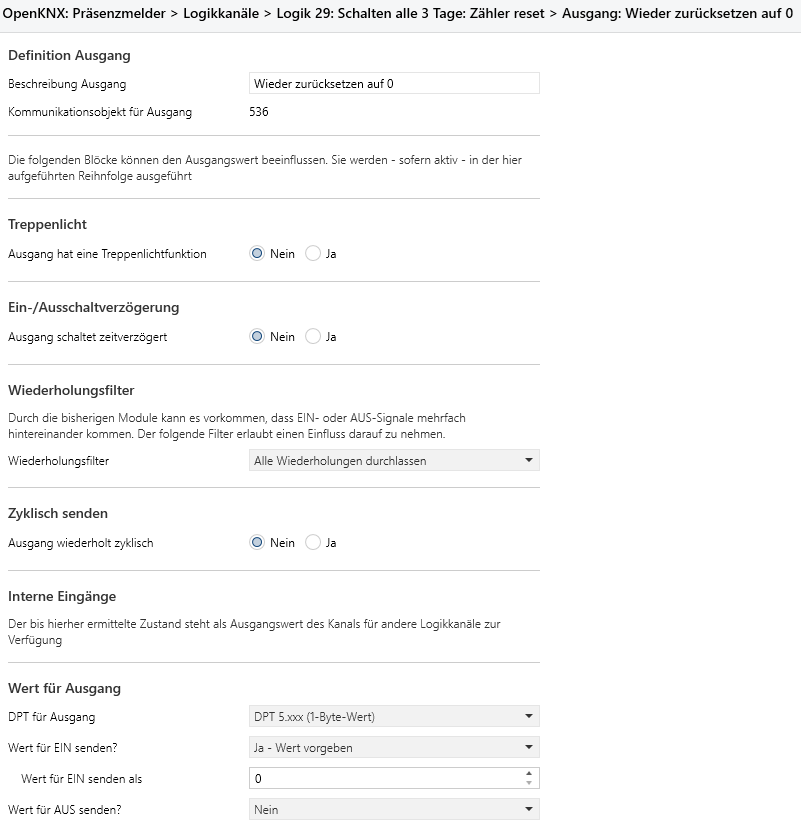</kbd>

#### **Tor zum Durchschalten der Schaltzeiten jeden dritten Tag**

Jetzt wird alles zusammen gebracht. Das Tor wird durch den Zähler geöffnet, sobald dieser den Wert 0 erreicht. Das Tor lässt dann den Wert der Zeitschaltuhr durch.

Das Tor wird so definiert, dass ein Öffnen vom Tor immer den Eingangswert sendet. Da beim öffnen die Zeitschaltuhr wahrscheinlich noch AUS ist, würde um 00:01 Uhr alle 3 Tage immer ein AUS gesendet werden. Das kann gewollt sein, falls nicht, einfach das gelb markierte Feld auf "nichts gesendet" ändern.

<kbd>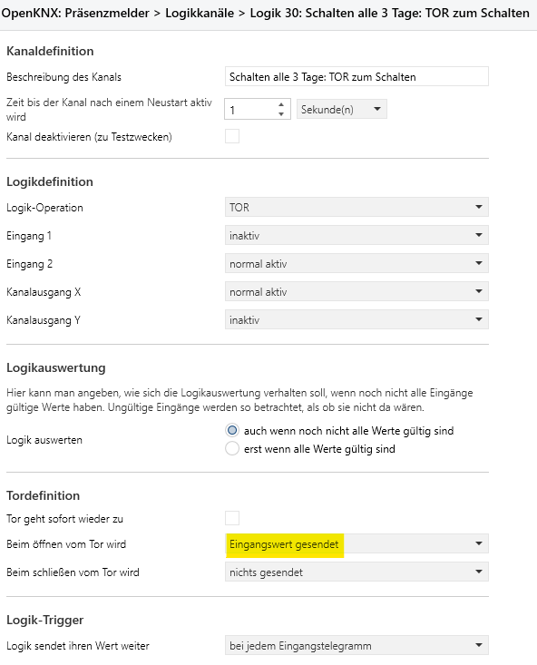</kbd>

Der Zählerwert zum öffnen vom Tor wird über den externen Eingang 2 geschickt. So kann man gleich auf den Wert 0 prüfen. 

<kbd>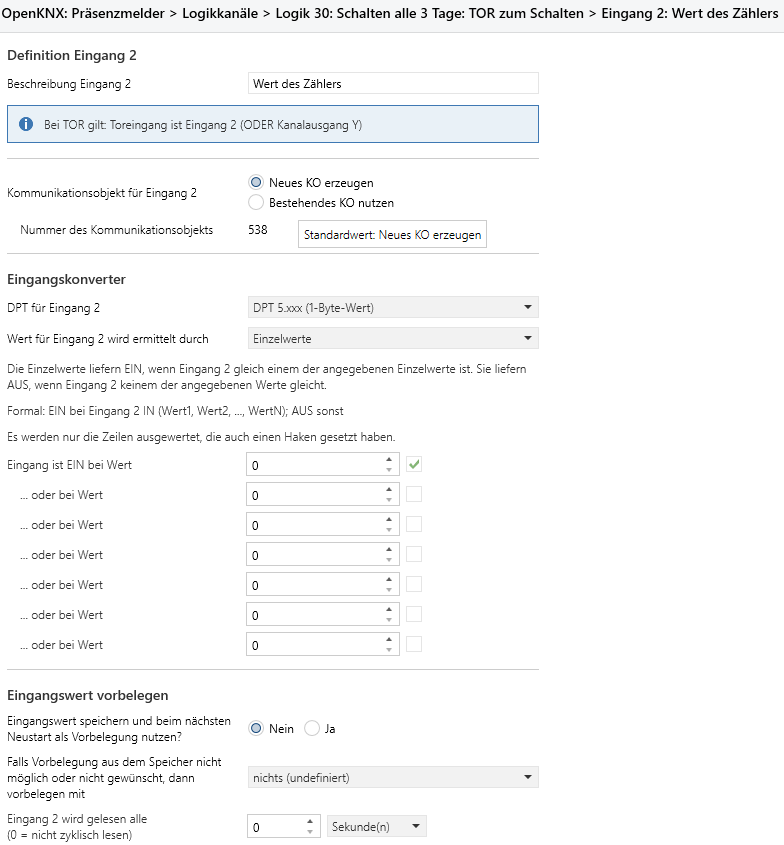</kbd>

Der aktuelle Schaltzustand der Zeitschaltuhr wird als Interner Eingang 3 mit dem Kanalausgang 26 verbunden. Auch die 26 (gelb markiert) muss bei einer Übernahme des Beispiels angepasst werden (Kanalnummer der Zeitschaltuhr mit den Schaltzeiten).

<kbd>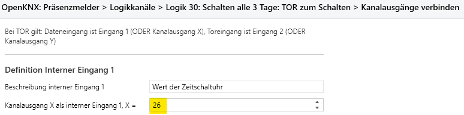</kbd>

Der Ausgang vom Tor macht nichts besonderes. Er lässt alle Signale vom Tor-Dateneingang einfach durch.

<kbd></kbd>

#### **Gruppenadressen und deren Verknüpfungen**

Es werden nur 2 GA gebraucht:

- eine transportiert den Zählerwert (DPT 5.005)
- eine für den Schaltwert alle 3 Tage

<kbd>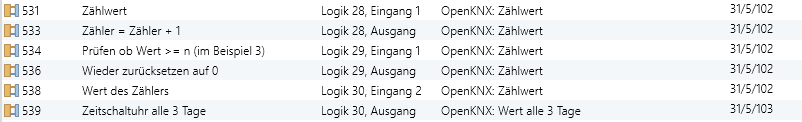</kbd>

Der Zählwert wird von Logik 28 erhöht (inkrementiert) und muss natürlich mit dem eigenen Eingang verbunden werden, damit beim nächsten erhöhen der aktuelle Wert anliegt und erhöht werden kann. Deswegen die Verknüpfung von KO 531 und KO 533.

Logik 29 soll den Zählwert zurücksetzen, wenn er 3 ist (das IF). Dazu muss der Wert an den Eingang von Logik 29 (zur Prüfung) und and den Ausgang (damit er auf 0 gesetzt werden kann). Deswegen sind KO 533 mit KO 534 und KO 536 verknüpft.

Logik 30 soll das Tor immer öffnen, wenn der Zähler = 0 ist, deswegen muss der Zählwert auch an den Eingang von Logik 30 (zur Prüfung). Deswegen ist KO 533 auch mit KO 538 verknüpft.

Der Ausgang von Logik 30 enthält die Schaltzeiten alle 3 Tage, deswegen ist hier die GA für den Schaltwert alle 3 Tage mit KO 539 verknüpft.

### **Einfacher Szenen-Controller**

Für Geräte, die keine Szenen können oder für bestimmte Zustände nur ein Setzen über ein KO und nicht über eine Szene unterstützen, möchte man sich vielleicht kleine Logiken basteln, die auf eine Szene reagiert und entsprechend ein KO schaltet.

Ebenso kann es nötig sein, über weitere Szenen das entsprechende KO wieder auszuschalten. Das Logikmodul bietet mit der Logikfunktion "Schalter", in Verbindung mit den Eingangskonvertern für "Einzelwerte", eine einfache Möglichkeit dies zu erreichen.

Folgendes Szenario wird für dieses Beispiel angenommen: 

Man hat für einen Raum Szenen definiert:

* 10 - abwesend - alles Licht und Fernseher geht aus, Rollladen ist auf Automatik, PM ist entsperrt
* 17 - fernsehen - Deckenlicht aus, Fernseher an, Rollladen geht zu, Ambientenbeleuchtung wird nicht tangiert, PM sperren
* 22 - ambiente1 - Deckenlicht aus, Ambientenbeleuchtung mit irgendwelchen angenehmen Einstellungen an
* 23 - ambiente2 - Deckenlicht aus, Ambientenbeleuchtung mit irgendwelchen anderen angenehmen Einstellungen an
* 21 - ambiente0 - Ambientenbeleuchtung aus, PM entsperren
* 18 - normal - Deckenlicht an, Fernseher aus, Rollladen auf Automatik, PM entsperren
* 55 - lesen - Deckenlicht aus, Ambientenbeleuchtung auf Leselicht, PM sperren

Rollladenaktor, Schaltaktor für den Fernseher und alle Lichtcontroller unterstützen Szenen, der PM aber nicht.

Mit nur einem Logikkanal kann man den PM in das obige Szenario einbinden. 

#### **Schalter-Logik für unterschiedliche Ein- und Ausschaltbedingungen**

Hier wird die Schalter-Logik genutzt. Diese ist Trigger-Basiert und erlaubt es, Einschalt- bzw. Ausschalt-Signale über getrennte Eingänge bereitzustellen.

<kbd>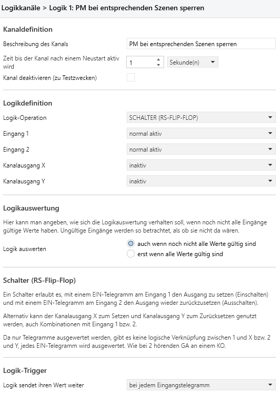</kbd>

Eingang 1 wird mit den Szenen belegt, die für ein Sperren des PM sorgen. Dafür wird der DPT17 (Szenen) gewählt mit einem Eingangskonverter, der Einzelwerte erlaubt.

<kbd>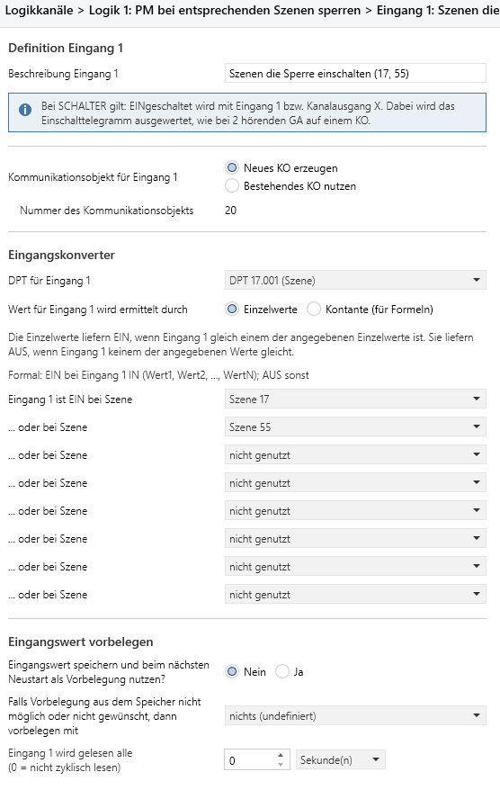<kbd>

Die Szene 17 und Szene 55 aus obigem Beispiel werden eingetragen.

Eingang 2 wird mit den Szenen belegt, die für ein entsperren des PM sorgen. Auch hier wird DPT17 (Szenen) gewählt mit einem Einzelwert-Eingangskonverter.

<kbd>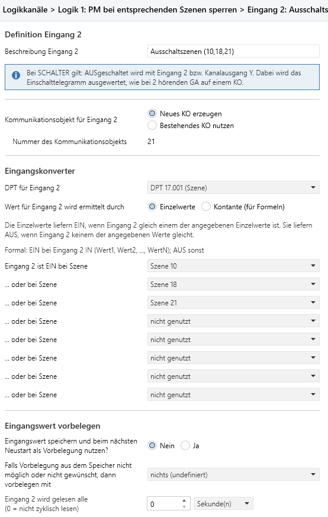</kbd>

Die Szenen 10, 18 und 21 aus obigem Beispiel werden eingetragen. Wie man sieht, können bis zu 8 Szenen pro Eingangskonverter genutzt werden.

Der Ausgang macht nichts besonderes, hier wird einfach nur ein DPT1 (Schalten) für die PM-Sperre ausgegeben. 

<kbd>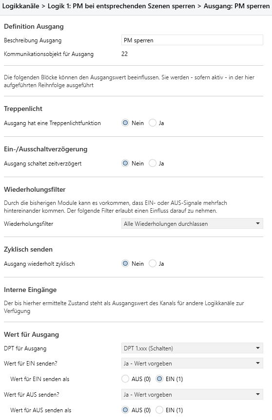</kbd>

Als Erweiterung könnte man den Ausgang auch über ein Treppenlicht, eingestellt auf z.B. 4 Stunden, die PM-Sperre ausschalten lassen, falls man vergisst, die Szene "normal" zu wählen. Dies ist in dem Beispiel nicht enthalten.

<kbd>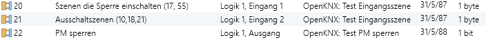</kbd>

Bei der KO-Zuordnung bekommen Eingang 1 und Eingang 2 die gleiche Szenen-GA zugewiesen, da ja die gleiche Szenen-Information für die Einschalt- wie auch für die Ausschalt-Bedingung zur Verfügung stehen muss. Der Ausgang wird mit dem Sperreingang des PM verbunden.

#### **Funktionsbeschreibung**

Wird über die GA 31/5/87 die Szene 17 (fernsehen) gesendet, sendet der Eingang 1 ein EIN-Signal an die Schalter-Logik. Diese schaltet den Ausgang auf EIN, wodurch auf der GA 31/5/88 ein EIN-Telegramm an den PM geschickt wird und diesen sperrt.

Wenn als nächstes z.B. die Szene 23 (ambiente2) gesendet wird, passiert in der Logik gar nichts, da weder Eingang 1 noch Eingang 2 auf diese Szene reagieren. Der PM bleibt somit gesperrt.

Fall die Szene 18 (normal) gesendet wird, sendet Eingang 2 ein EIN-Signal an die Schalter-Logik. Diese schaltet den Ausgang auf AUS, wodurch auf der GA 31/5/88 ein AUS-Telegramm an den PM geschickt wird und diesen entsperrt.

### **Betriebszeitzähler mit maximaler Betriebszeit pro Tag**

Hier wird in einem einfachen 2-Kanal-Beispiel gezeigt, wie man mit dem Logikmodul die Betriebszeit von Geräten kontrollieren kann. Die Betriebszeit ist im Beispiel als Sekundenzähler realisiert, das kann natürlich auch in Minuten oder Stunden abgeändert werden. 

Es wird folgendes Verhalten realisiert:

* Ein EIN-Signal am Schalteingang führt zum Einschalten des Geräts (EIN-Signal am Schaltausgang) und zum starten der Betriebszeit.
* Ein AUS-Signal am Schalteingang führt zum Ausschalten des Geräts (AUS-Signal am Schaltausgang) und zum stoppen der Betriebszeit.
* Jedes weitere EIN- oder AUS-Signal lässt die Betriebszeit entsprechend weiterlaufen oder stoppen.
* Beim erreichen der maximalen Betriebszeit (im Beispiel 30 Sekunden) wird das Gerät durch ein AUS-Signal gestoppt. 
* Darauffolgende EIN-Signale führen nicht zu erneuten starten des Geräts. 
* Wird die Betriebszeit auf 0 zurückgesetzt (z.B. durch eine Zeitschaltuhr um Mitternacht), kann das Gerät durch ein EIN-Signal erneut gestartet werden.

Diese Beispiellogik realisiert somit einen Betriebszeitzähler, der eine maximale Einschaltzeit pro Zeitintervall (z.B. pro Tag) eines Gerätes sicherstellt.

Vorgehen:

Das normale Einschaltsignal des Gerätes wird durch ein TOR geschickt, dass im AUS-Fall auf jeden Fall auch ein AUS-Signal schickt. Im EIN-Fall wird nur ein EIN-Signal weitergeschickt, wenn der Betriebszeitzähler noch nicht die maximale Einschaltzeit (im Beispiel 30 Sekunden) erreicht hat. Der Ausgang schaltet das Gerät ein und schaltet gleichzeitig einen einfachen Zähler, der weiter zählt, solange ein EIN vorliegt.

#### **Schaltsignal auswerten**

<kbd>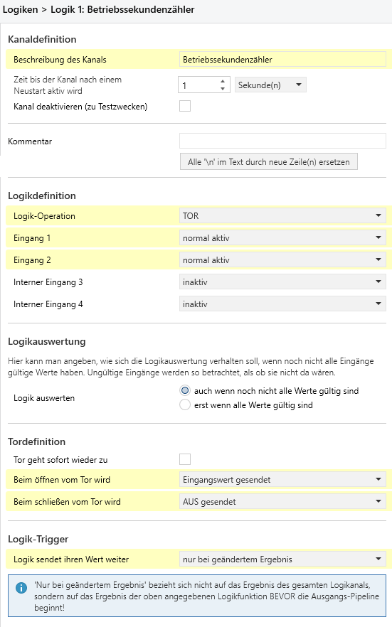</kbd>

Es wird ein Tor verwendet, dass beim Öffnen den Wert vom Eingang 1 sendet, beim Schließen immer ein AUS sendet.

Es wird immer nur beim geänderten Ergebnis gesendet, damit mehrere aufeinanderfolgende EIN-Signale den Zählvorgang nicht stören.

#### **Zählerwert auswerten**

<kbd>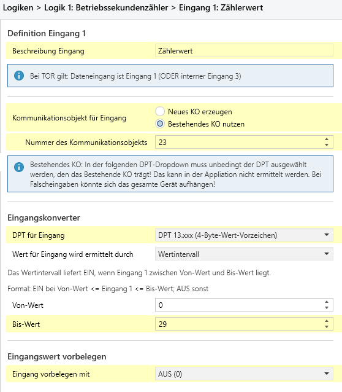</kbd>

Eingang 1 bekommt den Zählwert über eine interne KO-Verknüpfung vom Eingang 1 des anderen Kanals. Bei der Übernahme der Logik zum ausprobieren bitte darauf achten, dass die KO-Nummer passend zum Kanal angepasst wird.

Der Zählerwert muss im Intervall 0 bis 29 liegen, damit der Eingang EIN ist. Somit kann das TOR nur ein EIN-Signal senden, wenn die Betriebszeit innerhalb des vorgegebenen Intervalls ist. Hier muss man auch die Obergrenze ändern, wenn man eine andere Betriebszeit haben will.

#### **Einschaltsignal empfangen**

<kbd>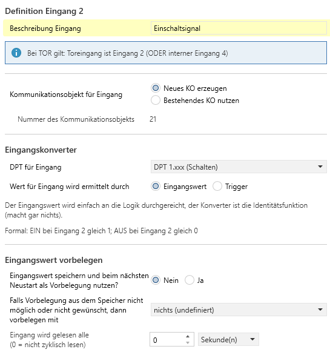</kbd>

Über Eingang 2 wird das Schaltsignal empfangen, mit dem das Gerät eingeschaltet werden soll. Das ist ein Standard-DPT1-Eingang ohne spezielle Einstellungen. 

#### **Gerät schalten**

<kbd>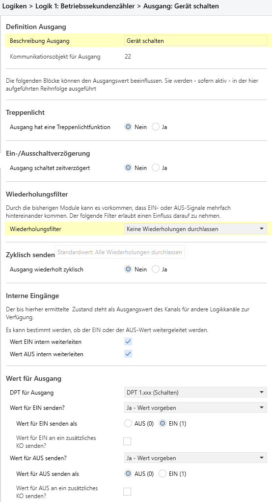</kbd>

Das ist der Ausgang, über den das Gerät geschaltet wird. Das ist ein Standard-DPT1-Ausgang, bei dem als einziges sichergestellt wird, dass mehrere aufeinanderfolgende EIN- bzw. AUS-Signale am Ausgang nicht wiederholt werden, um die Zählfunktion nicht zu beeinflussen.

#### **Betriebszeitzähler realisieren**

<kbd>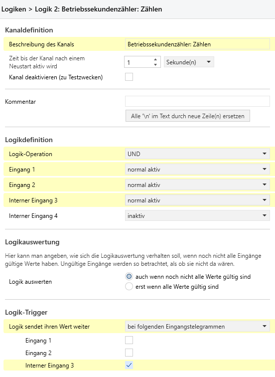</kbd>

Der eigentliche Zähler wird durch ein UND realisiert, das von dem Kanal vorher freigeschaltet wird und das durch zyklisches Senden am Ausgang, verbunden mit einer Formel, die immer +1 zählt, zu einem Zähler wird. 

Da der Trigger der Logik durch den Internen Eingang 3 erfolgt, kann ein Hochzählen des Eingangssignals keine Auswirkungen auf die Logik haben. Andernfalls gäbe es eine Endlosschleife (also nicht vergessen, das so einzustellen)!

#### **Der eigentliche Wert des Zählers**

<kbd>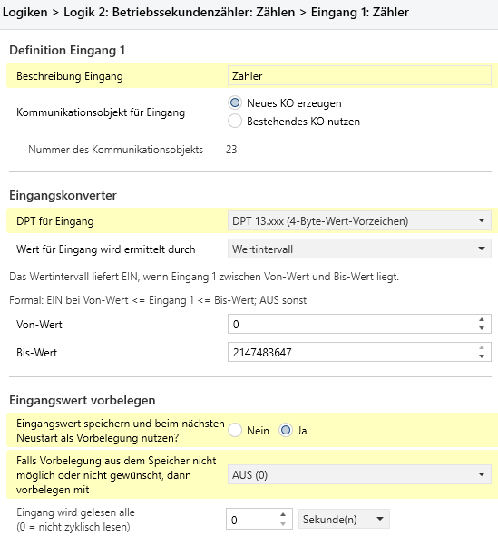</kbd>

Eingang 1 repräsentiert den eigentlichen Zählwert. Dieser Wert wird bei einem Busausfall gespeichert und nach der Buswiederkehr neu geladen. Somit ist der Wert ausfallsicher. Für den Fall, dass noch kein Wert im Speicher existiert, wird mit dem Wert 0 begonnen.

#### **Konstante mit Wert 1 zum hochzählen**

<kbd>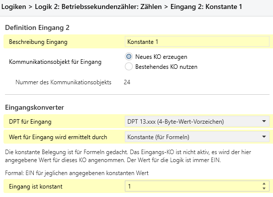</kbd>

Der Eingang 2 repräsentiert den konstanten Wert 1, der in der Ausgangsformel bestimmt, um wie viel der vorherige Wert hochgezählt wird.

#### **Interne Verknüpfung zum Schaltkanal**

<kbd>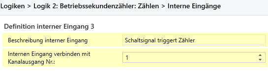</kbd>

Diese Verknüpfung zum Ausgang von Kanal 1 aktiviert den Zähler immer dann, wenn Kanal 1 auf EIN steht.

#### **Zählausgang mit Zeitglied und Increment-Formel**

<kbd>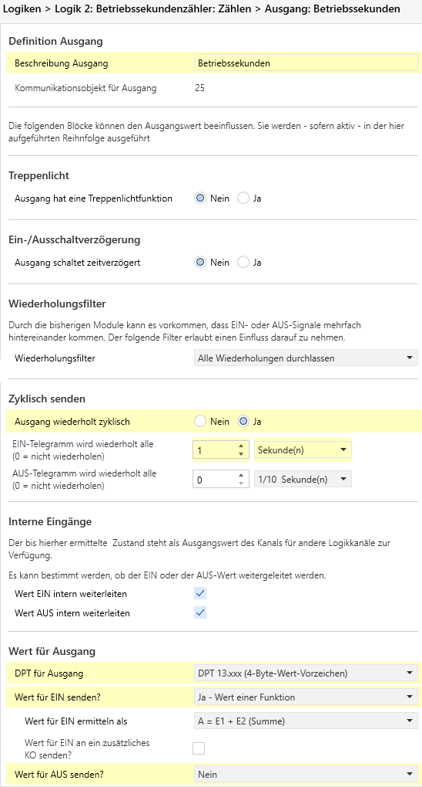</kbd>

Der Zählausgang vereinigt einige der fortgeschrittenen Funktionen des Logikmoduls.

Zum einen wird hier im Sekundentakt zyklisch gesendet. Dies repräsentiert die Zeitbasis des Zählers. Hier müsste man Minute oder Stunde einstellen, um es zu einem Minuten- oder Stundenzähler zu machen. Man könnte aber auch z.B. 10 Sekunden wählen, damit nur zu vollen 10 Sekunden abgeschaltet wird. 
Änderungen an der Zeitbasis erlauben somit auch andere Arten von Zählungen.

Der Ausgangswert wird als Wert einer Funktion ermittelt, in diesem Fall als Summe von Eingang 1 und Eingang 2. Wir wissen, das Eingang 1 den Zählwert repräsentiert und Eingang 2 den konstanten Wert 1. Hier wird also immer um 1 hochgezählt.

Wenn die Logik AUS ist, wird nichts gesendet und somit auch nichts hochgezählt.

#### **Kommunikationsobjekte und deren GA-Zuweisungen**

<kbd>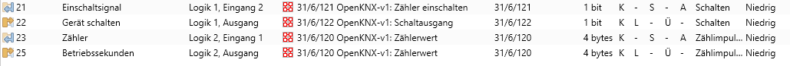</kbd>

Die Beispielverknüpfung zeigt uns die GA

* 31/6/120 - dies ist der Zählwert, also die abgelaufene Betriebszeit
* 31/6/121 - ein EIN- bzw. AUS-Signal auf diesem Eingang schaltet das Gerät ein bzw. aus.
* 31/6/122 - Dies ist der Schaltausgang der Logik und sollte mit dem zu schaltenden Gerät verbunden werden.

#### **Detaillierte Funktionsbeschreibung**

Zuerst gehen wir davon aus, dass der Zählwert 31/6/120 auf 0 steht, der Schalteingang 31/6/121 AUS ist und somit auch der Ausgang 31/6/122 AUS ist, das Gerät ist ausgeschaltet.

Ein EIN auf der 31/6/121 führt dazu, dass das TOR von Kanal 1 aufgeht. Ab Eingang 1 vom TOR liegt ein EIN-Signal, da der Zähler im Wertintervall von 0-29 ist. Dieses EIN-Signal wird zum Ausgang geschickt und damit ein EIN ausgesendet. Das Gerät wird eingeschaltet.

Durch die interne Verknüpfung wird das UND von Kanal 2 getriggert. Dieses UND hat am Eingang 1 ein EIN-Signal, da der Zähler im Wertebereich von 0-2147483647 liegt. Eingang 2 ist EIN, weil Konstante Werte immer ein EIN-Signal ergeben. Interner Eingang 3 ist EIN, weil Kanal 1 am Ausgang ein EIN hat.

Das UND schickt also ein EIN-Signal zu seinem Ausgang, der erst einmal den Wert von Eingang 1 um eins hoch zählt. Der Zähler hat jetzt den Wert 1. 

Diese Änderung triggert den Eingang 1 von Kanal 1, aber 1 liegt immer noch im Intervall von 0-29, der Eingang bleibt somit auf EIN.

Da der Ausgang von Kanal 2 zyklisch senden soll, wird er nach einer Sekunde ein erneutes EIN senden. Der Ausgang addiert also wieder eine 1. Der Zähler hat jetzt den Wert 2.

Diese Änderung triggert den Eingang 1 von Kanal 1, aber 2 liegt immer noch im Intervall von 0-29, der Eingang bleibt somit auf EIN.

Das geht jetzt so weiter, bis der Zählwert am Ausgang von Kanal 2 von 29 auf 30 erhöht wird. 

Diese Änderung triggert den Eingang 1 von Kanal 1, 30 liegt jetzt außerhalb vom Intervall von 0-29, der Eingang geht auf AUS und das TOR sendet an seinem Ausgang auch ein AUS.

Durch die interne Verknüpfung wird das UND von Kanal 2 getriggert. Dieses UND hat jetzt am internen Eingang 3 ein AUS, weil Kanal 1 am Ausgang ein AUS hat. Das UND schickt ein AUS-Signal an seinen Ausgang und der Kanal 2 hört auf zu zählen.

Wird zwischendurch ein AUS am Schalteingang von Kanal 1 empfangen, geht das TOR zu und schickt ein AUS an seinem Ausgang, was das Gerät ausschaltet. Durch die interne Verknüpfung hört auch Kanal 2 auf zu zählen.

Wird, nachdem der Zähler seinen maximalwert erreicht hat, erneut ein EIN-Signal an den Schalteingang vom TOR gesendet, dann geht das TOR zwar auf, aber da der Zählwert 30 außerhalb des Intervalls 0-29 liegt, ist der Eingang 1 vom TOR AUS, somit wird dieses AUS-Signal am Ausgang gesendet. Genauer gesagt, es wird unterdrückt, weil keine Wiederholungen von AUS zugelassen sind. Auf jeden Fall wird das Gerät nicht erneut eingeschaltet.

Um das Gerät wieder einschalten zu können, muss man den Zähler auf 0 setzen. Das kann man z.B. durch eine Zeitschaltuhr machen, die eine 0 auf die GA 31/6/120 schickt.

### **Duscherkennung über kurzfristig stark ansteigende Luftfeuchte**

Hier wird eine Art der Duscherkennung gezeigt, die nicht auf der Erhöhung der Temperatur des Zu- oder Ablaufrohres basiert, sondern auf der relativen Luftfeuchte.

Da relative Luftfeuchte aber jeglichen Wert bis 100% haben kann, ohne dass geduscht wird, muss nicht auf den absoluten Wert, sondern auf eine starke Steigung der Luftfeuchte innerhalb kurzer Zeit geachtet werden.

Der Luftfeuchte-Sensor wird so programmiert, dass er bei einer Änderung der Luftfeuchte um 1% sendet.

Im Logikmodul wird überprüft, ob innerhalb einer Minute die Luftfeuchte um mehr als 2% steigt.

Man kann (und sollte) die einzelnen Grenzwerte an die eigenen Bedürfnisse anpassen.

#### Vergleichswert für die Duscherkennung ermitteln

Da wir für die Duscherkennung vergleichen wollen, ob die Luftfeuchte innerhalb einer Minute um 2% gestiegen ist, müssen wir erst einmal dafür sorgen, dass wir jede Minute den aktuellen Wert für eine Minute speichern.

Dies erfolgt klassischerweise durch ein TOR, dass jede Minute kurz geöffnet wird. Dadurch wird der Wert vom Eingang auf den Ausgang geschickt. Da das TOR danach sofort wieder geschlossen wird, bleibt der Wert am Ausgang für eine Minute erhalten.

Im folgenden Bild wird die Logik für das TOR definiert.

<kbd>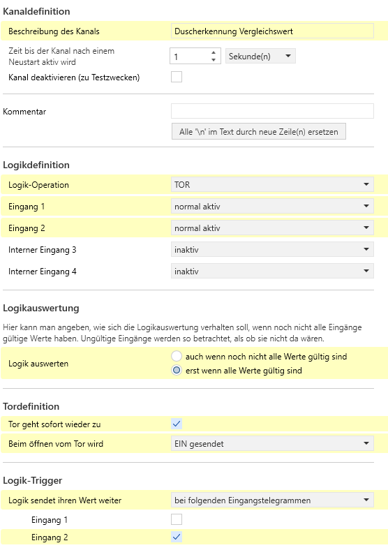</kbd>

Das folgende Bild definiert den Eingang 1, als DPT9. Die Einstellungen führen dazu, dass nach einem Neustart der zuletzt gespeicherte Wert wieder am Eingang anliegt.

<kbd>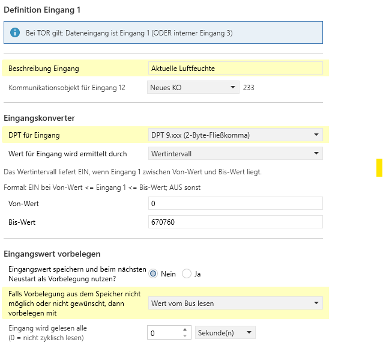</kbd>

Der Eingang 2 dient nur dazu, das TOR kurz zu öffnen und durchzuschalten. Dieser Eingang wird jede Minute durch ein EIN-Telegramm getriggert.

<kbd>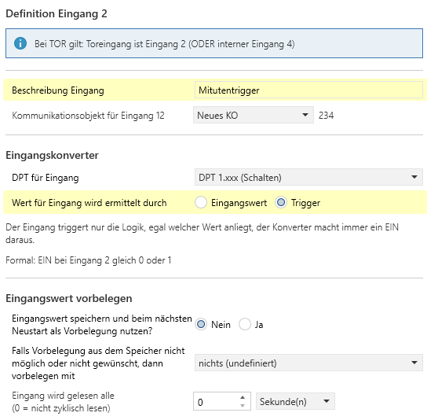</kbd>

Der Ausgang ist so definiert, dass er mit jedem Trigger den Wert vom Eingang 1 übernimmt.

<kbd>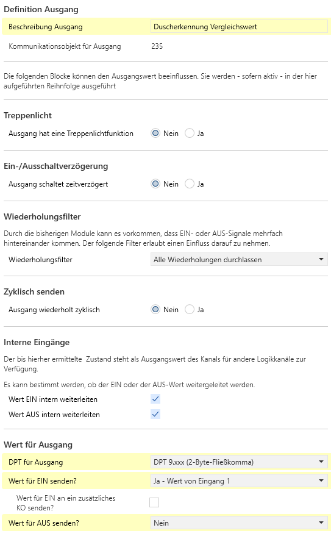</kbd>

#### Minutentrigger bereitstellen

Damit das TOR jede Minute getriggert werden kann, wird hier über eine einfache Zeitschaltuhr jede Minute ein Signal ausgelöst. Die Definitionen sprechen (hoffentlich) für sich und brauchen keine weitere Erklärung.

<kbd>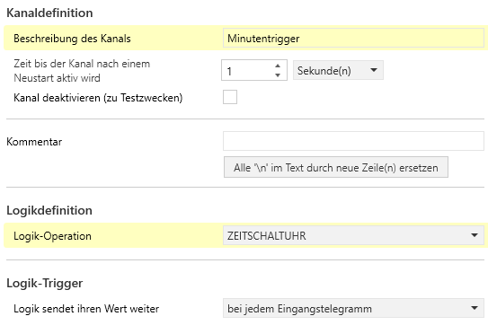</kbd>

<kbd>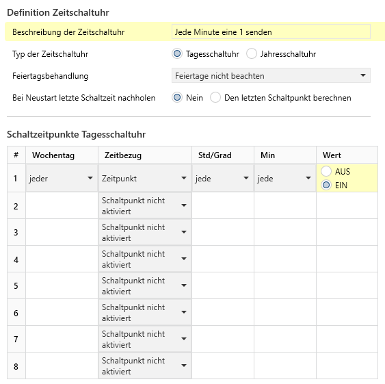</kbd>

<kbd></kbd>

#### Duscherkennung über Luftfeuchte

Dieser Kanal macht die eigentliche Duscherkennung. Über ein Differenzintervall wird herausgefunden, ob der aktuelle Wert für Luftfeuchte vom vorherigen Wert um mehr als 2% abweicht.

Das erste Bild zeigt die Kanaleinstellung, die ein einfaches OR ist.

<kbd>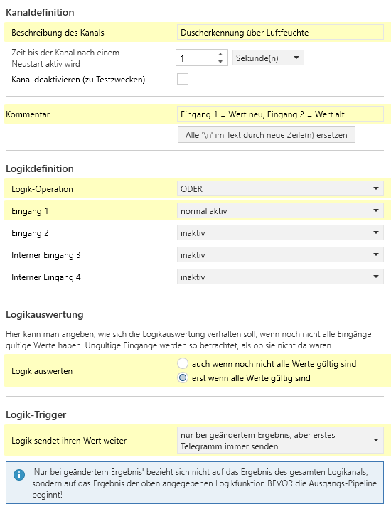</kbd>

Das folgende Bild zeigt den Eingang 1 für das Differenzintervall. Wenn die Differenz >= 3 ist, triggert der Eingang die Logik.

ACHTUNG: Der Eingang ist über ein internes KO mit dem Eingang 1 von Kanal 12 verbunden. Da die KO-Nummern vom Kanal abhängig sind, muss die Nummer angepasst werden, falls dieses Beispiel auf einen anderen Kanal adaptiert wird. Alternativ kann man normal extern über GA verknüpfen.

<kbd>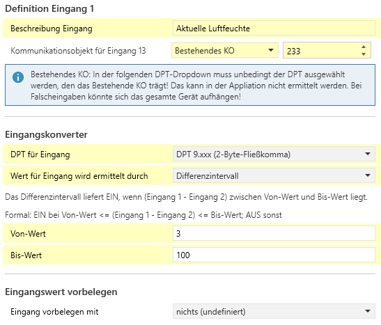</kbd>

Der Eingang 2 ist der 2. Wert der Differenz vom Differenzintervall.  

ACHTUNG: Der Eingang ist über ein internes KO mit dem Ausgang von Kanal 12 verbunden. Da die KO-Nummern vom Kanal abhängig sind, muss die Nummer angepasst werden, falls dieses Beispiel auf einen anderen Kanal adaptiert wird. Alternativ kann man normal extern über GA verknüpfen.

<kbd>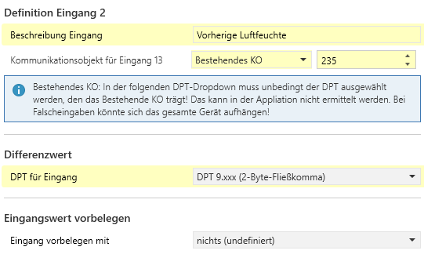</kbd>

Der Ausgang ist als Treppenlicht definiert, das von der Duscherkennung auf EIN geht und nach 10 Minuten wieder auf 0 geht. 

<kbd></kbd>

Sollte dieses Beispiel übernommen werden, müssen einige Parameter eventuell angepasst werden. Falls z.B. im Normalverlauf die Luftfeuchte schon um 2% steigen kann, sollte man hier 3% wählen. Die Nachlaufzeit vom Treppenlicht kann auch an eigene Bedürfnisse angepasst werden.

### **Wert von einem KO nach einem Neustart lesen**

Es gibt Geräte, die können keine Werte von anderen Geräten lesen, müssten es aber tun, um nach einem Neustart den korrekten Zustand haben. Hier kann das Logikmodul helfen. 

Das folgende Beispiel schließt gleichzeitig eine Lücke beim OpenKNX-Fingerprint der Version 0.2. Wird dort eine Aktion definiert, die ein "Umschalten" repräsentiert, bekommt diese Aktion ein Status-KO als Eingang für den "Wert zum Umschalten". Leider fehlt in dieser Version die Möglichkeit, dass dieses KO nach einem Neustart den Wert liest. 

Das Beispiel ist sehr einfach zu realisieren und benötigt nur einen Kanal.

#### **Lesen nach Neustart**

Dieser Logikkanal definiert ein ODER mit einem Eingang. Es geht einfach nur darum, dass der Eingang verfügbar ist.

<kbd>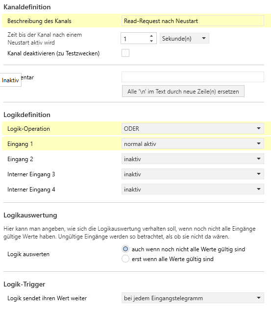</kbd>

#### **Zyklisch lesen**

Der Eingang 1 wird so definiert, dass er seinen Wert vom Bus liest, und zwar zyklisch alle 5 Sekunden, bis eine Antwort eintrifft.

<kbd>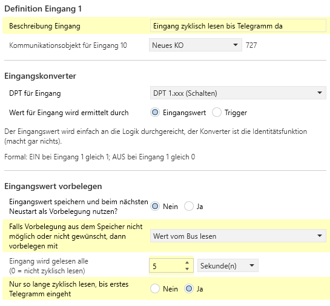</kbd>

> Achtung: Falls das KO für diesen Eingang keine Antwort erhält, wird alle 5 Sekunden ein Lesetelegramm gesendet. Man sollte das also nur machen, wenn man sich sicher ist, dass eine Antwort kommt.

#### **Ausgang: ohne Funktion**

Der Ausgang tut in diesem Beispiel nichts und muss eigentlich nicht definiert werden. Wenn man aber den Ausgangskonverter auf "nicht senden" stellt, wird für diesen Ausgang auch kein KO dargestellt, was die Übersicht erhöht.

<kbd>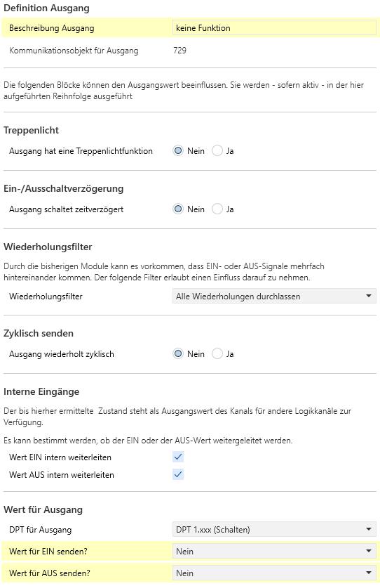</kbd>

#### **KO-Zuordnung**

Für diese Logik erscheint nur ein KO für Eingang 1. Diesem KO muss eine GA zugewiesen werden, deren Status nach dem Neustart gelesen werden soll. Im Beispiel wird der Status vom "Garage: Tor ist unten" gelesen.

<kbd></kbd>

#### **Funktionsbeschreibung**

Nach einem Neustart des Moduls wird dieser Kanal normal ausgeführt und versucht, den Eingang 1 mit einem gültigen Wert zu versorgen, indem er alle 5 Sekunden die zugeordnete GA liest. Sobald die erste Antwort kommt, hört der Eingang auf zu lesen. Das wars, mehr macht er nicht.

Warum ist das eine Lösung für fehlende Reads eines anderen KO? Weil der Kanal am Eingang 1 die GA zugeordnet bekommt, die auch das andere KO zugeordnet hat. Das Antworttelegramm empfangen nämlich beide KO, so wird auch das KO ohne eigene Leselogik mit initialisiert.

### **Vervielfacher/Sequenzer (am Beispiel einer Farbringsteuerung für den OpenKNX-Fingerprint)**

Der OpenKNX-Fingerprint in der Version 0.2 kann keine Rückmeldung vom Status des geschalteten Gerätes über seinen Farbring. Diese Lücke kann über das Logikmodul geschlossen werden.

Das folgende Beispiel zeigt, wie ein Vervielfacher/Sequenzer mit dem Logikmodul aufgebaut werden kann, um aus einem Telegramm mehrere zu machen und so den Farbring vom Fingerprint zu steuern. Damit das Beispiel direkt funktioniert, muss es auf dem Logikmodul im Fingerprint gebaut werden. 

Will man es auf einem anderen OpenKNX-Logikmodul nachbauen, muss man auf die internen KO-Verknüpfungen bei den Ausgängen verzichten und die Ausgänge normal über GA verknüpfen.

#### **Hintergrund**

Der Farbring vom Fingerprint kann über 4 Eigenschaften gesteuert werden, die alle einzeln gesetzt werden können:

1. Farbe mit den Werten 1=Rot, 2=Blau, 3=Violett, 4=Grün, 5=Gelb, 6=Cyan, 7=Weiß
2. Geschwindigkeit mit den Werten 0-255 (z.B. fürs Blinken oder Pulsieren)
3. Anzahl der Zyklen mit den Werten von 0-255 (z.B. fürs Blinken oder Pulsieren)
4. Effekt mit den Werten 1=Pulsieren, 2=Blinken, 3=An, 4=Aus, 5=Fade-In, 6=Fade-Out

1-4 dieser Werte müssen gesetzt werden, damit der LED-Ring aufleuchtet, z.B.

* Farbe=6, Geschwindigkeit=100, Anzahl=10, Effekt=2 erzeugt 10 mal mittelschnelles Blinke in Cyan
* Farbe=7, Effekt=3 schaltet Weiß ein
* Effekt=4 schaltet aus

#### **Anforderung**

Die Anforderung ist nun, über ein einfaches Statussignal (ein EIN in DPT1) alle 1-4 Werte nach Wunsch setzen zu können und so eine Wunschfarbe mit Wunscheffekt aufleuchten zu lassen. Ein AUS auf diesem Statussignal schaltet die LED immer aus.

#### **Lösungsidee**

Man baut für jede gewünschte Farbe, Geschwindigkeit, Anzahl und Effekt einen DPT1 zu DPT5 Konverter, der immer, wenn er ein EIN empfängt, den passenden Wert setzt. 

Bei den Konvertern für die Effekte wird auch das AUS-Signal ausgewertet.

Damit **eine** GA dann die Funktionen (lila, pulsieren, langsam, 10 mal) auslöst, muss sie nur den DPT1-Eingängen der entsprechenden Konverter zugeordnet werden.

#### **DPT1 zu DPT5 Konverter**

Ein solcher Konverter ist schnell definiert, hier am Beispiel vom Setzen der Farbe Lila:

<kbd>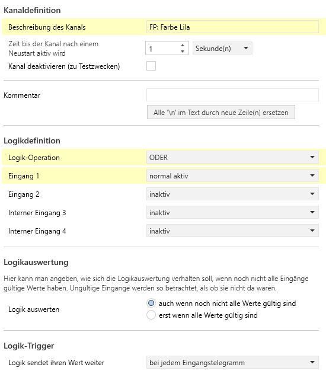</kbd>

Die Logik ist ein einfaches ODER mit einem Eingang.

<kbd>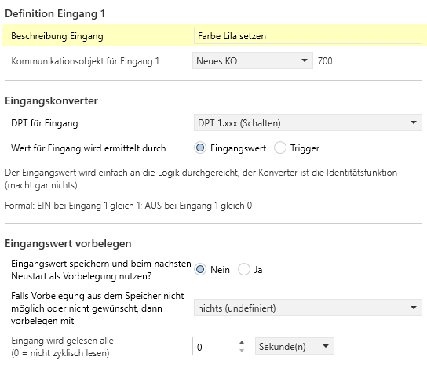</kbd>

Der Eingang 1 behält seine Standardeinstellungen, man sollte ihn nur passend benennen.

<kbd>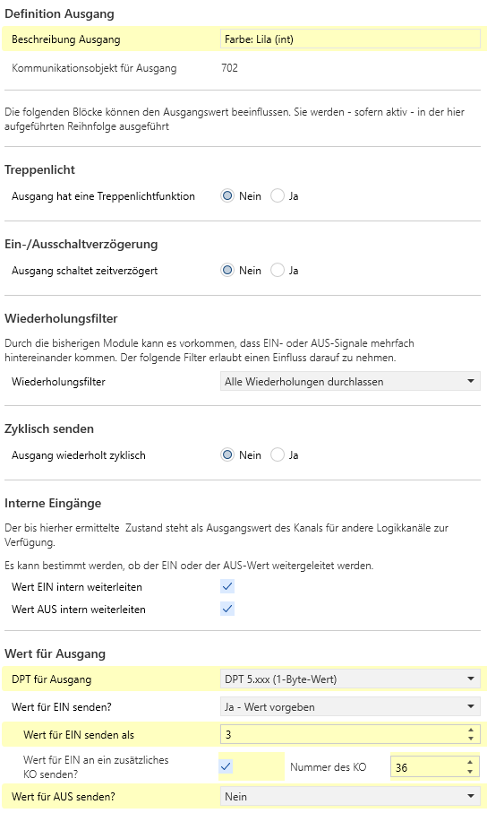</kbd>

Der Ausgang hat die Besonderheit, dass er nur bei EIN etwas ausgibt und diesen Wert direkt in das KO 36 des Fingerprints schreibt, dass die Farbe erwartet. So benötigt man keine GA-Verknüpfung zwischen dem Ausgang des Konverters und dem Farb-KO.

#### **Weitere Konverter erstellen**

Damit das Beispiel Sinn macht, werden weitere DPT1 zu DPT5 Konverter benötigt. 
Für diese Konverter werden keine Screenshots gezeigt, da diese identisch aussehen, bis auf die Texte, den Wert am Ausgang und die KO-Nummer beim Ausgang:

1. Farbe Gelb, Wert 5, KO-Nummer 36
2. Farbe Grün, Wert 4, KO-Nummer 36
3. Anzahl 10, Wert 10, KO-Nummer 39
4. Geschwindigkeit 255, Wert 255, KO-Nummer 38
5. Geschwindigkeit 100, Wert 100, KO-Nummer 38

#### **Sonderfall Konverter für Effekte**

Da der Effekt Ein- und Ausschalten soll, sieht seine Definition etwas anders aus, hier am Beispiel von Pulsieren:

<kbd>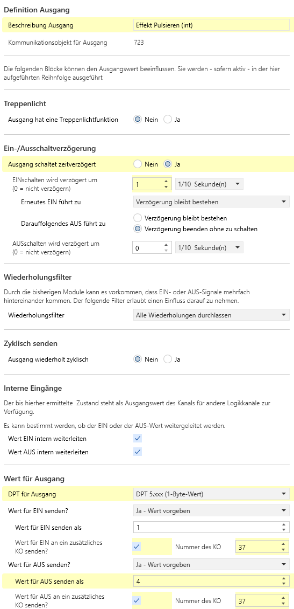</kbd>

Dieser Konverter muss bei EIN die 1 (Pulsieren) senden, beim AUS die 4 (Aus), beides an KO 37.

Ein kleiner Trick liegt noch bei der Definition "Ausgang schaltet zeitverzögert", die auf 1/10 Sekunde eingestellt ist. Damit wird, obwohl die GA quasi gleichzeitig alle Konverter triggert, das setzen des Effektes und damit das Einschalten der LED um 1/10 Sekunden verzögert. Damit ist sichergestellt, dass alle anderen Parameter für den Effekt sicher im Fingerprint gesetzt sind und es kein nachträgliches Flimmern beim Effekt gibt.

#### **Weitere Effekt-Konverter**

Für dieses Beispiel werden noch weitere Effekt-Konverter gebraucht, die sich alle nur durch deren Text und die Effektnummer bei EIN unterscheiden:

1. Effekt Blinken an/aus, EIN = 2
2. Effekt Dauerleuchten an/aus, EIN=4

#### **Übersicht der definierten Kanäle**

Wenn man jetzt im Logikmodul auf "Übersicht interne KO" geht, sollte man folgendes Bild sehen:

<kbd></kbd>

Hier ist es besonders wichtig, dass in der Spalte "zusätzliche KO" alle KO-Nummern so sind, wie im obigen Bild vorgegeben.

#### **Zuordnung von Gruppenadressen**

Das folgende Bild zeigt konzeptionell, wie man jetzt einzelnen DPT1-GA den Eingangs-KO der Konverter zuordnen kann und so den Farbring des Fingerprints steuern kann:

<kbd>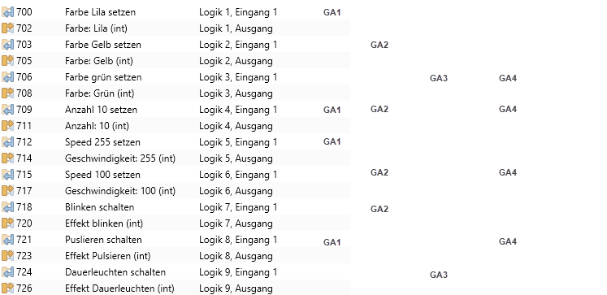</kbd>

Man erkennt folgendes:

* GA1 löst 10 mal langsames Pulsieren in Lila aus
* GA2 löst 20 mal mittelschnelles Blinken in Gelb aus
* GA3 löst dauerhaftes Leuchten in Grün aus
* GA4 löst 10 mal mittelschnelles Pulsieren in Gelb aus

Durch weitere Konverter kann man weitere Variationen für den Farbring hinzufügen und so weitere Leuchteffekte erzeugen.

## **Weitere Beispiele**

Die folgenden Beispiele müssen noch ausgearbeitet werden. Die gegebenen Überschriften zeigen aber bereits jetzt eine Liste der möglichen Funktionen.

### Ist ein Fenster zu lange offen, soll der Text "Auskühlalarm" als Meldung auf dem Glastaster erscheinen

### Ist die Markise durch einen Alarm (Windalarm/Regenalarm) gesperrt, soll ein langes Piepen und ein rotes Blinken bei manueller Bedienung auf den Alarm hinweisen

### Wird die Haustür geöffnet, soll ein dreifaches Piepen darauf hinweisen, dass noch irgendeine eine Terrassentür nicht verschlossen ist

### Fernsehen oder Musikhören soll Präsenz in dem Raum simulieren

### Wenn ein Temperatursensor eine halbe Stunde lang kein Signal gesendet hat, diesen zurücksetzen

----

## **Update der Applikation**

Wie eine beliebige Applikation in der ETS aktualisiert werden kann, ist im OpenKNX-Wiki beschrieben:
<https://github.com/OpenKNX/OpenKNX/wiki/Wie-aktualisiert-man-eine-ETS-Applikation-auf-eine-aktuelle-Version>

### **Inkompatibilitäten beim Update**

Trotz intensiver Versuche, eine updatefähige Applikation zu erzeugen zeigt es sich, dass durch Erweiterungen, Benutzerwünsche und teilweises Unverständnis über die Updatefunktion der ETS es nicht möglich ist, immer ein Update ohne manuellen Eingriff anzubieten.

## **Unterstützte Hardware**

Die Software für dieses Release wurde auf folgender Hardware getestet und läuft damit "out-of-the-box":

* **Smart-MF Sensormodul** [www.smart-mf.de](https://www.smart-mf.de), als Logikmodul mit der Option, über eine Zwischenplatine einen Buzzer und/oder einen RGB-LED-Signalgeber zu erhalten
* **PiPico-BCU-Connector** [OpenKNX-Wiki](https://github.com/OpenKNX/OpenKNX/wiki/PiPico-BCU-Connector), als Logikmodul
* **1TE-RP2040-Smart-MF** [www.smart-mf.de](https://www.smart-mf.de), auf allen Varianten als Logikmodul lauffähig
* **OpenKNX-UP1-System** [OpenKNX-Wiki](https://github.com/OpenKNX/OpenKNX/wiki/OpenKNX-UP1), auf allen Varianten als Logikmodul lauffähig
* **OpenKNX-REG1-Base** [OpenKNX-Wiki](https://github.com/OpenKNX/OpenKNX/wiki/REG1-Base), Logikmodul lauffähig
* **OpenKNX-REG1-Base-IP** [OpenKNX-Wiki](https://github.com/OpenKNX/OpenKNX/wiki/REG1-Base-IP), Logikmodul (reines KNX-IP-Gerät) lauffähig

Andere Hardware kann genutzt werden, jedoch muss das Projekt dann neu compiliert werden. Alle notwendigen Teile für ein Aufsetzen der Build-Umgebung inclusive aller notwendigen Projekte finden sich im [OpenKNX-Projekt](https://github.com/OpenKNX)

Interessierte sollten auch die Beiträge im [OpenKNX-Forum](https://knx-user-forum.de/forum/projektforen/openknx) studieren.

## **Übersicht der vorhandenen Kommunikationsobjekte**

Hier werden nur Kommunikationsobjekte (KO) des Logikmoduls beschrieben, die KO anderer Module sind in der jeweiligen Applikationsbeschreibung dokumentiert.

KO | Name | DPT | Bedeutung
:---:|:---|---:|:--
15 | Urlaub | 1.001 | Eingang: Information über Urlaub
16 | Welcher Feiertag ist heute? | 5.010 | Ausgang: Nummer des Feiertages, falls der aktuelle Tag ein Feiertag ist, sonst 0
17 | Welcher Feiertag ist morgen? | 5.010 | Ausgang: Nummer des Feiertages, falls der morgige Tag ein Feiertag ist, sonst 0
18 | LED sperren | 1.001 | Eingang: LED global sperren (kein Licht)
19 | Buzzer sperren | 1.001 | Eingang: Buzzer global sperren (kein Ton)
n | Eingang 1 | *) | Eingang 1 für einen Logikkanal
n+1 | Eingang 2 | *) | Eingang 2 für einen Logikkanal
n+2 | Ausgang | **) | Ausgang eines Logikkanals

*) Eingangs-DPT ist 1, 2, 5, 5.001, 6, 7, 8, 9, 12, 13, 14, 17, 232

**) Ausgangs-DPT ist Eingangs-DPT ergänzt um DPT 16.

Jeder Logikkanal hat genau 3 aufeinanderfolgende Kommunikationsobjekte. Wenn n der Eingang 1 für Kanal x ist, so ist n+3 der Eingang 1 für Kanal x+1. Bei 99 Kanälen ist das letzte KO der Ausgang für Kanal 99 und hat die Nummer n+296.

n für Kanal 1 ist von dem Gerät abhängig, auf dem die Applikation Logik läuft:

* Für das Logikmodul ist n=20, somit ist das letzte belegte KO 316.
* Für das Sensormodul ist n=125, somit ist das letzte belegte KO 421 bzw. KO 364 bei 80 Logikkanälen.
* Für das Wiregateway ist n=150, somit ist das letzte belegte KO 446.
* Für das Enocean-Gateway ist n=320, somit ist das letzte belegte KO 469 (50 Logikkanäle).
