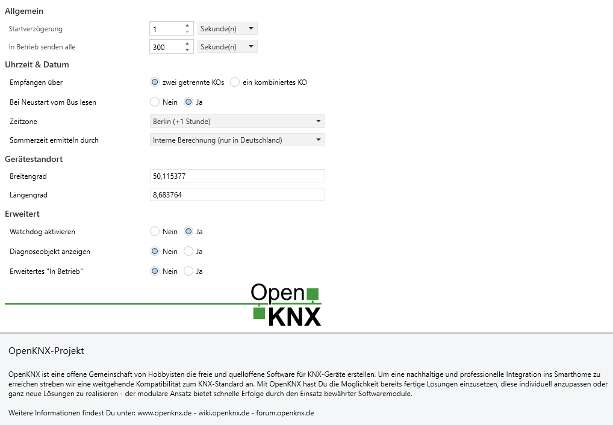

<!-- DOC -->
# OpenKNX

OpenKNX ist eine offene Gemeinschaft von Hobbyisten die freie und quelloffene Software für KNX-Geräte erstellen. Um eine nachhaltige und professionelle Integration ins Smarthome zu erreichen streben wir eine weitgehende Kompatibilität zum KNX-Standard an. Mit OpenKNX hast Du die Möglichkeit bereits fertige Lösungen einzusetzen, diese individuell anzupassen oder ganz neue Lösungen zu realisieren - der modulare Ansatz bietet schnelle Erfolge durch den Einsatz bewährter Softwaremodule.

<!-- DOCCONTENT
Weitere Informationen findest Du unter: www.openknx.de - wiki.openknx.de - forum.openknx.de
DOCCONTENT -->

<!-- DOCEND -->

## Inhalte

Hier werden die Geräteübergreifenden Parameter und Kommunikationsobjekte beschrieben, die man in fast allen OpenKNX Geräten findet. 

- [OpenKNX](#openknx)
  - [Inhalte](#inhalte)
  - [**Allgemein**](#allgemein)
    - [**Startverzögerung**](#startverzögerung)
    - [**In Betrieb senden alle**](#in-betrieb-senden-alle)
  - [**Uhrzeit \& Datum**](#uhrzeit--datum)
    - [**Empfangen über**](#empfangen-über)
      - [**Ein kombiniertes KO**](#ein-kombiniertes-ko)
      - [**Zwei getrennte KOs**](#zwei-getrennte-kos)
    - [**Bei Neustart vom Bus lesen**](#bei-neustart-vom-bus-lesen)
    - [**Zeitzone**](#zeitzone)
      - [**POSIX TZ-String**\*](#posix-tz-string)
    - [**Sommerzeit ermitteln durch**](#sommerzeit-ermitteln-durch)
      - [**Kommunikationsobjekt 'Sommerzeit aktiv'**](#kommunikationsobjekt-sommerzeit-aktiv)
      - [**Kombiniertem Datum/Zeit-KO (DPT 19)**](#kombiniertem-datumzeit-ko-dpt-19)
      - [**Interne Berechnung**](#interne-berechnung)
  - [**Gerätestandort**](#gerätestandort)
    - [**Breitengrad**](#breitengrad)
    - [**Längengrad**](#längengrad)
  - [**Erweitert**](#erweitert)
    - [**Watchdog aktivieren**](#watchdog-aktivieren)
    - [**Diagnoseobjekt anzeigen**](#diagnoseobjekt-anzeigen)
    - [**Erweitertes "In Betrieb"**](#erweitertes-in-betrieb)
    - [Erweitertes Speichern](#erweitertes-speichern)
      - [Flashspeicher](#flashspeicher)
      - [Auswirkung beim RP2040/RP2350](#auswirkung-beim-rp2040rp2350)
      - [Zyklisches speichern](#zyklisches-speichern)
      - [Manuelles speichern](#manuelles-speichern)
  - [**Info-LEDs**](#info-leds)
  - [**Module**](#module)
    - [**Modul aktivieren**](#modul-aktivieren)
    - [**Abgleich mit dem Gerät**](#abgleich-mit-dem-gerät)
      - [**Nicht unterstützte Module ausblenden**](#nicht-unterstützte-module-ausblenden)
      - [**Komplettabgleich aller Module**](#komplettabgleich-aller-module)

## **Allgemein**

<kbd></kbd>

Hier werden Einstellungen getroffen, die die generelle Arbeitsweise des Gerätes bestimmen.

Die Seite "Allgemein" wird bei fast allen OpenKNX-Applikationen verwendet. Sie dient dazu, Einstellungen vorzunehmen, die bei allen OpenKNX-Geräten gleichermaßen benötigt werden.

<!-- DOC  HelpContext="Startup" -->
### **Startverzögerung**

Hier kann man festlegen, wie viel Zeit vergehen soll, bis das Gerät nach einem Neustart seine Funktion aufnimmt. Dabei ist es egal, ob der Neustart durch einen Busspannungsausfall, einen Reset über den Bus, durch ein Drücken der Reset-Taste oder durch den Watchdog ausgelöst wurde.

Da das Gerät prinzipiell (sofern parametriert) auch Lesetelegramme auf den Bus senden kann, kann mit dieser Einstellung verhindert werden, dass bei einem Busneustart von vielen Geräten viele Lesetelegramme auf einmal gesendet werden und so der Bus überlastet wird.

**Anmerkung:** Auch wenn man hier technisch bis zu 16.000 Stunden Verzögerung angeben kann, sind nur Einstellungen im Sekundenbereich sinnvoll.

<!-- DOC HelpContext="Heartbeat" -->
### **In Betrieb senden alle**

Das Gerät kann einen Status "Ich bin noch in Betrieb" über das KO 1 senden. 
Diese Option ermöglicht das periodische Senden einer Nachricht. Dadurch kann überprüft werden, ob ein Gerät noch funktioniert und erreichbar ist.

Hier wird das Sendeintervall eingestellt.

Sollte hier eine 0 angegeben werden, wird kein "In Betrieb"-Signal gesendet und das KO 1 steht nicht zur Verfügung.

<!-- DOCEND -->
## **Uhrzeit & Datum**

Die Einstellungen für Uhrzeit, Datum und zeitabhängige Berechnungen werden hier vorgenommen. 

<!-- DOC -->
### **Empfangen über**

Dieses Gerät kann Uhrzeit und Datum vom Bus empfangen. Dabei kann man wählen, ob man Uhrzeit über ein Kommunikationsobjekt und das Datum über ein anders empfangen will oder beides, Uhrzeit und Datum, über ein kombiniertes Kommunikationsobjekt.

#### **Ein kombiniertes KO**

Wählt man diesen Punkt, wird ein kombiniertes Kommunikationsobjekt für Uhrzeit/Datum (DPT 19) bereitgestellt. Der KNX-Zeitgeber im System muss die kombinierte Uhrzeit/Datum entsprechend liefern können.

#### **Zwei getrennte KOs**

Wählt man diesen Punkt, wird je ein Kommunikationsobjekt für Uhrzeit (DPT 10) und Datum (DPT 11) bereitgestellt. Der KNX-Zeitgeber im System muss die Uhrzeit und das Datum für die beiden Kommunikationsobjekte liefern können.

<!-- DOC -->
### **Bei Neustart vom Bus lesen**

Nach einem Neustart können Uhrzeit und Datum auch aktiv über Lesetelegramme abgefragt werden. Mit diesem Parameter wird bestimmt, ob Uhrzeit und Datum nach einem Neustart aktiv gelesen werden.

Wenn dieser Parameter gesetzt ist, wird die Uhrzeit und das Datum alle 20-30 Sekunden über ein Lesetelegramm vom Bus gelesen, bis eine entsprechende Antwort kommt. Falls keine Uhr im KNX-System vorhanden ist oder die Uhr nicht auf Leseanfragen antworten kann, sollte dieser Parameter auf "Nein" gesetzt werden.

<!-- DOC -->
### **Zeitzone**

Für die korrekte Berechnung der Zeit wird die Zeitzone des Standortes benötigt.

<!-- DOC -->
#### **POSIX TZ-String***

<!-- DOC Skip="2" -->
Diese Einstellung wird angezeigt, wenn bei Zeitzone "Benutzerdefiniert" ausgwählt wurde.

**Allgemeiner Aufbau:**

`STD[+/-]hh[:mm[:ss]][DST[+/-]hh[:mm[:ss]][,Start[/Time],End[/Time]]]`

**Bedeutung der einzelnen Teile:**

- `STD`  
  Abkürzung der Standardzeit (z. B. `CET` für Mitteleuropäische Zeit).

- `[+/-]hh[:mm[:ss]]`  
  Zeitverschiebung zur UTC. Positive Werte sind westlich von Greenwich (z. B. USA), negative Werte östlich (z. B. Europa).  
  Beispiel: `-1` für Mitteleuropa (eine Stunde östlich von UTC).

- `DST`  
  Abkürzung der Sommerzeit (z. B. `CEST` für Mitteleuropäische Sommerzeit).

- `[+/-]hh[:mm[:ss]]`  
  (Optional) Abweichung der Sommerzeit zur Standardzeit.

- `,Start[/Time],End[/Time]`  
  (Optional) Regeln, wann die Sommerzeit beginnt und endet.  
  Format: `M<m>.<w>.<d>` (Monat, Woche, Wochentag), z. B. `M3.5.0` = letzter Sonntag im März.


**Beispiel für Mitteleuropa (Deutschland):**

`CET-1CEST,M3.5.0/2:00:00,M10.5.0/3:00:00`

- `CET` = Standardzeit (Central European Time)
- `-1` = 1 Stunde östlich von UTC
- `CEST` = Sommerzeit (Central European Summer Time)
- `M3.5.0/2:00:00` = Sommerzeit beginnt am letzten Sonntag im März um 2:00 Uhr
- `M10.5.0/3:00:00` = Sommerzeit endet am letzten Sonntag im Oktober um 3:00 Uhr


**Weitere Beispiele:**

- UTC (keine Sommerzeit):  
  `UTC0`

- New York (USA, mit Sommerzeit):  
  `EST5EDT,M3.2.0/2,M11.1.0/2`

<!-- DOC -->
### **Sommerzeit ermitteln durch**

Hier kann man eine der verfügbaren Möglichkeiten auswählen, mit der das Gerät ermitteln kann, ob gerade die Sommerzeit aktiv ist.

#### **Kommunikationsobjekt 'Sommerzeit aktiv'**

Wird diese Option ausgewählt, muss über das Kommunikationsobjekt 'Sommerzeit aktiv' dem Gerät mitgeteilt werden, ob gerade die Sommerzeit aktiv ist.

#### **Kombiniertem Datum/Zeit-KO (DPT 19)**

Erscheint nur, wenn der Datum- bzw. Zeitempfang über ein kombiniertes Datum/Zeit-KO (DPT 19) gewählt worden ist.

Wenn der Datum- bzw. Zeitempfang über ein kombiniertes Datum/Zeit-KO (DPT 19) gewählt worden ist, kann dieses Zeittelegramm auch die Information enthalten, ob gerade die Sommerzeit aktiv ist. Wenn der Zeitgeber im System diese Information mit dem DPT 19-Telegramm mitschicken kann, sollte diese Option gewählt werden.

#### **Interne Berechnung**

Diese Option berechnet anhand der eingestellten Zeitzone die Sommerzeit.

<!-- DOC -->
## **Gerätestandort**

Für die korrekte Berechnung der Zeit für Sonnenauf- und -untergang werden die genauen Koordinaten des Standorts benötigt sowie auch die Zeitzone und die Information, ob gerade die Sommerzeit aktiv ist.

Die Geo-Koordinaten können bei Google Maps nachgeschaut werden, indem man mit der rechten Maustaste auf das Objekt klickt und die unten erscheinenden Koordinaten benutzt.

Die Standard-Koordinaten stehen für Frankfurt am Main, Innenstadt.

### **Breitengrad**

In dem Feld wird der Breitengrad des Standortes eingegeben.

### **Längengrad**

In dem Feld wird der Längengrad des Standortes eingegeben.

## **Erweitert**

Im folgenden können Einstellungen vorgenommen werden, die eher für erfahrene Benutzer sind.

<!-- DOC -->
### **Watchdog aktivieren**

Trotz hohen Qualitätsansprüchen, vielfältigen Tests und langem produktiven Einsatz kann man nie ausschließen, dass noch Fehler in der Firmware enthalten sind. Besonders ärgerlich sind Fehler, die ein Hardwaremodul zum hängen bringen und so die Funktion eingestellt wird.

Das Gerät bringt einen Watchdog mit, welcher es erlaubt, in Situationen, die einem "Hänger" entsprechen, die Hardware automatisch neu zu starten.

Der Vorteil eines Watchdog ist, dass er vor allem sporadische und selten vorkommende "Hänger" beseitigt, meist ohne dass man es merkt.

Der Nachteil ist, dass damit Fehler/Probleme verschleiert und umgangen werden, die besser an die Entwickler gemeldet und von ihnen gelöst werden sollten.

Mit einem 'Ja' wird der Watchdog eingeschaltet.

<!-- DOC -->
### **Diagnoseobjekt anzeigen**

Man kann bei diesem Gerät ein Diagnoseobjekt (KO 7) einschalten. Dieses Diagnoseobjekt ist primär zum Debuggen vorhanden, kann aber auch einem User bei einigen Fragen weiter helfen.

Die Grundidee vom Diagnoseobjekt: Man sendet mit der ETS Kommandos an das KO 7 und bekommt eine entsprechende Antwort. Derzeit sind nur wenige Kommandos für die Nutzung durch den Enduser geeignet, allerdings werden im Laufe der Zeit immer weitere Kommandos hinzukommen. Die Kommandos sind von den verwendeten OpenKNX-Modulen abhängig und werden in den dortigen Applikationsbeschreibungen beschrieben.

Mit einem 'Ja' wird das KO 7 'Diagnoseobjekt' freigeschaltet.

<!-- DOC -->
### **Erweitertes "In Betrieb"**

Der erweiterte ‚In-Betrieb‘-Modus liefert zusätzliche Informationen zum Gerätestatus.
Statt als einzelnes Bit (DPT-1) wird der Status nun als Byte (DPT-5) übertragen.
Der erweiterte Status wird nicht nur zyklisch, sondern auch bei Änderungen gesendet – so können Probleme wie Netzwerkfehler oder Übertemperatur sofort gemeldet werden.
Durch eine Bitmaske lassen sich dabei verschiedene Zustandsinformationen gezielt auswerten.

Struktur: `0b NRRR_TWSB`

* Das Bit **B** (`1`) repräsentiert das normale Signal "In Betrieb" (immer aktiv).
* Das Bit **S** (`2`) repräsentiert den Startvorgang und wird einmalig nach Ablauf der Startverzögerung übermittelt.
* Das Bit **W** (`4`) repräsentiert, ob das Gerät durch einen Watchdog neu gestartet wurde und wird nur in Verbindung mit dem Startup-Bit einmalig gesendet.
* Das Bit **T** (`8`) repräsentiert, ob die BCU einen Übertemperaturalarm hat.
* Das Bit **R** (`16`) repräsentiert, eine Reserve.
* Das Bit **R** (`32`) repräsentiert, eine Reserve.
* Das Bit **R** (`64`) repräsentiert, eine Reserve.
* Das Bit **N** (`128`) repräsentiert, ob eine Netzwerkverbindung besteht.

**Hinweis:** Wenn eine neue Firmware auf das Gerät übertragen wird, kommt es in manchen Fällen dazu, dass das Flag für den "Neustart durch den Watchdog" gesetzt wurde.

**Tipp:** Bei Bedarf kann das Logikmodul daraus einzelne 1-Bit-KOs erzeugen. Ein entsprechendes Beispiel lässt sich über den Konfigurationstransfer importieren und anschließend über Eingang 2 anpassen.

```
OpenKNX,cv1,*/LOG/*§f~Name=Bit%20aus%20erweitertem%20Betrieb%20ausmakieren§f~Logic=1§f~Calculate=1§f~Trigger=1§f~TriggerE1=1§f~NameInput1=Erweiterter%20Betriebsstatus§f~E1=1§f~E1Dpt=2§f~E1OtherKO:2=1§f~E1UseOtherKO=1§f~E1LowDpt5:1=0§f~NameInput2=Bitmaske%20(dezimal)§f~E2ConvertInt=5§f~E2=1§f~E2Dpt=2§f~E2LowDpt5Fix=128§f~NameOutput=ausmaskiertes%20Bit§f~OOn=8§f~OOnAll=8§f~OOnFunction=9§>Wert für Eingang 2 passend setzen!§;OpenKNX
```

<!-- DOC -->
### Erweitertes Speichern

Die integrierten Module können standardmäßig ihre Zustände automatisch auf dem internen Flashspeicher zwischenspeichern. Dies erfolgt beim Ausfall der Busspannung (bei TP-Geräten mit entsprechendem SAVEPIN) und bei einem Neustart des Geräts. Einige Updateskripte triggern außerdem das Speichern vor dem Aktualisieren.

Bei einem Reset durch den Watchdog oder die Reset-Taste, bei einem Absturz oder bei einem Stromausfall (ohne entsprechenden SAVEPIN), kann das rechtzeitige Speichern jedoch nicht mehr durchgeführt werden. Hier bietet sich bei Bedarf an, die Daten zyklisch oder manuell (per KO) zu speichern. Folgende Punkte sind zu beachten:

#### Flashspeicher
Ein Flashspeicher unterliegt begrenzten Schreibzyklen. Ein zu häufiges Speichern führt zu einer verkürzten Lebensdauer. Die Anzahl der Schreibzyklen sind Flashspeicher abhängig. Eine pauschale Aussage zur Beständigkeit kann somit nicht getroffen werden. Allerdings kann man bei einem RP2040 davon ausgehen, dass dieser ca. 100000 Schreibzyklen verkraftet. Um den Flashspeicher zu schützen, kann man beim zyklischen Speichern maximal "Stündlich" auswählen. Unsere Empfehlung ist aber **nicht** mehr als 4x pro Tag. Beim manuellen Speichern gibt es ebenfalls einen zeitlichen Schreibschutz.

#### Auswirkung beim RP2040/RP2350

Bei einem RP2040/RP2350 wird während des Schreibvorgangs die Verarbeitung pausiert.
Während dieser Pause können KNX-Telegramme verloren gehen. Daher sollte man sich gut überlegen, ob ein zyklisches Schreiben nötig ist. Wir empfehlen diese Option nur zu verwenden, wenn dies tatsächlich nötig ist (z.B. beim Zählermodul). Alternativ ist auch das manuelle Speichern per KO möglich, so dass man dies erst bei einer Änderung auslöst. Außerdem kann man mithilfe einer Zeitschaltuhr das zyklische Schreiben in die Nacht verlegen.

#### Zyklisches speichern

<!-- DOC Skip="2" -->
Diese Option wird eingeblendet, wenn "Erweitertes Speichern" auf "Ja" gestellt ist.

Auswahl:

- Deaktiviert
- Jede Stunde
- Alle 2 Stunden
- Alle 4 Stunden
- Alle 6 Stunden
- Täglich
- Wöchentlich

#### Manuelles speichern

<!-- DOC Skip="2" -->
Diese Option wird eingeblendet, wenn "Erweitertes Speichern" auf "Ja" gestellt ist.

Über diese Einstellung kann ein Gruppenobjekt eingeblendet werden, über das die Speicherung über Bus Telegramm mit dem Wert 1 ausgelöst werden kann.

Auswahl:

- Deaktiviert
- Aktiv mit 5 min. Schreibschutz
  Die Anzahl der Speicheroperation werden auf maximal einmal pro 5 Minuten begrenzt
- Aktiv mit 15 min. Schreibschutz
  Die Anzahl der Speicheroperation werden auf maximal einmal pro 15 Minuten begrenzt
- Aktiv mit 60 min. Schreibschutz
  Die Anzahl der Speicheroperation werden auf maximal einmal pro 60 Minuten begrenzt

<!-- DOC -->
## **Info-LEDs**

Auf dieser Seite können die Info-LEDs angepasst werden. In der Regel ist bereits eine geräteabhängige Vorbelegung der LEDs vorhanden. Dies bedeutet jedoch nicht, dass jeder Info-LED bereits eine Funktion zugewiesen ist.

Diese Vorbelegung kann – sofern vorhanden – bei Bedarf angepasst werden. Da viele Produktdatenbanken geräteunabhängig aufgebaut sind, können unter Umständen mehr LEDs zur Auswahl stehen, als das verwendete Gerät tatsächlich bietet. In diesem Fall bleibt die entsprechende Zuordnung ohne Funktion.

Eine Beschreibung der LED-Funktionen ist im Wiki unter http://go.openknx.de/statusled zu finden.

**Hinweis**: Die Nummerierung der Info-LEDs entspricht nicht immer der Beschriftung auf der Gerätefront. Bei OpenKNX-REG1-Geräten z. B. beginnen die LEDs technisch von unten mit der Prog-LED, gefolgt von Info-LED 1 bis 3. Je nach verwendeter Front erfolgt die Beschriftung jedoch von oben mit Info 1, Info 2, Func und Prog-LED. Info 1 entspricht somit in Wirklichkeit der Info-LED 3, während Func in Wirklichkeit der Info-LED 1 entspricht.

<!-- DOC -->
## **Module**

Hier wird eine Liste aller in dieser Applikation enthaltenen OpenKNX-Module und deren Version angezeigt. Standardmäßig sind alle Module aktiv. Mit der Checkbox kann man ein Modul deaktivieren. Es erscheint dann nicht mehr zur Auswahl in der ETS-Applikation und wird auf dem Gerät nicht ausgeführt.

<!-- DOC -->
### **Modul aktivieren**

Ist die Checkbox ausgewählt, ist das entsprechende Modul aktiv und dessen Parameterseite erscheint in der ETS.

Wird die Checkbox ausgeschaltet, wird das Module deaktiviert und alles Grupppenadressenzuordnungen entfernt. Die eingestellten Parameter bleiben erhalten, sind aber wirkungslos, da das Modul auf dem Gerät nicht ausgeführt wird.

### **Abgleich mit dem Gerät**

Die vorliegende ETS-Applikation ist generisch gehalten und läuft auf viel unterschiedlicher Hardware. Dadurch kann es passieren, dass in der Applikation Module angezeigt werden, die mit der gegebenen Hardware keine Funktion haben. 

>Beispiel: Wenn die Hardware keine Binäreingänge hat, dann kann man noch so viele Einstellungen zu Binäreingängen in der ETS machen, es wird nicht funktionieren. 

Mit Hilfe der beiden Schaltflächen auf dieser Seite kann man die Liste der vorhandenen Module in der ETS-Applikation mit der Liste der funktionierenden Module der angeschlossenen Hardware abgleichen.

>Wichtig: Die Schaltflächen funktionieren nur, wenn das Gerät angeschlossen und mit der Applikation programmiert ist.

Es stehen 2 Schaltflächen zur Verfügung:

#### **Nicht unterstützte Module ausblenden**

Das Gerät wird nach den Modulen gefragt, die es nicht unterstützt. Diese werden ausgeblendet. Falls der Benutzer vorher schon Module manuell ausgeblendet hat, wird diese Auswahl nicht verändert.

Mit dieser Funktion werden Module nur ausgeblendet, nicht eingeblendet.

#### **Komplettabgleich aller Module**

Das Gerät wird für jedes Modul gefragt, ob es dieses Modul unterstützt. Die vom Gerät unterstützten Module werden eingeblendet, die nicht unterstützten ausgeblendet. Eine vom Benutzer vorher getroffene Auswahl wird überschrieben.

